# Epic 1 Architecture: First Sign-In & Organization

## 1. System Context

Epic 1 establishes the entire infrastructure footprint of Vut. Every subsequent epic builds on the actors, streams, projections, and deployment infrastructure defined here.

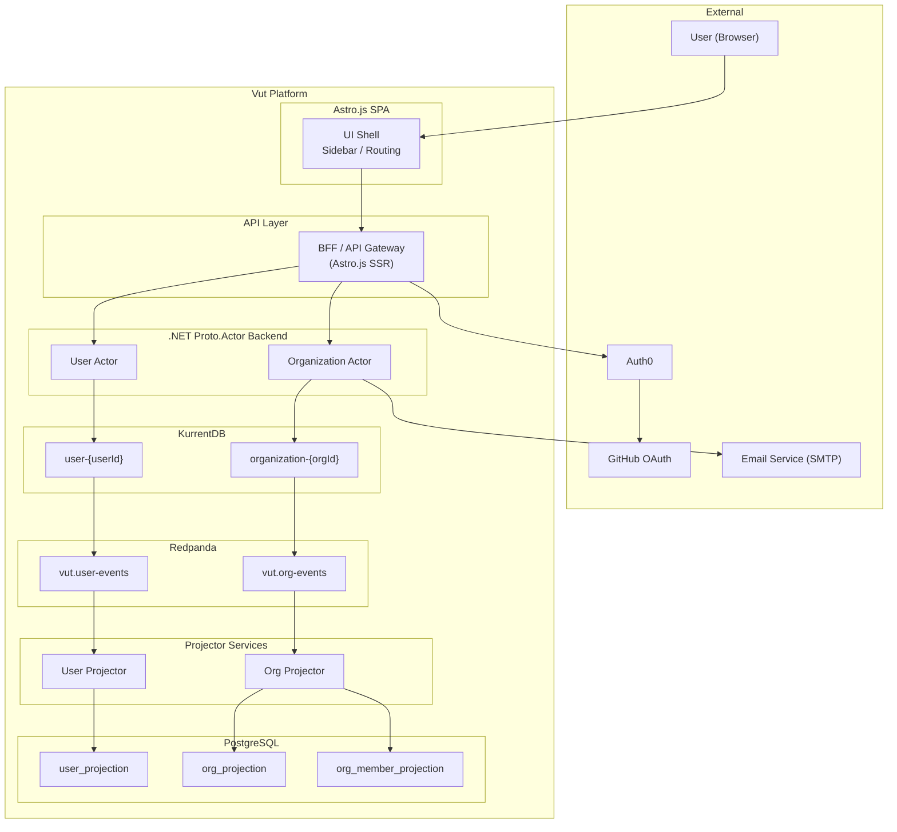

## 2. Component Diagram

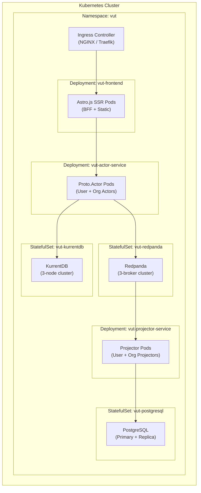

## 3. Infrastructure Setup (Kubernetes)

### 3.1 Namespace and Resource Quotas

All Vut services run in the `vut` namespace.

```yaml
# k8s/namespace.yaml
apiVersion: v1
kind: Namespace
metadata:
  name: vut
  labels:
    app.kubernetes.io/part-of: vut
```

### 3.2 KurrentDB StatefulSet

```yaml
# k8s/kurrentdb/statefulset.yaml (sketch)
apiVersion: apps/v1
kind: StatefulSet
metadata:
  name: vut-kurrentdb
  namespace: vut
spec:
  replicas: 3
  serviceName: vut-kurrentdb
  selector:
    matchLabels:
      app: vut-kurrentdb
  template:
    spec:
      containers:
        - name: kurrentdb
          image: kurrentdb/kurrentdb:latest
          ports:
            - containerPort: 2113  # HTTP/API
            - containerPort: 1113  # TCP
          env:
            - name: EVENTSTORE_CLUSTER_SIZE
              value: "3"
            - name: EVENTSTORE_RUN_PROJECTIONS
              value: "None"  # We project in .NET consumers
            - name: EVENTSTORE_DB
              value: "/data/db"
          volumeMounts:
            - name: data
              mountPath: /data
  volumeClaimTemplates:
    - metadata:
        name: data
      spec:
        accessModes: ["ReadWriteOnce"]
        resources:
          requests:
            storage: 10Gi
```

### 3.3 Redpanda StatefulSet

```yaml
# k8s/redpanda/statefulset.yaml (sketch)
apiVersion: apps/v1
kind: StatefulSet
metadata:
  name: vut-redpanda
  namespace: vut
spec:
  replicas: 3
  serviceName: vut-redpanda
  selector:
    matchLabels:
      app: vut-redpanda
  template:
    spec:
      containers:
        - name: redpanda
          image: redpandadata/redpanda:latest
          ports:
            - containerPort: 9092  # Kafka API
            - containerPort: 9644  # Admin API
          command:
            - redpanda
            - start
            - --smp 1
            - --memory 512M
            - --overprovisioned
            - --kafka-addr internal://0.0.0.0:9092
```

### 3.4 PostgreSQL StatefulSet

```yaml
# k8s/postgresql/statefulset.yaml (sketch)
apiVersion: apps/v1
kind: StatefulSet
metadata:
  name: vut-postgresql
  namespace: vut
spec:
  replicas: 1  # Primary; read replica added later
  serviceName: vut-postgresql
  selector:
    matchLabels:
      app: vut-postgresql
  template:
    spec:
      containers:
        - name: postgresql
          image: postgres:16
          ports:
            - containerPort: 5432
          env:
            - name: POSTGRES_DB
              value: vut_readmodel
            - name: POSTGRES_USER
              valueFrom:
                secretKeyRef:
                  name: vut-postgresql-secret
                  key: username
            - name: POSTGRES_PASSWORD
              valueFrom:
                secretKeyRef:
                  name: vut-postgresql-secret
                  key: password
```

### 3.5 Actor Service Deployment

```yaml
# k8s/actor-service/deployment.yaml (sketch)
apiVersion: apps/v1
kind: Deployment
metadata:
  name: vut-actor-service
  namespace: vut
spec:
  replicas: 2
  selector:
    matchLabels:
      app: vut-actor-service
  template:
    spec:
      containers:
        - name: actor-service
          image: vut/actor-service:latest
          ports:
            - containerPort: 5000  # gRPC
          env:
            - name: KurrentDB__ConnectionString
              value: "esdb://vut-kurrentdb:2113?tls=false"
            - name: Redpanda__BootstrapServers
              value: "vut-redpanda:9092"
            - name: Auth0__Domain
              valueFrom:
                secretKeyRef:
                  name: vut-auth0-secret
                  key: domain
            - name: Auth0__Audience
              valueFrom:
                secretKeyRef:
                  name: vut-auth0-secret
                  key: audience
```

### 3.6 Frontend Deployment (Astro.js BFF)

```yaml
# k8s/frontend/deployment.yaml (sketch)
apiVersion: apps/v1
kind: Deployment
metadata:
  name: vut-frontend
  namespace: vut
spec:
  replicas: 2
  selector:
    matchLabels:
      app: vut-frontend
  template:
    spec:
      containers:
        - name: frontend
          image: vut/frontend:latest
          ports:
            - containerPort: 3000
          env:
            - name: ACTOR_SERVICE_URL
              value: "http://vut-actor-service:5000"
            - name: READMODEL_URL
              value: "http://vut-readmodel-api:5001"
            - name: AUTH0_DOMAIN
              valueFrom:
                secretKeyRef:
                  name: vut-auth0-secret
                  key: domain
            - name: AUTH0_CLIENT_ID
              valueFrom:
                secretKeyRef:
                  name: vut-auth0-secret
                  key: client-id
            - name: AUTH0_CLIENT_SECRET
              valueFrom:
                secretKeyRef:
                  name: vut-auth0-secret
                  key: client-secret
```

## 4. Auth0 Integration Architecture

### 4.1 Auth0 Configuration

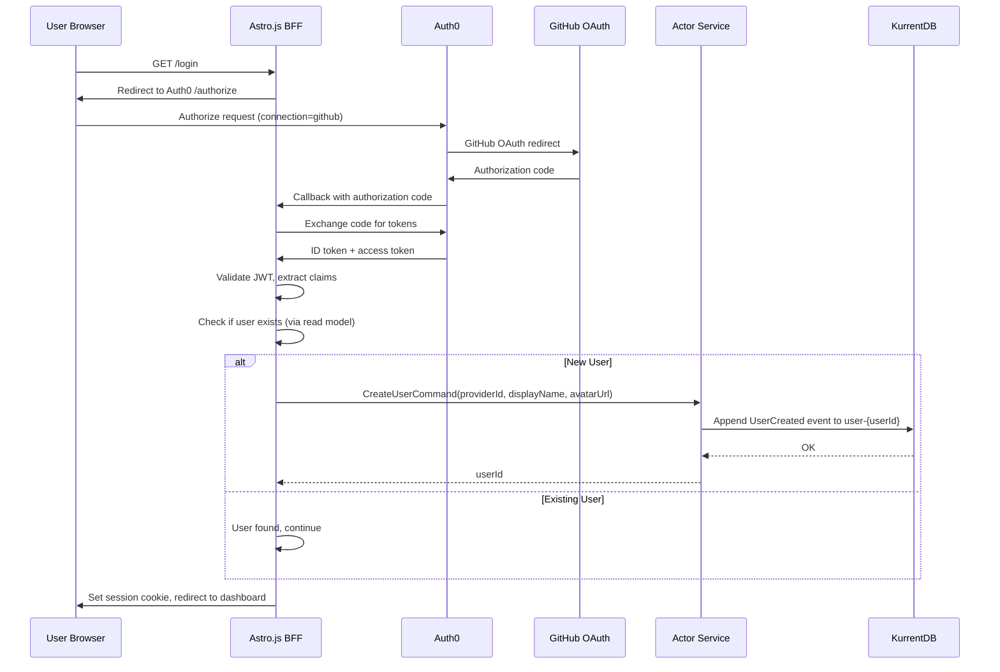

### 4.2 JWT Claims Used

Auth0 token includes these claims that Vut extracts:
- `sub`: The Auth0 user ID (format: `github|12345678`)
- `nickname`: GitHub username
- `name`: Display name
- `picture`: Avatar URL
- `email`: Email address (if available from GitHub scope)

### 4.3 Auth Middleware

The BFF validates the JWT on every request:
1. Extract Bearer token or session cookie
2. Validate JWT signature against Auth0 JWKS
3. Extract `sub` claim as the Vut `providerId`
4. Look up the Vut `userId` from the read model using `providerId`
5. Attach `userId` and `providerId` to the request context as the `actorId` for all commands

## 5. Actor Model Design

### 5.1 Proto.Actor Hierarchy

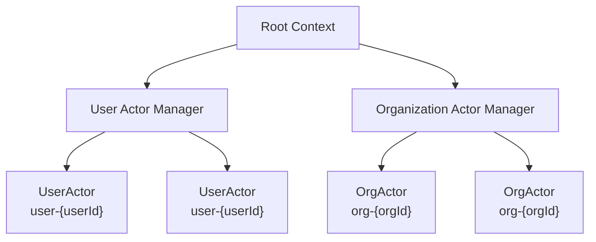

The Actor Managers are responsible for creating and locating actor instances. When a command arrives for a specific aggregate, the manager either returns the existing PID or spawns a new actor that rehydrates from KurrentDB.

### 5.2 Actor Lifecycle

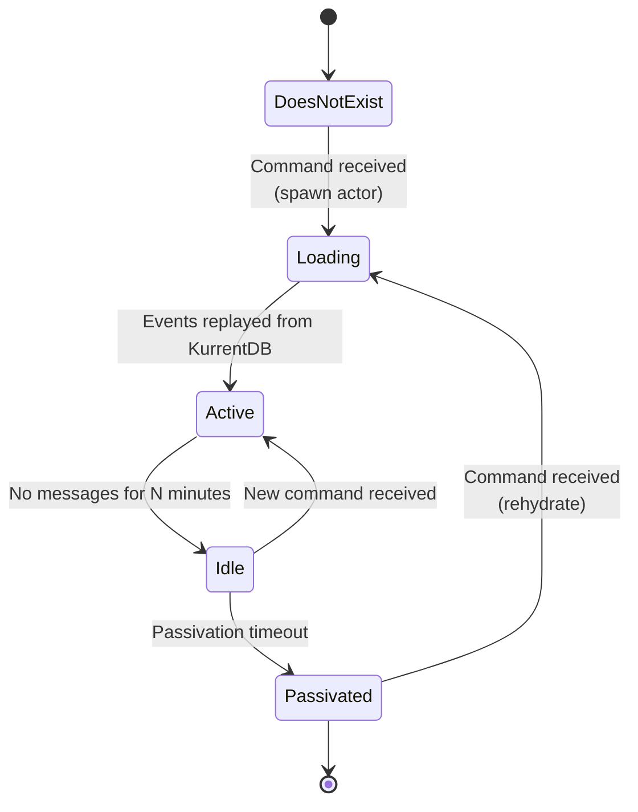

### 5.3 User Actor

**Stream:** `user-{userId}`
**Responsibility:** Manages the user aggregate root. Creates user on first login, handles profile updates.

```
Commands:
  CreateUser(providerId, displayName, avatarUrl) -> userId
  UpdateProfile(displayName, avatarUrl)

Events:
  UserCreated(userId, providerId, displayName, avatarUrl, actorId, timestamp)
  UserProfileUpdated(userId, displayName, avatarUrl, actorId, timestamp)

State:
  userId: UUID
  providerId: string (Auth0 subject)
  displayName: string
  avatarUrl: string
```

**Validation Rules:**
- `CreateUser` is idempotent: if the user already exists, return the existing userId without emitting a duplicate event.
- `UpdateProfile` only emits `UserProfileUpdated` if displayName or avatarUrl actually changed.

### 5.4 Organization Actor

**Stream:** `organization-{orgId}`
**Responsibility:** Manages the organization aggregate root. Handles creation, member management, and role changes.

```
Commands:
  CreateOrganization(name, ownerId) -> orgId
  RenameOrganization(newName)
  InviteMember(inviteeEmail, role)
  AcceptInvitation(userId, email)
  DeclineInvitation(userId, email)
  RemoveMember(userId)
  ChangeMemberRole(userId, newRole)

Events:
  OrganizationCreated(orgId, name, actorId, timestamp)
  OrganizationRenamed(orgId, newName, actorId, timestamp)
  MemberInvited(orgId, inviteeEmail, role, actorId, timestamp)
  MemberJoined(orgId, userId, actorId, timestamp)
  MemberRemoved(orgId, userId, actorId, timestamp)
  MemberRoleChanged(orgId, userId, oldRole, newRole, actorId, timestamp)
  OrganizationDeleted(orgId, actorId, timestamp)

State:
  orgId: UUID
  name: string
  members: Map<userId, MemberEntry>
  invitations: Map<email, InvitationEntry>
  isDeleted: bool

MemberEntry:
  userId: UUID
  role: Owner | Member
  joinedAt: timestamp

InvitationEntry:
  email: string
  role: Owner | Member
  invitedAt: timestamp
  status: Pending | Accepted | Declined
```

**Validation Rules:**
- `CreateOrganization`: name must be non-empty, creator is automatically added as Owner.
- `RenameOrganization`: only Owners can rename.
- `InviteMember`: only Owners can invite.
- `AcceptInvitation`: the email used in the invitation must match the user's verified email from Auth0, or the user must be the one the invitation was sent to.
- `RemoveMember`: only Owners can remove. Cannot remove the last Owner.
- `ChangeMemberRole`: only Owners can change roles. Cannot demote the last Owner.
- `OrganizationDeleted` event is defined but the UI action is deferred (not required in Epic 1).

## 6. Event Stream Design

### 6.1 Stream Naming Convention

| Aggregate | Stream ID Format | Example |
|-----------|-----------------|---------|
| User | `user-{userId}` | `user-a1b2c3d4-e5f6-7890-abcd-ef1234567890` |
| Organization | `organization-{orgId}` | `organization-f7e6d5c4-b3a2-1098-7654-321fedcba098` |
| Product | `product-{productId}` | (Epic 2) |
| Task | `task-{taskId}` | (Epic 3) |

### 6.2 Event Envelope

Every event is wrapped in a consistent envelope:

```json
{
  "eventId": "uuid-v4",
  "eventType": "UserCreated",
  "streamId": "user-a1b2c3d4-...",
  "eventNumber": 1,
  "timestamp": "2026-05-05T14:30:00.000Z",
  "actorId": "user-a1b2c3d4-...",
  "payload": {
    "userId": "a1b2c3d4-e5f6-7890-abcd-ef1234567890",
    "providerId": "github|12345678",
    "displayName": "Jane Developer",
    "avatarUrl": "https://avatars.githubusercontent.com/u/12345678"
  }
}
```

### 6.3 Event Serialization

Events are serialized as JSON in KurrentDB. The .NET backend uses `System.Text.Json` with camelCase naming. Each event type maps to a concrete CLR type via a discriminator (`eventType` field).

### 6.4 Redpanda Topic Design

| Topic | Key | Value | Partitions | Purpose |
|-------|-----|-------|------------|---------|
| `vut.user-events` | userId (string) | Event envelope (JSON) | 3 | All User stream events |
| `vut.org-events` | orgId (string) | Event envelope (JSON) | 6 | All Organization stream events |
| `vut.product-events` | productId (string) | Event envelope (JSON) | 6 | (Epic 2) All Product stream events |
| `vut.task-events` | taskId (string) | Event envelope (JSON) | 12 | (Epic 3) All Task stream events |

Partitioning by aggregate ID ensures ordering per entity. The partition count is chosen upfront based on expected throughput; KurrentDB appends events then publishes to Redpanda atomically via a background process in the actor service.

## 7. Read Model (PostgreSQL Projections)

### 7.1 Projection Views

```sql
-- User projection
CREATE TABLE user_projection (
    user_id       UUID PRIMARY KEY,
    provider_id   TEXT NOT NULL UNIQUE,
    display_name  TEXT NOT NULL,
    avatar_url    TEXT,
    created_at    TIMESTAMPTZ NOT NULL,
    updated_at    TIMESTAMPTZ NOT NULL
);

-- Organization projection
CREATE TABLE org_projection (
    org_id        UUID PRIMARY KEY,
    name          TEXT NOT NULL,
    is_deleted    BOOLEAN NOT NULL DEFAULT FALSE,
    created_at    TIMESTAMPTZ NOT NULL,
    updated_at    TIMESTAMPTZ NOT NULL
);

-- Organization member projection (derived from org stream events)
CREATE TABLE org_member_projection (
    org_id        UUID NOT NULL REFERENCES org_projection(org_id),
    user_id       UUID NOT NULL REFERENCES user_projection(user_id),
    role          TEXT NOT NULL CHECK (role IN ('Owner', 'Member')),
    joined_at     TIMESTAMPTZ NOT NULL,
    PRIMARY KEY (org_id, user_id)
);

-- Organization invitation projection (derived from org stream events)
CREATE TABLE org_invitation_projection (
    org_id            UUID NOT NULL REFERENCES org_projection(org_id),
    email             TEXT NOT NULL,
    role              TEXT NOT NULL CHECK (role IN ('Owner', 'Member')),
    status            TEXT NOT NULL CHECK (status IN ('Pending', 'Accepted', 'Declined')),
    invited_at        TIMESTAMPTZ NOT NULL,
    user_id           UUID,  -- NULL until the invitee signs in
    PRIMARY KEY (org_id, email)
);

-- User organization membership (reverse index for "my orgs" queries)
CREATE TABLE user_org_projection (
    user_id       UUID NOT NULL REFERENCES user_projection(user_id),
    org_id        UUID NOT NULL REFERENCES org_projection(org_id),
    role          TEXT NOT NULL,
    PRIMARY KEY (user_id, org_id)
);

-- Indexes
CREATE INDEX idx_user_projection_provider ON user_projection(provider_id);
CREATE INDEX idx_org_member_projection_user ON org_member_projection(user_id);
CREATE INDEX idx_org_invitation_projection_email ON org_invitation_projection(email, status);
```

### 7.2 Projector Service Design

The projector service is a .NET worker that subscribes to Redpanda consumer groups and updates PostgreSQL projections.

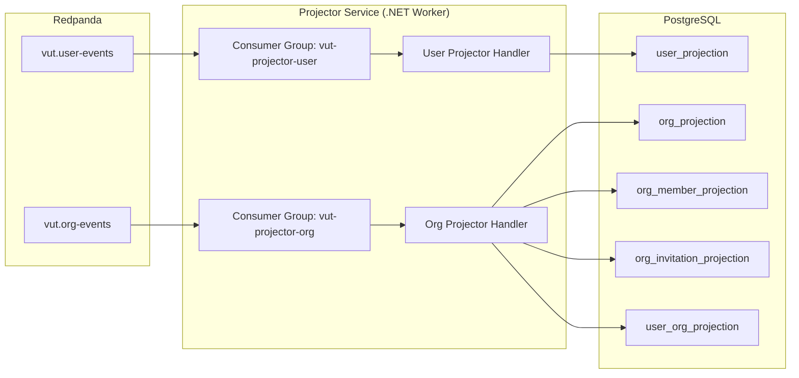

**Projector Idempotency:** Each projector tracks the last consumed offset per partition in a `projection_checkpoint` table. On restart, it resumes from the last checkpoint. The projector handles events idempotently -- re-processing an event produces the same result.

```sql
CREATE TABLE projection_checkpoint (
    projector_name   TEXT NOT NULL,
    topic            TEXT NOT NULL,
    partition_id     INT NOT NULL,
    last_offset      BIGINT NOT NULL,
    updated_at       TIMESTAMPTZ NOT NULL,
    PRIMARY KEY (projector_name, topic, partition_id)
);
```

## 8. Key Workflow Sequence Diagrams

### 8.1 First-Time User Sign-In

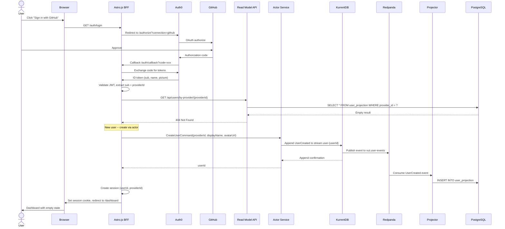

### 8.2 Returning User Sign-In

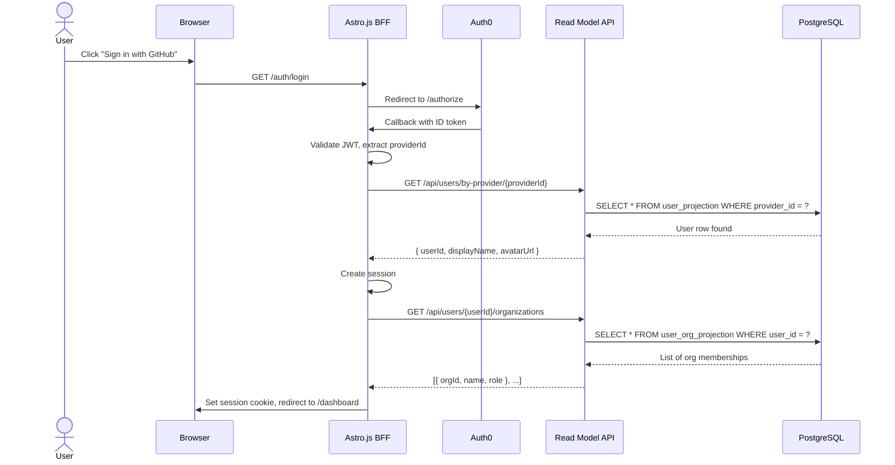

### 8.3 Create Organization

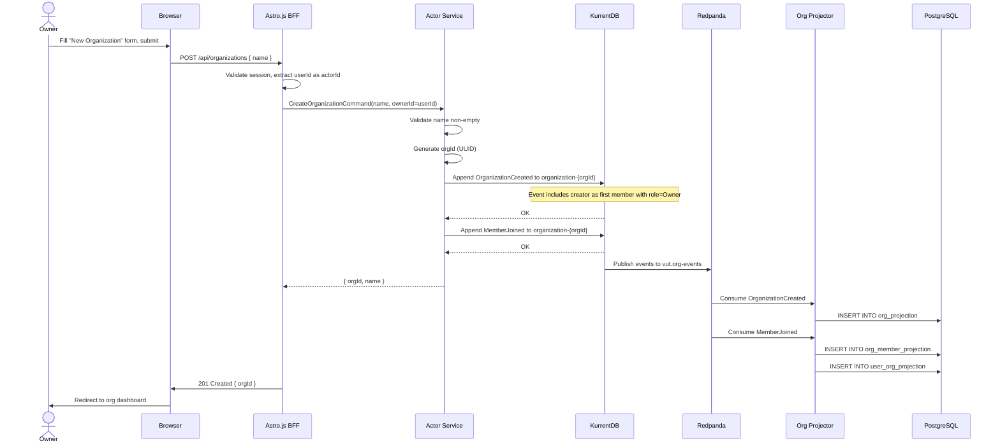

### 8.4 Invite and Accept Member

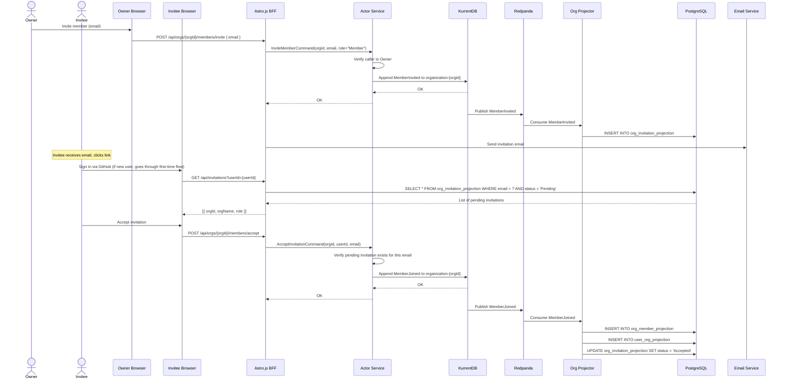

### 8.5 Organization Switching

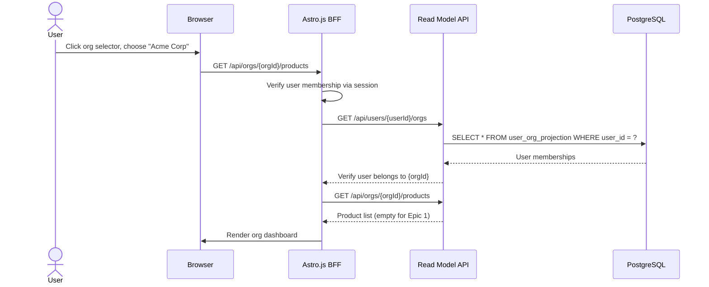

## 9. API Design (BFF Endpoints)

### 9.1 Authentication Endpoints

| Method | Path | Description |
|--------|------|-------------|
| GET | `/auth/login` | Initiates Auth0 login flow (redirect) |
| GET | `/auth/callback` | Auth0 callback, exchanges code, creates/retrieves user |
| POST | `/auth/logout` | Clears session, redirects to Auth0 logout |

### 9.2 User Endpoints

| Method | Path | Description |
|--------|------|-------------|
| GET | `/api/users/me` | Current user profile |
| PATCH | `/api/users/me` | Update display name / avatar |

### 9.3 Organization Endpoints

| Method | Path | Description |
|--------|------|-------------|
| POST | `/api/organizations` | Create organization |
| GET | `/api/organizations` | List user's organizations |
| GET | `/api/organizations/{orgId}` | Get org details |
| PATCH | `/api/organizations/{orgId}` | Rename organization |
| GET | `/api/organizations/{orgId}/members` | List members |
| POST | `/api/organizations/{orgId}/members/invite` | Invite member |
| POST | `/api/organizations/{orgId}/members/accept` | Accept invitation |
| POST | `/api/organizations/{orgId}/members/decline` | Decline invitation |
| DELETE | `/api/organizations/{orgId}/members/{userId}` | Remove member |
| PATCH | `/api/organizations/{orgId}/members/{userId}/role` | Change role |

### 9.4 Invitation Endpoints

| Method | Path | Description |
|--------|------|-------------|
| GET | `/api/invitations` | List pending invitations for current user |

## 10. Frontend Architecture

### 10.1 Astro.js SPA Shell

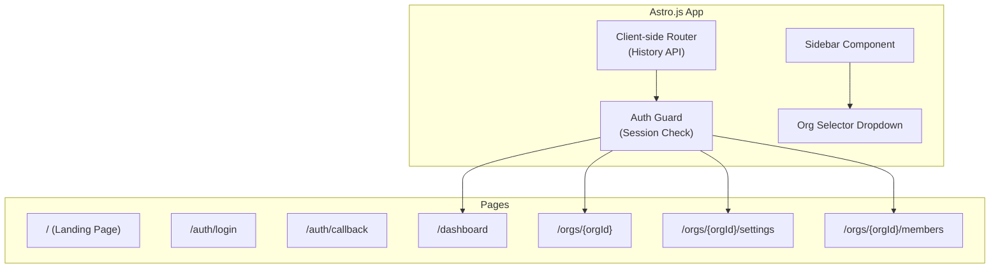

### 10.2 Client-Side State

The Astro.js frontend maintains a minimal client-side state store:
- `currentUser`: The logged-in user's profile
- `organizations`: List of orgs the user belongs to
- `currentOrgId`: The currently selected organization
- `pendingInvitations`: Invitations awaiting response

State is hydrated from the read model API on initial page load and kept fresh via refetch on navigation.

### 10.3 Authorization Model (Frontend)

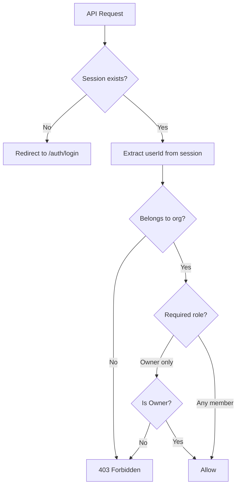

## 11. Data Flow Summary

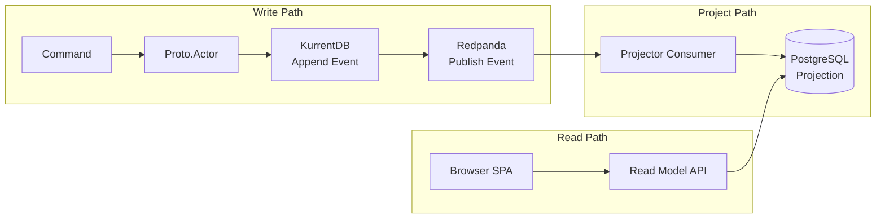

**Write Path:** Browser -> BFF -> Actor Service -> KurrentDB -> Redpanda
**Project Path:** Redpanda -> Projector -> PostgreSQL
**Read Path:** Browser -> BFF -> Read Model API -> PostgreSQL

This separation ensures:
- Writes are always consistent (KurrentDB is the source of truth)
- Reads are eventually consistent (projection lag is typically <100ms)
- Projections can be rebuilt from KurrentDB at any time

## 12. Cross-Cutting Concerns Established in Epic 1

These patterns, once established in Epic 1, are reused by all subsequent epics:

| Concern | Implementation | Reused By |
|---------|---------------|-----------|
| Event envelope with actorId + timestamp | Standardized JSON envelope in actor service | Epics 2-6 |
| Actor lifecycle (spawn, hydrate, passivate) | Proto.Actor manager pattern | Epics 2-6 |
| KurrentDB stream append | Shared infrastructure client | Epics 2-6 |
| Redpanda publishing after append | Post-commit hook in actor base class | Epics 2-6 |
| Projector service (consume, checkpoint, project) | Shared projector framework | Epics 2-6 |
| BFF session management + Auth0 | Astro.js middleware | Epics 2-6 |
| Authorization middleware (org membership check) | BFF request pipeline | Epics 2-6 |
| Projection checkpoint table | PostgreSQL schema | Epics 2-6 |
| Kubernetes manifests pattern | Deployment + Service + ConfigMap | Epics 2-6 |

## 13. Technology Decisions for Epic 1

| Decision | Choice | Rationale |
|----------|--------|-----------|
| Actor framework | Proto.Actor | PRD requirement. Supports location transparency, clustering, and grain-like virtual actors. |
| Event store | KurrentDB (EventStoreDB) | PRD requirement. Purpose-built for event sourcing with stream-based storage, built-in projections (we use external), and HTTP/gRPC APIs. |
| Message broker | Redpanda | PRD requirement. Kafka-compatible, no JVM dependency, simpler operations in K8s. |
| Read model | PostgreSQL | PRD requirement. Mature, reliable, supports the complex queries needed for projections and the cumulative flow (Epic 5). |
| Frontend | Astro.js + Tailwind CSS | PRD requirement. SSR-capable, island architecture for selective hydration, excellent performance. |
| Auth | Auth0 | PRD requirement. Managed service, supports GitHub SSO and future providers. |
| Serialization | System.Text.Json (JSON) | Native .NET, high performance, no external dependency. |
| ID generation | UUID v4 | Globally unique, no coordination needed, safe for distributed actor creation. |
| Session management | HTTP-only cookie (BFF) | Secure, no token exposure to JavaScript, BFF validates JWT server-side. |
