# Epic 1 Architecture: First Sign-In & Organization (Microsoft Orleans)

## 1. System Context

Epic 1 establishes the entire infrastructure footprint of Velucid. Every subsequent epic builds on the grains, event sourcing, projections, and deployment infrastructure defined here.

The architecture uses **Microsoft Orleans virtual actors (grains)** as the core backend framework. Orleans grains are identified by strongly-typed interfaces and keys (GUIDs), auto-activate on first call, and are location-transparent across silo nodes. There are no manager actors, no manual PID lookup, and no manual spawning logic.

**Deployment model:** The platform runs on a single developer machine using **K3s** (lightweight Kubernetes) to orchestrate all services. Orleans silos use `UseAdoNetClustering()` with PostgreSQL for cluster membership from day one, even with a single silo. This means scaling to multiple machines later requires zero code changes — just join additional K3s nodes to the cluster via **Tailscale VPN** and Orleans automatically discovers new silos through the shared PostgreSQL membership table. No cloud infrastructure is needed; the entire system runs locally with production-grade orchestration.

**Internet access:** The dev machine has no static IP. Users reach `velucid.app` via **Cloudflare Tunnel** — a `cloudflared` daemon runs inside the K3s cluster and establishes an outbound-only encrypted connection to Cloudflare's edge network. Cloudflare terminates TLS, provides DDoS protection, and proxies traffic back through the tunnel to the K3s Traefik ingress. No port forwarding, firewall rules, or static IP required.

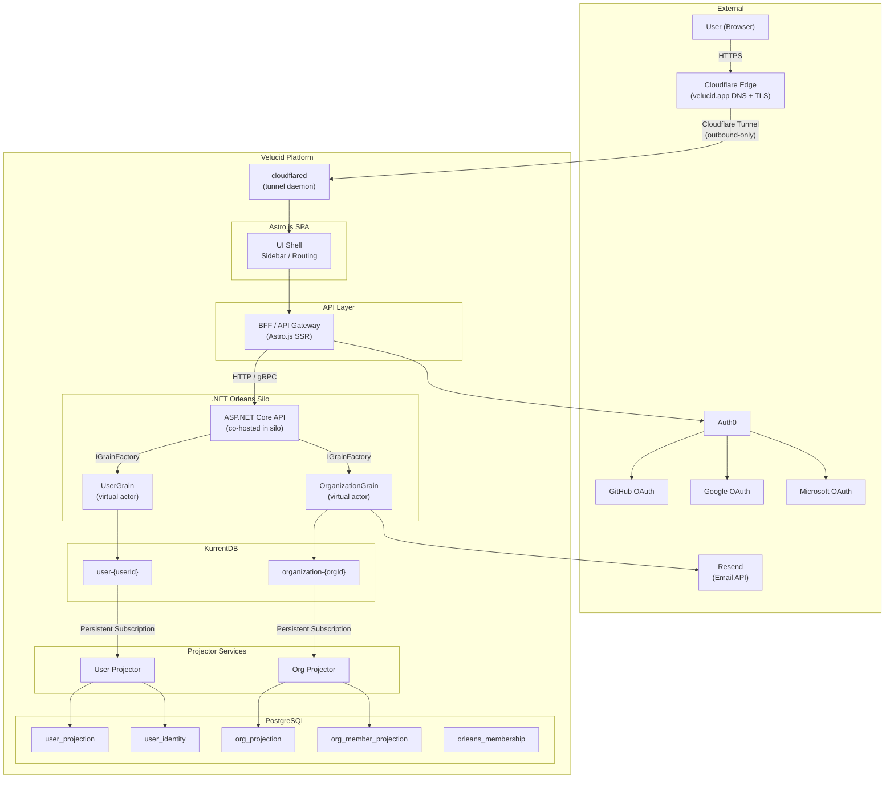

The BFF communicates with a co-hosted ASP.NET Core API that lives inside the Orleans silo process. The API uses `IGrainFactory` to obtain grain references. Grains are auto-activated by the Orleans runtime on first call — no manual routing or external broker required.

---

## 2. Why Virtual Actors (Orleans)

### 2.1 Why Virtual Actors

Virtual actors (grains) are the natural fit for Velucid's domain model. Each aggregate root (User, Organization, Product, Task) maps to one grain instance identified by its entity ID. Virtual actors provide:

1. **Automatic lifecycle management**: Grains activate on first call and deactivate when idle — no manual creation or destruction logic.
2. **Location transparency**: The caller doesn't need to know which server hosts a grain. The Orleans runtime handles placement and routing.
3. **Single-threaded execution**: Each grain processes one call at a time, eliminating concurrency bugs within an aggregate.
4. **Failure recovery**: If a silo crashes, grains re-activate on surviving silos automatically. State is safe in KurrentDB.
5. **Horizontal scaling**: Adding silo pods distributes grains across more nodes with zero code changes.

### 2.2 Why Orleans Specifically

| Concern | Orleans Approach |
|---------|-----------------|
| Cluster membership | Built-in; uses PostgreSQL (ADO.NET) — no external message broker needed |
| Grain communication | Strongly-typed C# interfaces (`IUserGrain`, `IOrganizationGrain`) |
| .NET integration | Native ASP.NET Core co-hosting via `UseOrleans()` |
| Persistence providers | Rich ecosystem (ADO.NET, Azure, Redis, custom) |
| Grain deactivation | Built-in `DelayDeactivation()` + configurable idle timeout |
| Community & support | Large, Microsoft-backed, deployed at scale (Halo, Xbox, Skype, Azure) |
| Streaming | Built-in Orleans Streams (optional, for future use) |
| Dependency injection | Full ASP.NET Core DI integration in grains |

### 2.3 Trade-offs Acknowledged

- **Opinionated framework**: Orleans has strong opinions about grain design, state management, and communication patterns. This rigidity is beneficial for Velucid's straightforward aggregate model.
- **Custom event sourcing**: Orleans does not have a built-in KurrentDB provider. A custom `EventSourcedGrain<TState>` base class is needed (see Section 5.1).
- **Grain key types**: Orleans grain keys are limited to `Guid`, `long`, `string`, or compound keys. This is not a limitation for Velucid (all entities use UUID/Guid keys).

These trade-offs are acceptable because:
- Native ASP.NET Core integration reduces boilerplate and improves developer experience.
- The strongly-typed grain interface model is safer and more maintainable.
- Orleans is battle-tested at scale.

---

## 3. Component Diagram

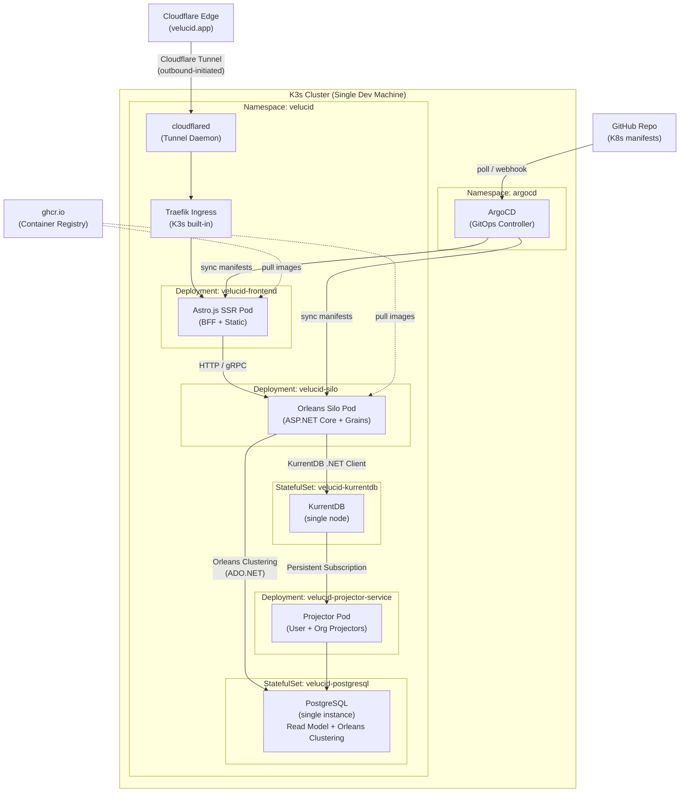

**Key design decisions:**
- **Cloudflare Tunnel** exposes `velucid.app` to the internet without a static IP. The `cloudflared` daemon runs as a K3s deployment and initiates an outbound connection to Cloudflare — no inbound ports need to be opened on the dev machine's router.
- Orleans uses PostgreSQL (already in the stack) for cluster membership via `Orleans.Clustering.AdoNet`. This is configured from day one even on a single node, so adding more silos later requires zero code changes.
- The silo is a homogeneous Orleans cluster node running ASP.NET Core. Every pod runs the same code and can host any grain type.
- The API layer is **co-hosted** inside the silo — no separate API service needed. The BFF calls the co-hosted API endpoints, which use `IGrainFactory` to access grains.
- K3s bundles Traefik as the default ingress controller — no separate NGINX installation needed.

**Scaling to multiple machines (future):**
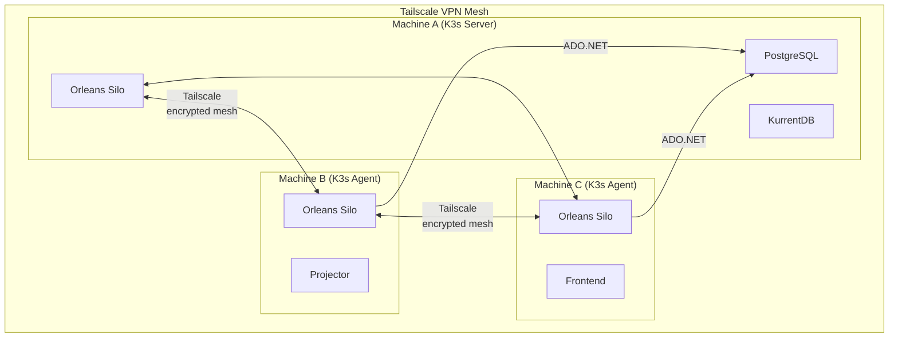
When scaling is needed, additional developer machines join the K3s cluster via Tailscale. Orleans discovers new silos through the PostgreSQL membership table. Grains automatically rebalance across all available silos.

---

## 4. Cluster Topology & Placement

### 4.1 Silo Configuration

Every `velucid-silo` pod joins the Orleans cluster on startup. The cluster is configured with:

- **Clustering Provider**: PostgreSQL via `Orleans.Clustering.AdoNet` (membership table in the existing PostgreSQL instance). This is used even on a single node — when additional K3s nodes join via Tailscale, new silos register themselves in the same membership table automatically.
- **Grain Directory**: Orleans' built-in distributed grain directory (hash-based placement)
- **Grain Types**: Registered via dependency injection at startup

```csharp
// Program.cs — Orleans silo configuration
var builder = WebApplication.CreateBuilder(args);

builder.UseOrleans(siloBuilder =>
{
    siloBuilder
        .UseAdoNetClustering(options =>
        {
            options.ConnectionString = builder.Configuration
                .GetConnectionString("PostgreSQL");
            options.Invariant = "Npgsql";
        })
        .ConfigureEndpoints(
            siloPort: 11111,
            gatewayPort: 30000)
        .AddMemoryGrainStorageAsDefault() // Grain state is in KurrentDB, not Orleans storage
        .Configure<ClusterOptions>(options =>
        {
            options.ClusterId = "velucid-cluster";
            options.ServiceId = "velucid";
        })
        .Configure<GrainCollectionOptions>(options =>
        {
            options.CollectionAge = TimeSpan.FromMinutes(30);
        });
});

// Co-hosted API
builder.Services.AddControllers();
builder.Services.AddSingleton<IKurrentDbClient>(/* ... */);

var app = builder.Build();
app.MapControllers();
app.Run();
```

### 4.2 Grain Types

| Grain Interface | Key Type | Identity Format | Description |
|----------------|----------|-----------------|-------------|
| `IUserGrain` | `Guid` | `{userId}` (UUID) | One grain per Velucid user |
| `IOrganizationGrain` | `Guid` | `{orgId}` (UUID) | One grain per Velucid organization |

Future epics will register additional grain types:

| Grain Interface | Key Type | Identity Format | Epic |
|----------------|----------|-----------------|------|
| `IProductGrain` | `Guid` | `{productId}` (UUID) | Epic 2 |
| `ITaskGrain` | `Guid` | `{taskId}` (UUID) | Epic 3 |

### 4.3 Silo Placement

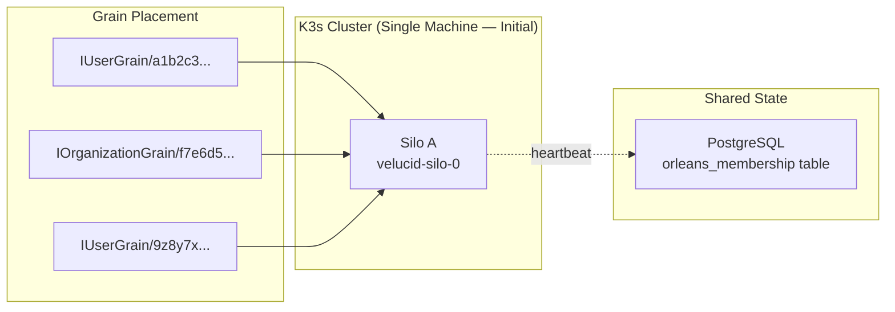

With a single silo, all grains are placed on that silo. The membership table still tracks the silo's heartbeat, maintaining the same protocol used in multi-silo deployments. When additional machines join the K3s cluster via Tailscale, silos are distributed across machines:

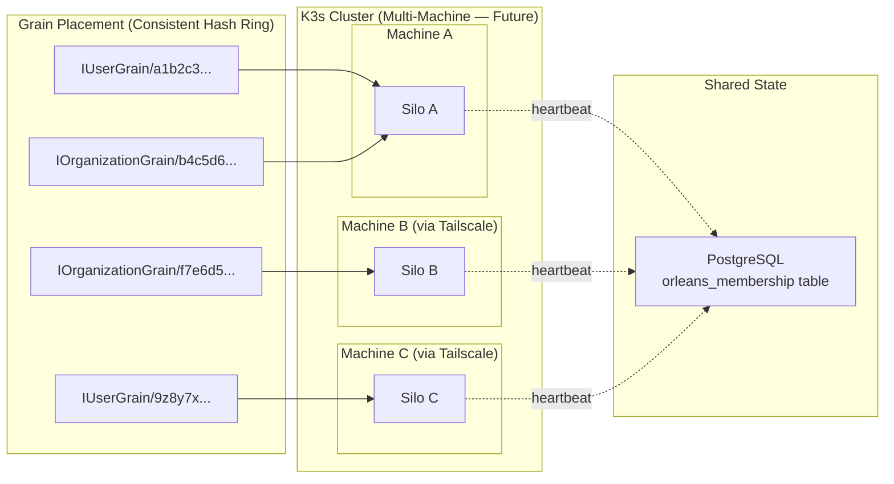

Orleans uses consistent hashing to place each grain on a specific silo. The membership table in PostgreSQL tracks which silos are alive. When a silo fails, Orleans re-places grains from the dead silo onto surviving silos automatically.

### 4.4 Grain Activation Flow

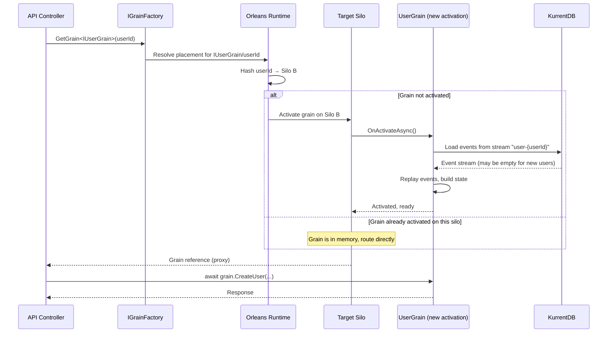

**Key points:**
- Activation is implicit. The first call to any grain triggers activation.
- State is hydrated from KurrentDB during `OnActivateAsync()`.
- If the grain is already active on the owning silo, the call is delivered directly (no re-hydration).
- If the owning silo fails, Orleans re-places the grain on another silo and it re-activates.

---

## 5. Virtual Actor (Grain) Design

### 5.1 Base Grain Abstraction

All aggregate grains share a common base that handles event sourcing lifecycle. This base class integrates KurrentDB directly using the `EventStore.Client` .NET SDK.

```csharp
// Pseudocode — base grain abstraction for event sourcing with KurrentDB
public abstract class EventSourcedGrain<TState> : Grain
    where TState : class, new()
{
    private readonly IKurrentDbClient _client;
    private readonly string _streamId;
    private TState _state = new();
    private StreamRevision _currentRevision = StreamRevision.None;

    protected TState State => _state;

    protected EventSourcedGrain(IKurrentDbClient client, string streamId)
    {
        _client = client;
        _streamId = streamId;
    }

    public override async Task OnActivateAsync(CancellationToken ct)
    {
        await HydrateFromStream(ct);
        await base.OnActivateAsync(ct);
    }

    private async Task HydrateFromStream(CancellationToken ct)
    {
        var result = _client.ReadStreamAsync(
            Direction.Forwards,
            _streamId,
            StreamPosition.Start,
            cancellationToken: ct);

        if (await result.ReadState == ReadState.StreamNotFound)
            return; // New aggregate, empty state

        await foreach (var resolved in result)
        {
            var @event = DeserializeEvent(resolved);
            Apply(_state, @event);
            _currentRevision = resolved.Event.EventNumber;
        }
    }

    protected async Task<TResult> EmitEvent<TResult>(
        object @event,
        Func<TState, TResult> resultSelector)
    {
        var eventData = SerializeEvent(@event);
        var writeResult = await _client.AppendToStreamAsync(
            _streamId,
            _currentRevision,
            new[] { eventData });

        _currentRevision = writeResult.NextExpectedStreamRevision;
        Apply(_state, @event);
        return resultSelector(_state);
    }

    protected async Task EmitEvent(object @event)
    {
        var eventData = SerializeEvent(@event);
        var writeResult = await _client.AppendToStreamAsync(
            _streamId,
            _currentRevision,
            new[] { eventData });

        _currentRevision = writeResult.NextExpectedStreamRevision;
        Apply(_state, @event);
    }

    protected abstract void Apply(TState state, object @event);

    private EventData SerializeEvent(object @event)
    {
        var typeName = EventTypeMapping.GetTypeName(@event.GetType());
        var json = JsonSerializer.SerializeToUtf8Bytes(
            @event, @event.GetType());
        return new EventData(Uuid.NewUuid(), typeName, json);
    }

    private object DeserializeEvent(ResolvedEvent resolved)
    {
        var type = EventTypeMapping.GetClrType(
            resolved.Event.EventType);
        return JsonSerializer.Deserialize(
            resolved.Event.Data.Span, type)!;
    }
}
```

**What this provides:**
- No external persistence provider needed — grains interact with KurrentDB directly via the official .NET client.
- Optimistic concurrency via `_currentRevision` — KurrentDB rejects writes if another process has appended events since the grain last read.
- Event replay on activation builds the grain state from the event stream.
- The `Apply` method is the single place where state is mutated, ensuring consistency between event replay and command processing.

### 5.2 Grain Lifecycle State Machine

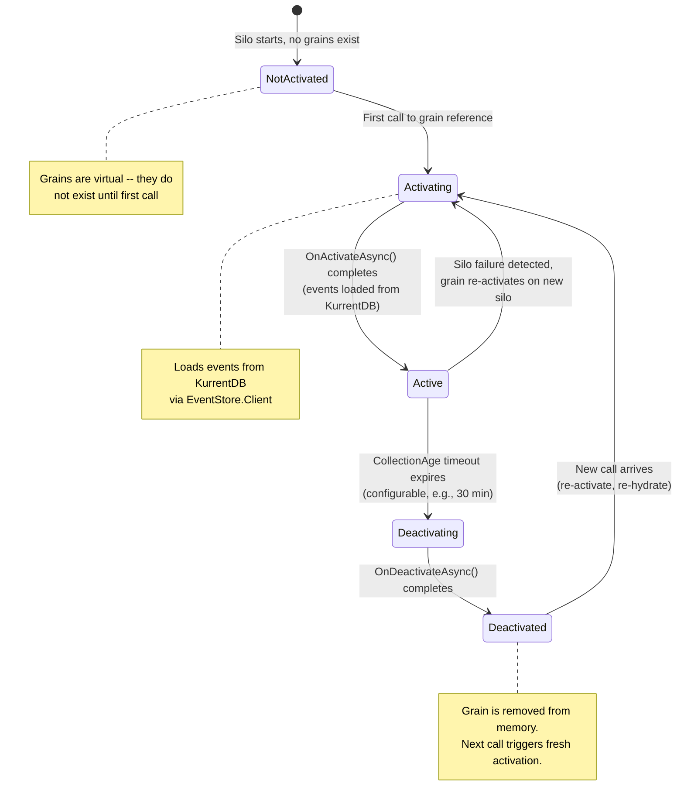

**Deactivation strategy:** Orleans uses `GrainCollectionOptions.CollectionAge` (e.g., 30 minutes) to deactivate idle grains. Grains can also call `DelayDeactivation(TimeSpan)` to extend their lifetime after receiving a message. This prevents idle grains from consuming memory indefinitely.

```csharp
// Pseudocode — extending grain lifetime after activity
public override Task OnActivateAsync(CancellationToken ct)
{
    // Keep grain alive for 30 minutes after last call
    DelayDeactivation(TimeSpan.FromMinutes(30));
    return base.OnActivateAsync(ct);
}

// Called before deactivation — opportunity for cleanup
public override Task OnDeactivateAsync(
    DeactivationReason reason, CancellationToken ct)
{
    // State is safe because events are in KurrentDB
    return base.OnDeactivateAsync(reason, ct);
}
```

### 5.3 User Grain

**Grain Interface:** `IUserGrain : IGrainWithGuidKey`
**Identity:** `{userId}` (UUID)
**Event Stream:** `user-{userId}`
**Responsibility:** Manages the user aggregate root. Creates user on first login, links additional identity providers, handles profile updates, and manages email verification.

```csharp
// Grain interface — strongly typed, no .proto files needed
public interface IUserGrain : IGrainWithGuidKey
{
    Task<CreateUserResult> CreateUser(
        string providerId, string providerName,
        string displayName, string avatarUrl, string? email);

    Task LinkIdentity(
        string providerId, string providerName, string? email);

    Task UpdateProfile(string displayName, string avatarUrl);

    Task<string> RequestEmailVerification(string email);

    Task VerifyEmail(string token);
}
```

```
Events (persisted to KurrentDB):
  UserCreated(userId, displayName, avatarUrl, email?, actorId, timestamp)
  IdentityLinked(userId, providerId, providerName, email?, actorId, timestamp)
  UserProfileUpdated(userId, displayName, avatarUrl, actorId, timestamp)
  EmailVerificationRequested(userId, email, token, actorId, timestamp)
  EmailVerified(userId, email, actorId, timestamp)

State (hydrated from events on activation):
  userId: UUID
  displayName: string
  avatarUrl: string
  email: string?
  isEmailVerified: bool
  emailVerificationToken: string
  emailVerificationTokenExpiresAt: timestamp
  identities: Map<providerId, IdentityEntry>

IdentityEntry:
  providerId: string (Auth0 subject, e.g., "github|12345678")
  providerName: string (e.g., "github", "google", "microsoft")
  email: string?
  linkedAt: timestamp
```

**Validation Rules:**
- `CreateUser` is idempotent: if the user already exists (state has a userId), return the existing userId without emitting a duplicate event. `CreateUser` also emits an `IdentityLinked` event for the initial provider. If `email` is provided from the provider, it is stored but marked as unverified (`isEmailVerified = false`). Email may be null — identity providers do not guarantee returning an email.
- `LinkIdentity` validates that the `providerId` is not already linked to a different user. If already linked to this user, it is a no-op.
- `UpdateProfile` only emits `UserProfileUpdated` if displayName or avatarUrl actually changed.
- `RequestEmailVerification` generates a time-limited 6-digit code (expires in 15 minutes). The user provides an email address on the `/verify-email` page — this is the primary way email is collected. Emits `EmailVerificationRequested`.
- `VerifyEmail` validates the token has not expired and matches. On success, sets `isEmailVerified = true` and updates `email`. Emits `EmailVerified`.

**Email Verification Gate:**
All platform actions (create organization, invite members, etc.) require `isEmailVerified = true`. The BFF checks this from the read model before forwarding commands. Unverified users are redirected to the email verification page.

### 5.4 Organization Grain

**Grain Interface:** `IOrganizationGrain : IGrainWithGuidKey`
**Identity:** `{orgId}` (UUID)
**Event Stream:** `organization-{orgId}`
**Responsibility:** Manages the organization aggregate root. Handles creation, member management, and role changes.

```csharp
public interface IOrganizationGrain : IGrainWithGuidKey
{
    Task<CreateOrgResult> CreateOrganization(string name, Guid ownerId);
    Task RenameOrganization(string newName);
    Task InviteMember(string inviteeEmail, string role);
    Task AcceptInvitation(Guid userId, string email);
    Task DeclineInvitation(Guid userId, string email);
    Task RemoveMember(Guid userId);
    Task ChangeMemberRole(Guid userId, string newRole);
}
```

```
Events (persisted to KurrentDB):
  OrganizationCreated(orgId, name, actorId, timestamp)
  OrganizationRenamed(orgId, newName, actorId, timestamp)
  MemberInvited(orgId, inviteeEmail, role, actorId, timestamp)
  MemberJoined(orgId, userId, actorId, timestamp)
  MemberRemoved(orgId, userId, actorId, timestamp)
  MemberRoleChanged(orgId, userId, oldRole, newRole, actorId, timestamp)
  OrganizationDeleted(orgId, actorId, timestamp)

State (hydrated from events on activation):
  orgId: UUID
  name: string
  members: Map<userId, MemberEntry>
  invitations: Map<email, InvitationEntry>
  isDeleted: bool

MemberEntry:
  userId: UUID
  role: Owner | Member
  joinedAt: timestamp

InvitationEntry:
  email: string
  role: Owner | Member
  invitedAt: timestamp
  status: Pending | Accepted | Declined
```

**Validation Rules:**
- `CreateOrganization`: name must be non-empty, creator is automatically added as Owner.
- `RenameOrganization`: only Owners can rename.
- `InviteMember`: only Owners can invite.
- `AcceptInvitation`: the email used in the invitation must match the user's verified email.
- `RemoveMember`: only Owners can remove. Cannot remove the last Owner.
- `ChangeMemberRole`: only Owners can change roles. Cannot demote the last Owner.
- `OrganizationDeleted` event is defined but the UI action is deferred (not required in Epic 1).

### 5.5 Calling Grains from API Controllers

The co-hosted API controllers use `IGrainFactory` (injected via ASP.NET Core DI) to obtain grain references:

```csharp
// Pseudocode — API controller calling a grain
[ApiController]
[Route("api/users")]
public class UserController : ControllerBase
{
    private readonly IGrainFactory _grainFactory;

    public UserController(IGrainFactory grainFactory)
    {
        _grainFactory = grainFactory;
    }

    [HttpPost("create")]
    public async Task<IActionResult> CreateUser(
        [FromBody] CreateUserRequest request)
    {
        var userId = Guid.NewGuid();
        var grain = _grainFactory.GetGrain<IUserGrain>(userId);
        var result = await grain.CreateUser(
            request.ProviderId,
            request.ProviderName,
            request.DisplayName,
            request.AvatarUrl,
            request.Email);

        return Ok(result);
    }
}
```

**No cluster routing or gRPC serialization is involved.** The `IGrainFactory` returns a grain reference (proxy). If the grain is on this silo, the call is local. If it's on another silo, Orleans handles the serialization and network transport transparently.

---

## 6. Event Sourcing Integration

### 6.1 KurrentDB .NET Client Integration

KurrentDB integration uses the official `EventStore.Client.Grpc.Streams` NuGet package. Each grain interacts with KurrentDB directly — there is no intermediary persistence provider layer.

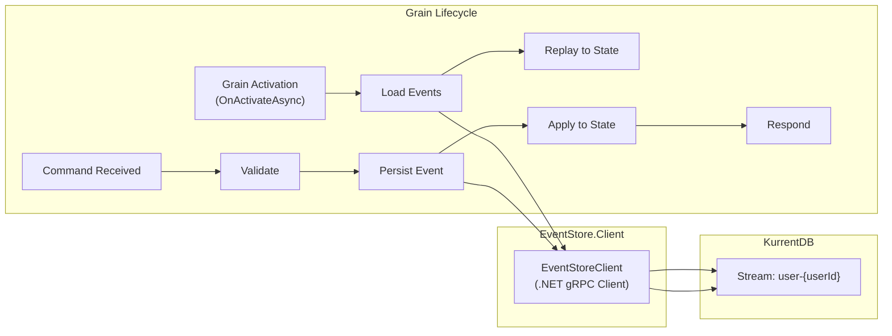

**Client initialization:**

```csharp
// Pseudocode — KurrentDB client registration in DI
builder.Services.AddSingleton(new EventStoreClient(
    EventStoreClientSettings.Create(
        "esdb://velucid-kurrentdb:2113?tls=false")));
```

The `EventStoreClient` is registered as a singleton in the DI container and injected into grains via constructor injection (Orleans supports DI for grains).

### 6.2 Event Serialization

Events are serialized as JSON in KurrentDB using `System.Text.Json` with camelCase naming. Each event type maps to a concrete CLR type.

The `EventSourcedGrain<TState>` base class handles serialization and deserialization transparently. Grains only work with strongly-typed event objects.

### 6.3 Stream Naming Convention

| Aggregate | Stream ID Format | Grain Interface | Example |
|-----------|-----------------|----------------|---------|
| User | `user-{userId}` | `IUserGrain` | `user-a1b2c3d4-e5f6-7890-abcd-ef1234567890` |
| Organization | `organization-{orgId}` | `IOrganizationGrain` | `organization-f7e6d5c4-b3a2-1098-7654-321fedcba098` |
| Product | `product-{productId}` | `IProductGrain` | (Epic 2) |
| Task | `task-{taskId}` | `ITaskGrain` | (Epic 3) |

### 6.4 Event Envelope

Every event is wrapped in a consistent envelope:

```json
{
  "eventId": "uuid-v4",
  "eventType": "UserCreated",
  "streamId": "user-a1b2c3d4-...",
  "eventNumber": 1,
  "timestamp": "2026-05-05T14:30:00.000Z",
  "actorId": "user-a1b2c3d4-...",
  "payload": {
    "userId": "a1b2c3d4-e5f6-7890-abcd-ef1234567890",
    "displayName": "Jane Developer",
    "avatarUrl": "https://avatars.githubusercontent.com/u/12345678",
    "email": "jane@example.com"
  }
}
```

Note: `email` may be `null` if the identity provider did not return one. It is only populated after the user completes email verification.

### 6.5 KurrentDB Persistent Subscriptions (Projector Feeds)

Projectors subscribe to KurrentDB persistent subscriptions directly. KurrentDB handles consumer group management, checkpointing, and retry policies natively.

| Subscription Group | Stream Filter | Consumer Strategy | Purpose |
|--------------------|---------------|-------------------|---------|
| `velucid-projector-user` | `user-*` | Round-robin (1 consumer) | All User stream events |
| `velucid-projector-org` | `organization-*` | Round-robin (1 consumer) | All Organization stream events |

Persistent subscriptions are created via KurrentDB's HTTP API or .NET SDK at startup. They track checkpoints internally — no `projection_checkpoint` table is needed.

**Orleans' role:** Orleans handles grain lifecycle, placement, and cluster membership only. It does NOT participate in event distribution to projectors — that is handled entirely by KurrentDB persistent subscriptions.

---

## 7. Read Model (PostgreSQL Projections)

### 7.1 Entity Relationship Diagram

```mermaid
erDiagram
    USER_PROJECTION ||--o{ USER_IDENTITY : "has identities"
    USER_PROJECTION ||--o{ ORG_MEMBER_PROJECTION : "belongs to"
    USER_PROJECTION ||--o{ USER_ORG_PROJECTION : "reverse index"
    ORG_PROJECTION ||--o{ ORG_MEMBER_PROJECTION : "has members"
    ORG_PROJECTION ||--o{ ORG_INVITATION_PROJECTION : "has invitations"
    ORG_PROJECTION ||--o{ USER_ORG_PROJECTION : "reverse index"

    USER_PROJECTION {
        uuid user_id PK
        text display_name
        text avatar_url
        text email
        boolean is_email_verified
        timestamptz created_at
        timestamptz updated_at
    }

    USER_IDENTITY {
        uuid user_id PK_FK
        text provider_id PK
        text provider_name
        text email
        timestamptz linked_at
    }

    ORG_PROJECTION {
        uuid org_id PK
        text name
        boolean is_deleted
        timestamptz created_at
        timestamptz updated_at
    }

    ORG_MEMBER_PROJECTION {
        uuid org_id PK_FK
        uuid user_id PK_FK
        text role
        timestamptz joined_at
    }

    ORG_INVITATION_PROJECTION {
        uuid org_id PK_FK
        text email PK
        text role
        text status
        timestamptz invited_at
        uuid user_id
    }

    USER_ORG_PROJECTION {
        uuid user_id PK_FK
        uuid org_id PK_FK
        text role
    }
```

### 7.2 SQL Schema

```sql
-- User projection (no provider_id — identities are in user_identity)
CREATE TABLE user_projection (
    user_id           UUID PRIMARY KEY,
    display_name      TEXT NOT NULL,
    avatar_url        TEXT,
    email             TEXT,
    is_email_verified BOOLEAN NOT NULL DEFAULT FALSE,
    created_at        TIMESTAMPTZ NOT NULL,
    updated_at        TIMESTAMPTZ NOT NULL
);

-- User identity table (supports multiple providers per user)
CREATE TABLE user_identity (
    user_id       UUID NOT NULL REFERENCES user_projection(user_id),
    provider_id   TEXT NOT NULL,       -- Auth0 subject (e.g., "github|12345678")
    provider_name TEXT NOT NULL,       -- e.g., "github", "google", "microsoft"
    email         TEXT,                -- Email from this provider (nullable)
    linked_at     TIMESTAMPTZ NOT NULL DEFAULT NOW(),
    PRIMARY KEY (user_id, provider_id)
);

-- Index for looking up a user by any linked provider
CREATE UNIQUE INDEX idx_user_identity_provider ON user_identity(provider_id);
-- Index for auto-linking by email (find existing user with same email)
CREATE INDEX idx_user_identity_email ON user_identity(email) WHERE email IS NOT NULL;

-- Organization projection
CREATE TABLE org_projection (
    org_id        UUID PRIMARY KEY,
    name          TEXT NOT NULL,
    is_deleted    BOOLEAN NOT NULL DEFAULT FALSE,
    created_at    TIMESTAMPTZ NOT NULL,
    updated_at    TIMESTAMPTZ NOT NULL
);

-- Organization member projection (derived from org stream events)
CREATE TABLE org_member_projection (
    org_id        UUID NOT NULL REFERENCES org_projection(org_id),
    user_id       UUID NOT NULL REFERENCES user_projection(user_id),
    role          TEXT NOT NULL CHECK (role IN ('Owner', 'Member')),
    joined_at     TIMESTAMPTZ NOT NULL,
    PRIMARY KEY (org_id, user_id)
);

-- Organization invitation projection (derived from org stream events)
CREATE TABLE org_invitation_projection (
    org_id            UUID NOT NULL REFERENCES org_projection(org_id),
    email             TEXT NOT NULL,
    role              TEXT NOT NULL CHECK (role IN ('Owner', 'Member')),
    status            TEXT NOT NULL CHECK (status IN ('Pending', 'Accepted', 'Declined')),
    invited_at        TIMESTAMPTZ NOT NULL,
    user_id           UUID,  -- NULL until the invitee signs in
    PRIMARY KEY (org_id, email)
);

-- User organization membership (reverse index for "my orgs" queries)
CREATE TABLE user_org_projection (
    user_id       UUID NOT NULL REFERENCES user_projection(user_id),
    org_id        UUID NOT NULL REFERENCES org_projection(org_id),
    role          TEXT NOT NULL,
    PRIMARY KEY (user_id, org_id)
);

-- Orleans clustering tables (created by Orleans ADO.NET scripts)
-- orleans_membership, orleans_reminders — managed by Orleans runtime

-- Indexes
CREATE INDEX idx_org_member_projection_user ON org_member_projection(user_id);
CREATE INDEX idx_org_invitation_projection_email ON org_invitation_projection(email, status);
```

### 7.3 Projector Service Design

The projector service is a .NET worker that subscribes to KurrentDB persistent subscriptions and updates PostgreSQL projections.

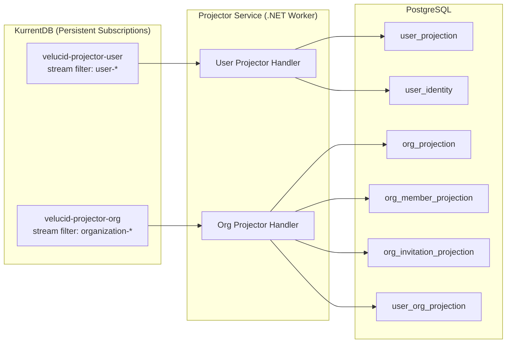

**Projector Idempotency:** Projectors handle events idempotently — re-processing an event produces the same result. Checkpointing is managed by KurrentDB's persistent subscription infrastructure (no separate checkpoint table needed). On restart, projectors resume from the last acknowledged position automatically.

**Projectors are separate from the Orleans silo.** They are independent .NET workers that subscribe to KurrentDB persistent subscriptions. They do not participate in the Orleans cluster. This separation ensures:
- Projectors can be scaled independently of the silo.
- Projector failures do not affect grain availability.
- Projectors can be rebuilt from KurrentDB at any time without touching the silo.

---

## 8. Key Workflow Sequence Diagrams

### 8.1 First-Time User Sign-In

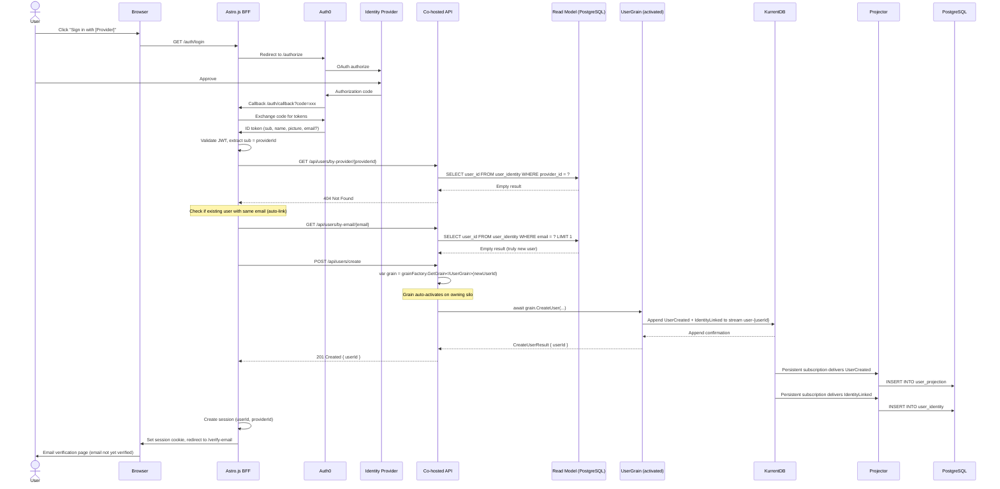

**Orleans difference:** The BFF calls a co-hosted API endpoint. The API controller uses `IGrainFactory` to get a grain reference — the grain activates on its first call, loading (empty) state from KurrentDB, processes the command, and persists events.

### 8.2 Email Verification

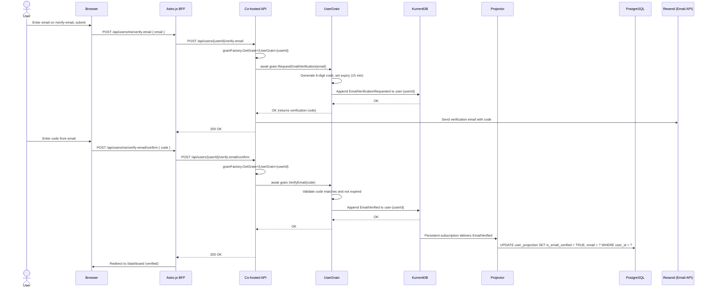

### 8.3 Returning User Sign-In

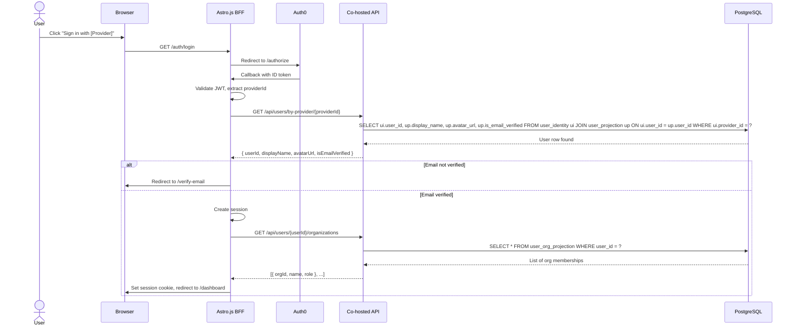

**Note:** The returning user sign-in flow is entirely read-path. No grain activation is needed because the user is not creating events — only reading from the PostgreSQL read model.

### 8.4 Create Organization

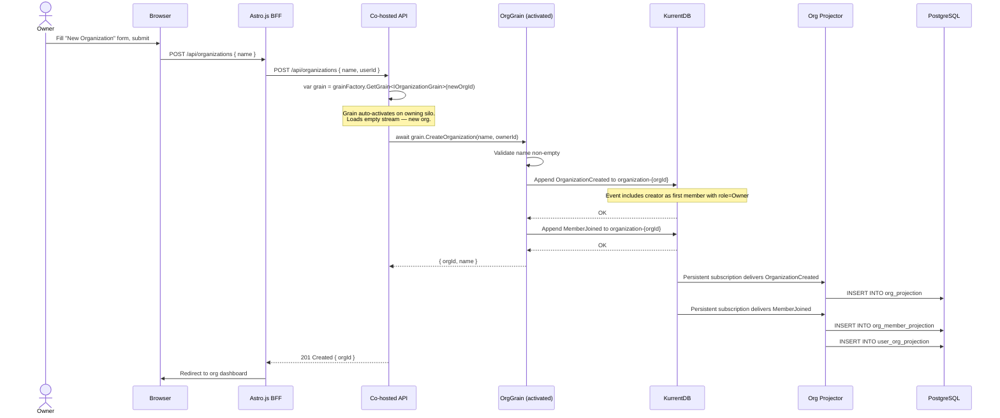

### 8.5 Invite and Accept Member

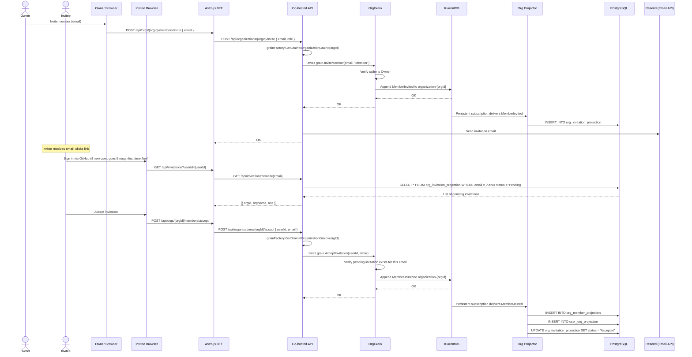

### 8.6 Organization Switching

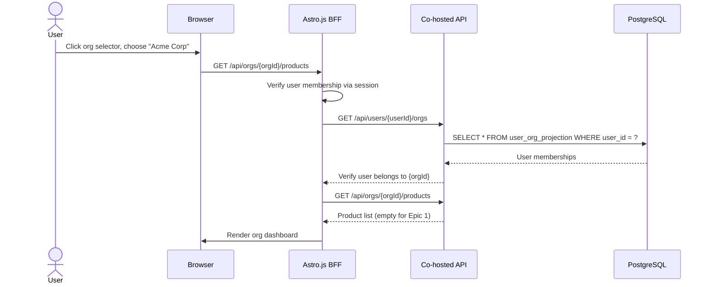

---

## 9. Infrastructure Setup (K3s)

### 9.1 K3s Installation

The platform runs on **K3s**, a lightweight certified Kubernetes distribution. K3s ships as a single binary, bundles Traefik as an ingress controller, and uses SQLite for its internal state (not to be confused with PostgreSQL used by the application).

```bash
# Install K3s on the dev machine (Linux/macOS via WSL2 on Windows)
curl -sfL https://get.k3s.io | sh -

# Verify installation
sudo k3s kubectl get nodes
```

All Velucid services run in the `velucid` namespace.

```yaml
# k8s/namespace.yaml
apiVersion: v1
kind: Namespace
metadata:
  name: velucid
  labels:
    app.kubernetes.io/part-of: velucid
```

### 9.2 Cloudflare Tunnel (Internet Ingress)

`cloudflared` runs as a K3s deployment and establishes an outbound-only connection to Cloudflare's edge network. Cloudflare DNS for `velucid.app` points to this tunnel — no static IP, no port forwarding needed.

**Setup:**
1. Create a Cloudflare Tunnel in the Cloudflare Zero Trust dashboard (or via CLI).
2. Store the tunnel credentials as a K8s secret.
3. Deploy `cloudflared` to the cluster.

```yaml
# k8s/cloudflared/secret.yaml
apiVersion: v1
kind: Secret
metadata:
  name: cloudflared-credentials
  namespace: velucid
type: Opaque
data:
  credentials.json: <base64-encoded tunnel credentials>
```

```yaml
# k8s/cloudflared/configmap.yaml
apiVersion: v1
kind: ConfigMap
metadata:
  name: cloudflared-config
  namespace: velucid
data:
  config.yaml: |
    tunnel: <tunnel-id>
    credentials-file: /etc/cloudflared/credentials.json
    ingress:
      - hostname: velucid.app
        service: http://traefik.kube-system.svc.cluster.local:80
      - hostname: "*.velucid.app"
        service: http://traefik.kube-system.svc.cluster.local:80
      - service: http_status:404
```

```yaml
# k8s/cloudflared/deployment.yaml
apiVersion: apps/v1
kind: Deployment
metadata:
  name: cloudflared
  namespace: velucid
spec:
  replicas: 1
  selector:
    matchLabels:
      app: cloudflared
  template:
    metadata:
      labels:
        app: cloudflared
    spec:
      containers:
        - name: cloudflared
          image: cloudflare/cloudflared:latest
          args: ["tunnel", "--config", "/etc/cloudflared/config.yaml", "run"]
          volumeMounts:
            - name: config
              mountPath: /etc/cloudflared/config.yaml
              subPath: config.yaml
              readOnly: true
            - name: credentials
              mountPath: /etc/cloudflared/credentials.json
              subPath: credentials.json
              readOnly: true
      volumes:
        - name: config
          configMap:
            name: cloudflared-config
        - name: credentials
          secret:
            secretName: cloudflared-credentials
```

**DNS configuration:** In the Cloudflare dashboard, create CNAME records pointing `velucid.app` and `*.velucid.app` to `<tunnel-id>.cfargotunnel.com`. Cloudflare handles TLS termination and DDoS protection at the edge.

**Traffic flow:**
```
User → velucid.app (Cloudflare DNS) → Cloudflare Edge (TLS termination)
  → Cloudflare Tunnel → cloudflared pod (K3s) → Traefik Ingress → velucid-frontend
```

### 9.3 Scaling to Multiple Machines (Tailscale + K3s)

When additional machines are needed, use **Tailscale** to create a flat mesh VPN and join K3s agent nodes:

```bash
# On each machine: install Tailscale and join the network
curl -fsSL https://tailscale.com/install.sh | sh
sudo tailscale up --authkey=tskey-auth-XXXX

# On the K3s server (Machine A): get the join token
sudo cat /var/lib/rancher/k3s/server/node-token

# On agent machines (B, C, ...): join the cluster using Tailscale IP
curl -sfL https://get.k3s.io | K3S_URL=https://<tailscale-ip-of-server>:6443 \
  K3S_TOKEN=<node-token> sh -
```

This is a future step — the initial deployment runs everything on a single machine. The K3s + Tailscale architecture ensures this scaling requires no application code changes.

### 9.4 KurrentDB StatefulSet

```yaml
# k8s/kurrentdb/statefulset.yaml (sketch)
apiVersion: apps/v1
kind: StatefulSet
metadata:
  name: velucid-kurrentdb
  namespace: velucid
spec:
  replicas: 1  # Single node for local development
  serviceName: velucid-kurrentdb
  selector:
    matchLabels:
      app: velucid-kurrentdb
  template:
    spec:
      containers:
        - name: kurrentdb
          image: kurrentdb/kurrentdb:latest
          ports:
            - containerPort: 2113  # HTTP/API
            - containerPort: 1113  # TCP
          env:
            - name: EVENTSTORE_INSECURE
              value: "true"
            - name: EVENTSTORE_RUN_PROJECTIONS
              value: "None"  # We project in .NET consumers
            - name: EVENTSTORE_DB
              value: "/data/db"
          volumeMounts:
            - name: data
              mountPath: /data
  volumeClaimTemplates:
    - metadata:
        name: data
      spec:
        accessModes: ["ReadWriteOnce"]
        storageClassName: local-path  # K3s default storage class
        resources:
          requests:
            storage: 10Gi
```

### 9.5 PostgreSQL StatefulSet

PostgreSQL serves double duty: Orleans clustering tables AND read model projections.

```yaml
# k8s/postgresql/statefulset.yaml (sketch)
apiVersion: apps/v1
kind: StatefulSet
metadata:
  name: velucid-postgresql
  namespace: velucid
spec:
  replicas: 1
  serviceName: velucid-postgresql
  selector:
    matchLabels:
      app: velucid-postgresql
  template:
    spec:
      containers:
        - name: postgresql
          image: postgres:16
          ports:
            - containerPort: 5432
          env:
            - name: POSTGRES_DB
              value: velucid_readmodel
            - name: POSTGRES_USER
              valueFrom:
                secretKeyRef:
                  name: velucid-postgresql-secret
                  key: username
            - name: POSTGRES_PASSWORD
              valueFrom:
                secretKeyRef:
                  name: velucid-postgresql-secret
                  key: password
          volumeMounts:
            - name: data
              mountPath: /var/lib/postgresql/data
  volumeClaimTemplates:
    - metadata:
        name: data
      spec:
        accessModes: ["ReadWriteOnce"]
        storageClassName: local-path
        resources:
          requests:
            storage: 5Gi
```

**Note:** Orleans clustering tables (`OrleansMembershipTable`, `OrleansMembershipVersionTable`) are created automatically by the Orleans ADO.NET clustering provider on first silo startup.

### 9.6 Orleans Silo Deployment

```yaml
# k8s/silo/deployment.yaml (sketch)
apiVersion: apps/v1
kind: Deployment
metadata:
  name: velucid-silo
  namespace: velucid
spec:
  replicas: 1  # Single silo on single machine; increase when scaling
  selector:
    matchLabels:
      app: velucid-silo
  template:
    spec:
      containers:
        - name: silo
          image: ghcr.io/lekhasy/vut/silo:latest
          ports:
            - containerPort: 5000  # HTTP API
            - containerPort: 11111 # Orleans silo-to-silo
            - containerPort: 30000 # Orleans gateway (client connections)
          env:
            - name: KurrentDb__ConnectionString
              value: "esdb://velucid-kurrentdb:2113?tls=false"
            - name: ConnectionStrings__PostgreSQL
              value: "Host=velucid-postgresql;Database=velucid_readmodel;Username=velucid_app;Password=$(POSTGRESQL_PASSWORD)"
            - name: Orleans__ClusterId
              value: "velucid-cluster"
            - name: Orleans__ServiceId
              value: "velucid"
            - name: Auth0__Domain
              valueFrom:
                secretKeyRef:
                  name: velucid-auth0-secret
                  key: domain
            - name: Auth0__Audience
              valueFrom:
                secretKeyRef:
                  name: velucid-auth0-secret
                  key: audience
```

**Note:** The silo starts with 1 replica on a single machine. When additional K3s nodes join via Tailscale, increase replicas and K8s schedules new silo pods across available nodes. Orleans discovers new silos via the PostgreSQL membership table — no configuration changes needed.

### 9.7 Frontend Deployment (Astro.js BFF)

```yaml
# k8s/frontend/deployment.yaml (sketch)
apiVersion: apps/v1
kind: Deployment
metadata:
  name: velucid-frontend
  namespace: velucid
spec:
  replicas: 1
  selector:
    matchLabels:
      app: velucid-frontend
  template:
    spec:
      containers:
        - name: frontend
          image: ghcr.io/lekhasy/vut/frontend:latest
          ports:
            - containerPort: 3000
          env:
            - name: SILO_API_URL
              value: "http://velucid-silo:5000"
            - name: AUTH0_DOMAIN
              valueFrom:
                secretKeyRef:
                  name: velucid-auth0-secret
                  key: domain
            - name: AUTH0_CLIENT_ID
              valueFrom:
                secretKeyRef:
                  name: velucid-auth0-secret
                  key: client-id
            - name: AUTH0_CLIENT_SECRET
              valueFrom:
                secretKeyRef:
                  name: velucid-auth0-secret
                  key: client-secret
```

### 9.8 GitOps CI/CD Pipeline (GitHub Actions + ArgoCD)

The deployment pipeline follows **GitOps** principles: every change starts from a git commit on GitHub, images are built by GitHub Actions, stored on ghcr.io, and ArgoCD automatically syncs the K3s cluster to match the desired state in git.

#### 9.8.1 Pipeline Flow

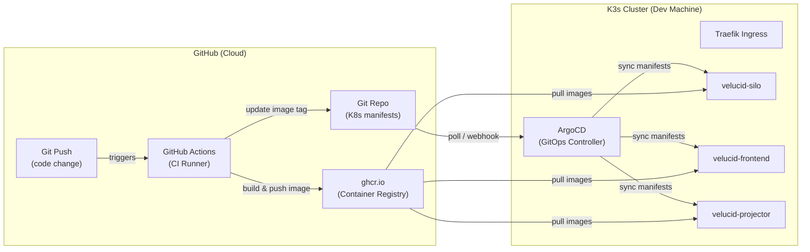

#### 9.8.2 GitHub Actions Workflow

```yaml
# .github/workflows/ci.yaml
name: Build & Deploy

on:
  push:
    branches: [main]
    paths:
      - 'backend/**'
      - 'frontend/**'

env:
  REGISTRY: ghcr.io
  IMAGE_PREFIX: ghcr.io/lekhasy/vut

jobs:
  build-silo:
    runs-on: ubuntu-latest
    permissions:
      contents: write
      packages: write
    steps:
      - uses: actions/checkout@v4

      - name: Log in to GitHub Container Registry
        uses: docker/login-action@v3
        with:
          registry: ${{ env.REGISTRY }}
          username: ${{ github.actor }}
          password: ${{ secrets.GITHUB_TOKEN }}

      - name: Build and push silo image
        uses: docker/build-push-action@v5
        with:
          context: ./backend
          file: ./backend/Dockerfile
          push: true
          tags: |
            ${{ env.IMAGE_PREFIX }}/silo:${{ github.sha }}
            ${{ env.IMAGE_PREFIX }}/silo:latest

      - name: Update K8s manifest with new image tag
        run: |
          sed -i "s|image: ${{ env.IMAGE_PREFIX }}/silo:.*|image: ${{ env.IMAGE_PREFIX }}/silo:${{ github.sha }}|" \
            k8s/silo/deployment.yaml
          git config user.name "github-actions[bot]"
          git config user.email "github-actions[bot]@users.noreply.github.com"
          git add k8s/
          git commit -m "chore: update silo image to ${{ github.sha }}" || true
          git push

  build-frontend:
    runs-on: ubuntu-latest
    permissions:
      contents: write
      packages: write
    steps:
      - uses: actions/checkout@v4

      - name: Log in to GitHub Container Registry
        uses: docker/login-action@v3
        with:
          registry: ${{ env.REGISTRY }}
          username: ${{ github.actor }}
          password: ${{ secrets.GITHUB_TOKEN }}

      - name: Build and push frontend image
        uses: docker/build-push-action@v5
        with:
          context: ./frontend
          file: ./frontend/Dockerfile
          push: true
          tags: |
            ${{ env.IMAGE_PREFIX }}/frontend:${{ github.sha }}
            ${{ env.IMAGE_PREFIX }}/frontend:latest

      - name: Update K8s manifest with new image tag
        run: |
          sed -i "s|image: ${{ env.IMAGE_PREFIX }}/frontend:.*|image: ${{ env.IMAGE_PREFIX }}/frontend:${{ github.sha }}|" \
            k8s/frontend/deployment.yaml
          git config user.name "github-actions[bot]"
          git config user.email "github-actions[bot]@users.noreply.github.com"
          git add k8s/
          git commit -m "chore: update frontend image to ${{ github.sha }}" || true
          git push
```

**Note:** For an open-source repository, GitHub Actions runners and ghcr.io storage are free with no minute limits.

#### 9.8.3 ArgoCD Installation & Configuration

```bash
# Install ArgoCD into the K3s cluster
kubectl create namespace argocd
kubectl apply -n argocd -f https://raw.githubusercontent.com/argoproj/argo-cd/stable/manifests/install.yaml

# Expose ArgoCD UI via Cloudflare Tunnel (optional: add to cloudflared config)
# Or access locally:
kubectl port-forward svc/argocd-server -n argocd 8080:443
```

#### 9.8.4 ArgoCD Application Manifest

```yaml
# k8s/argocd/application.yaml
apiVersion: argoproj.io/v1alpha1
kind: Application
metadata:
  name: velucid
  namespace: argocd
spec:
  project: default
  source:
    repoURL: https://github.com/lekhasy/Vut.git
    targetRevision: main
    path: k8s
    directory:
      recurse: true
  destination:
    server: https://kubernetes.default.svc
    namespace: velucid
  syncPolicy:
    automated:
      prune: true      # Remove resources deleted from git
      selfHeal: true    # Revert manual changes to match git
    syncOptions:
      - CreateNamespace=true
```

**Key behaviors:**
- **Automated sync**: ArgoCD polls the git repo (default: every 3 minutes) and applies any changes to K8s manifests.
- **Self-heal**: If someone manually changes a resource in K3s, ArgoCD reverts it to match git — git is the single source of truth.
- **Prune**: Resources removed from git are deleted from the cluster.
- **Webhook (optional)**: Configure a GitHub webhook to ArgoCD for instant sync on push instead of waiting for the poll interval.

#### 9.8.5 Deployment Flow (End-to-End)

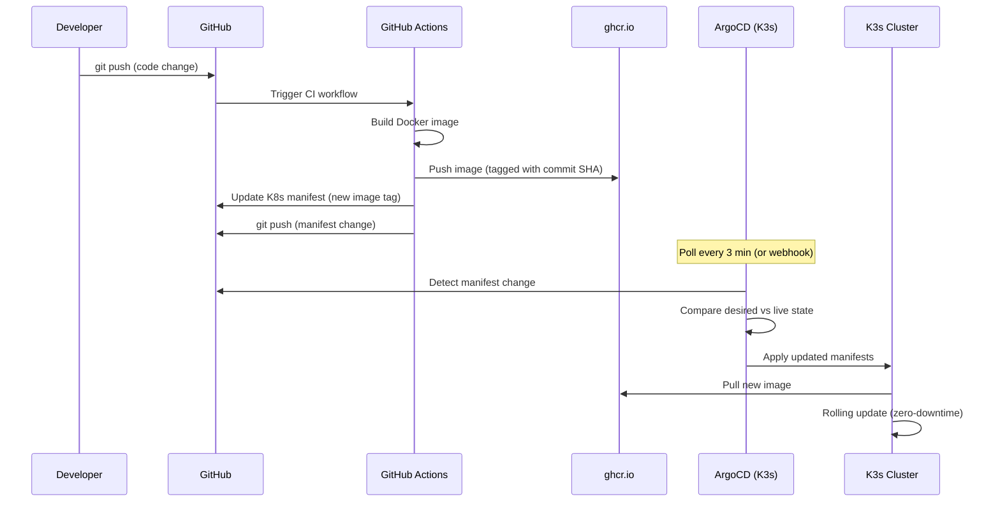

---

## 10. Auth0 Integration Architecture

### 10.1 Authentication Flow

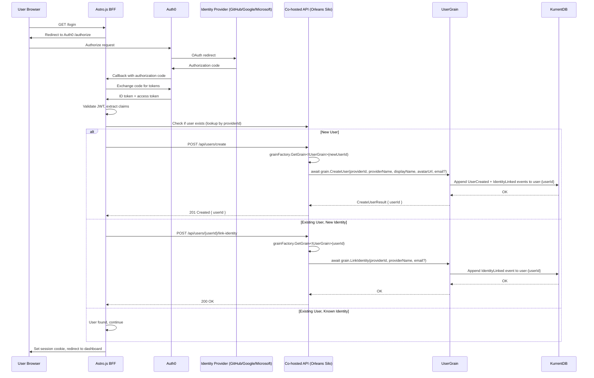

### 10.2 JWT Claims Used

Auth0 token includes these claims that Velucid extracts:
- `sub`: The Auth0 user ID (format varies by provider: `github|12345678`, `google-oauth2|1234567890`, `windowslive|1234567890`)
- `nickname`: Username (provider-specific)
- `name`: Display name
- `picture`: Avatar URL
- `email`: Email address (nullable — identity providers do not guarantee this; e.g., GitHub users may have no public email)

The `sub` claim's prefix identifies the provider. Velucid uses this as the `providerId` and stores it alongside a `providerName` in the `user_identity` table to support multiple login providers per user.

### 10.3 Auth Middleware

The BFF validates the JWT on every request:
1. Extract Bearer token or session cookie
2. Validate JWT signature against Auth0 JWKS
3. Extract `sub` claim as the Velucid `providerId`
4. Look up the Velucid `userId` from the read model using `user_identity` table: `SELECT user_id FROM user_identity WHERE provider_id = ?`
5. Attach `userId` and `providerId` to the request context as the `actorId` for all commands

If a user logs in with a new provider and the provider returns an email that matches an existing user, the BFF auto-links the identity (see Section 8.1). Auto-linking is only possible when the provider returns an email — it is skipped when email is null.

---

## 11. API Design (BFF Endpoints)

### 11.1 Authentication Endpoints

| Method | Path | Description |
|--------|------|-------------|
| GET | `/auth/login` | Initiates Auth0 login flow (redirect) |
| GET | `/auth/callback` | Auth0 callback, exchanges code, creates/retrieves user, auto-links identity by email if matched (only when provider returns email) |
| POST | `/auth/logout` | Clears session, redirects to Auth0 logout |

### 11.2 User Endpoints

| Method | Path | Description |
|--------|------|-------------|
| GET | `/api/users/me` | Current user profile (includes `isEmailVerified`) |
| PATCH | `/api/users/me` | Update display name / avatar |
| GET | `/api/users/me/identities` | List linked identity providers |
| DELETE | `/api/users/me/identities/{providerId}` | Unlink an identity provider (must keep at least one) |

### 11.3 Email Verification Endpoints

| Method | Path | Description |
|--------|------|-------------|
| POST | `/api/users/me/verify-email` | Request email verification (sends code to given email) |
| POST | `/api/users/me/verify-email/confirm` | Submit verification code to confirm email |

### 11.4 Organization Endpoints

| Method | Path | Description |
|--------|------|-------------|
| POST | `/api/organizations` | Create organization |
| GET | `/api/organizations` | List user's organizations |
| GET | `/api/organizations/{orgId}` | Get org details |
| PATCH | `/api/organizations/{orgId}` | Rename organization |
| GET | `/api/organizations/{orgId}/members` | List members |
| POST | `/api/organizations/{orgId}/members/invite` | Invite member |
| POST | `/api/organizations/{orgId}/members/accept` | Accept invitation |
| POST | `/api/organizations/{orgId}/members/decline` | Decline invitation |
| DELETE | `/api/organizations/{orgId}/members/{userId}` | Remove member |
| PATCH | `/api/organizations/{orgId}/members/{userId}/role` | Change role |

### 11.5 Invitation Endpoints

| Method | Path | Description |
|--------|------|-------------|
| GET | `/api/invitations` | List pending invitations for current user |

### 11.6 Internal Lookup Endpoints (BFF-to-API)

| Method | Path | Description |
|--------|------|-------------|
| GET | `/api/users/by-provider/{providerId}` | Look up user by any linked provider identity |
| GET | `/api/users/by-email/{email}` | Look up user by email (for auto-linking; only usable when provider returns email) |

---

## 12. Frontend Architecture

### 12.1 Astro.js SPA Shell

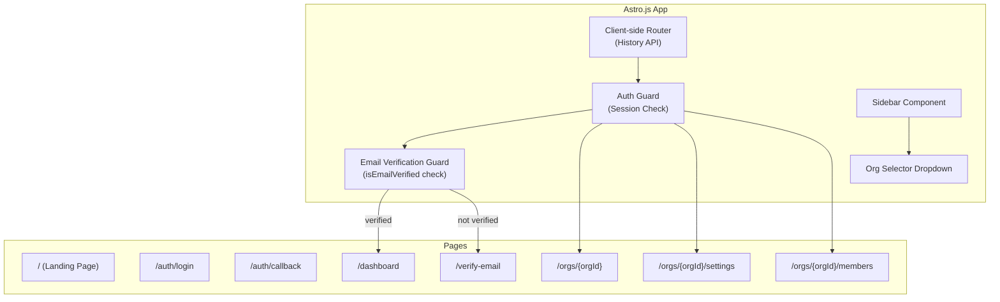

### 12.2 Client-Side State

The Astro.js frontend maintains a minimal client-side state store:
- `currentUser`: The logged-in user's profile (includes `isEmailVerified`)
- `identities`: List of linked identity providers for the current user
- `organizations`: List of orgs the user belongs to
- `currentOrgId`: The currently selected organization
- `pendingInvitations`: Invitations awaiting response

State is hydrated from the read model API on initial page load and kept fresh via refetch on navigation.

### 12.3 Authorization Model (Frontend)

```mermaid
flowchart TD
    Request[API Request] --> CheckSession{Session exists?}
    CheckSession -->|No| Redirect[Redirect to /auth/login]
    CheckSession -->|Yes| ExtractUserId[Extract userId from session]
    ExtractUserId --> CheckEmail{Email verified?}
    CheckEmail -->|No| VerifyPage[Redirect to /verify-email]
    CheckEmail -->|Yes| CheckMembership{Belongs to org?}
    CheckMembership -->|No| Deny[403 Forbidden]
    CheckMembership -->|Yes| CheckRole{Required role?}
    CheckRole -->|Owner only| IsOwner{Is Owner?}
    IsOwner -->|Yes| Allow[Allow]
    IsOwner -->|No| Deny
    CheckRole -->|Any member| Allow
```

---

## 13. Data Flow Summary

```mermaid
flowchart LR
    subgraph Write Path
        CMD[Command] --> GRAIN["Orleans Grain<br/>(virtual actor)"]
        GRAIN --> ES[KurrentDB<br/>Append Event]
    end

    subgraph Project Path
        ES --> PS[KurrentDB Persistent<br/>Subscription]
        PS --> PG[(PostgreSQL<br/>Projection)]
    end

    subgraph Read Path
        API[Co-hosted API] --> PG
        UI[Browser SPA] --> API
    end
```

**Write Path:** Browser → BFF → Co-hosted API → Orleans Grain (auto-activation) → KurrentDB
**Project Path:** KurrentDB (persistent subscription) → Projector → PostgreSQL
**Read Path:** Browser → BFF → Co-hosted API → PostgreSQL

This separation ensures:
- Writes are always consistent (KurrentDB is the source of truth)
- Reads are eventually consistent (projection lag is typically <100ms)
- Projections can be rebuilt from KurrentDB at any time
- Grains are stateless across activations (state is rehydrated from KurrentDB)

---

## 14. Error Handling & Resilience

### 14.1 Grain Failure Recovery

```mermaid
sequenceDiagram
    participant Client as API Controller
    participant Runtime as Orleans Runtime
    participant Silo1 as Silo A (failed)
    participant Silo2 as Silo B (takes over)
    participant Grain as OrgGrain (re-activated)
    participant K as KurrentDB

    Client->>Runtime: GetGrain<IOrganizationGrain>(orgId)
    Runtime->>Silo1: Route to Silo A (placement owner)
    Silo1--xRuntime: Silo A crashed
    Runtime->>Runtime: Detect failure via membership protocol
    Runtime->>Runtime: Re-place grain on Silo B
    Runtime->>Silo2: Activate grain on Silo B
    Silo2->>Grain: OnActivateAsync()
    Grain->>K: Load events from organization-{orgId}
    K-->>Grain: Full event stream
    Grain->>Grain: Replay all events, rebuild state
    Grain-->>Silo2: Ready
    Silo2-->>Client: Deliver pending call result
```

**Key resilience properties:**
- If a silo crashes, all grains on that silo are lost from memory but their events are safe in KurrentDB.
- Orleans detects silo failure via the membership protocol (PostgreSQL-backed heartbeats).
- Grains re-activate on surviving silos by re-hydrating from KurrentDB — state is never lost.
- The client receives a transparent retry; the grain appears to survive the failure.
- On a single-machine K3s deployment, K8s restarts crashed pods automatically. When scaled to multiple machines via Tailscale, Orleans re-places grains on silos running on other machines if one machine goes offline.

### 14.2 Timeout & Retry Strategy

| Scenario | Strategy |
|----------|----------|
| Grain activation timeout (slow KurrentDB) | Orleans has configurable activation timeout; API returns 503 if exceeded |
| API call to grain timeout | API returns 503 Service Unavailable to the browser |
| KurrentDB append failure | Grain throws exception to caller; no event is persisted; client can retry |
| Projector failure (PostgreSQL down) | KurrentDB persistent subscription retries; events are not acked until projection succeeds |
| Silo-to-silo communication failure | Orleans runtime retries grain calls transparently; re-places grain if silo is dead |
| PostgreSQL clustering table unavailable | Existing silos continue operating with stale membership; new silos cannot join until PostgreSQL recovers |

### 14.3 Idempotency

- **Grain methods** must be idempotent where possible. `CreateUser` returns the existing userId if the user already exists. `LinkIdentity` is a no-op if already linked.
- **Projector handlers** are idempotent by design — re-processing an event produces the same database state (UPSERT semantics).
- **BFF requests** should use idempotency keys for mutating operations to prevent duplicate command submission on network retries.

---

## 15. Performance Considerations

### 15.1 Grain Activation Cost

Grain activation requires loading events from KurrentDB. For aggregates with long event histories, this can be slow. Mitigations:

1. **Snapshotting**: Periodically save a snapshot of the grain state to KurrentDB (using a separate snapshot stream, e.g., `user-{userId}-snapshot`). On activation, load the latest snapshot and only replay events after it.
   - Recommended snapshot interval: every 50 events or when event count exceeds 100.

2. **Deactivation tuning**: Set `GrainCollectionOptions.CollectionAge` to balance memory usage vs. activation cost.
   - Short timeout (5 min): Frequent re-activations, low memory usage.
   - Long timeout (60 min): Fewer activations, higher memory usage.
   - Recommended starting point: 30 minutes, adjustable per grain type.

3. **Cold start optimization**: For grains that are accessed predictably (e.g., org grains during business hours), consider warming them up by calling a no-op method on deployment.

### 15.2 Read Path Performance

- PostgreSQL indexes are optimized for the query patterns in the API endpoints (see Section 7.2).
- The co-hosted API should use connection pooling (Npgsql's built-in pooling) and prepared statements.
- For large result sets (e.g., orgs with many members), implement pagination.

### 15.3 Write Path Performance

- Grain calls within the same silo are local (in-process). Grain calls across silos use Orleans' binary serialization protocol.
- KurrentDB appends are single-digit millisecond latency for small events.
- The write path (API → grain → KurrentDB) should complete in under 50ms for most commands.
- On a single-machine deployment, all grain calls are local (one silo). When scaled to multiple machines via Tailscale, cross-silo calls traverse the Tailscale mesh (typically 1-10ms latency on a LAN, 10-50ms over WAN). This is acceptable for Velucid's workload.

### 15.4 Co-hosting Performance Benefit

By co-hosting the API and Orleans silo in the same process:
- Local grain calls avoid network serialization entirely.
- The Orleans gateway port (30000) allows cross-silo calls when a grain is on a different silo.
- On a single-machine deployment, 100% of grain calls are local. When scaled across machines, approximately 1/N of grain calls will be local (where N is the number of silos), reducing latency for those calls to near-zero.

---

## 16. Security Considerations

### 16.1 Authentication & Authorization

- **Auth**: Third-party identity provider (Auth0). No stored passwords.
- **Authorization**: Role-based access at the organization level (owner vs. member). Product access is inherited from org membership.
- **Tenant Isolation**: All queries are scoped to the user's organization memberships. Cross-org data access is prevented at the API layer.
- **Event Store**: KurrentDB access is restricted to the backend services; no direct client access.
- **HTTPS Only**: All communication is over TLS.
- **No Secrets in Events**: Events never contain authentication tokens or sensitive credentials.

### 16.2 Cluster Security

- **Cloudflare Tunnel** is the only path from the internet to the K3s cluster. The `cloudflared` daemon initiates an outbound-only connection — no inbound ports are opened on the dev machine's router or firewall. Cloudflare provides DDoS protection, TLS termination, and bot mitigation at the edge.
- **K3s internal traffic** uses mutual TLS by default for Kubernetes API communication.
- **Silo-to-silo communication** should use mutual TLS in production. Orleans supports TLS for inter-silo traffic.
- **PostgreSQL** (clustering + read model) should require authentication. On a single machine, it runs within the K3s cluster network.
- **KurrentDB** should require authentication and is only accessible within the K3s cluster network.
- **Orleans silo ports** (11111, 30000) must not be exposed outside the cluster — only internal K3s traffic.
- **Tailscale (multi-machine scaling)**: When machines are connected via Tailscale, all traffic between nodes is encrypted end-to-end (WireGuard). Tailscale ACLs should restrict access to the K3s cluster ports. No additional VPN or network configuration is needed — Tailscale handles NAT traversal and encryption transparently.

### 16.3 Input Validation

- All commands are validated in the grain before events are emitted.
- The API performs basic input validation (non-empty strings, valid email format) before calling grains.
- KurrentDB streams are append-only — events cannot be tampered with after persistence.

---

## 17. Cross-Cutting Concerns Established in Epic 1

These patterns, once established in Epic 1, are reused by all subsequent epics:

| Concern | Implementation | Reused By |
|---------|---------------|-----------|
| Orleans silo configuration | `UseOrleans()` with PostgreSQL clustering via ADO.NET | Epics 2-6 |
| Grain type registration | DI-based grain registration (auto-discovered) | Epics 2-6 (add `IProductGrain`, `ITaskGrain`) |
| Event-sourced grain base | `EventSourcedGrain<TState>` with KurrentDB .NET client | Epics 2-6 |
| Event envelope with actorId + timestamp | Standardized JSON envelope in grain events | Epics 2-6 |
| KurrentDB stream append | Shared `EventStoreClient` via DI | Epics 2-6 |
| Projector service (KurrentDB subscription, project) | Shared projector framework | Epics 2-6 |
| BFF session management + Auth0 | Astro.js middleware | Epics 2-6 |
| Authorization middleware (org membership check) | API request pipeline | Epics 2-6 |
| K3s manifests pattern | Deployment + Service + ConfigMap (Tailscale for multi-machine) | Epics 2-6 |
| Grain deactivation via CollectionAge | Configurable timeout per grain type | Epics 2-6 |
| Co-hosted API pattern | ASP.NET Core controllers inside Orleans silo | Epics 2-6 |

### Migration Notes for Epics 2-6

When adding new aggregate types (Product, Task), follow this pattern:

1. **Define the grain interface** inheriting from `IGrainWithGuidKey`.
2. **Implement the grain class** inheriting from `EventSourcedGrain<TState>`.
3. **Define events and state** for the new aggregate.
4. **Add API controllers** that use `IGrainFactory.GetGrain<IProductGrain>(productId)`.
5. **Add a projector handler** for the new stream type.
6. **Add read model tables** for the new projections.
7. **Add BFF routes** that call the co-hosted API.

No changes to the cluster topology, PostgreSQL clustering configuration, or base infrastructure are needed. Orleans scales horizontally by adding more silo pods. When scaling to multiple machines, join new K3s agent nodes via Tailscale and increase silo replicas.

---

## 18. Technology Decisions for Epic 1

| Decision | Choice | Rationale |
|----------|--------|-----------|
| Actor framework | Microsoft Orleans | Virtual actors with built-in clustering (PostgreSQL), native ASP.NET Core integration, strongly-typed grain interfaces, large ecosystem, Microsoft-backed. |
| Event store | KurrentDB (EventStoreDB) | PRD requirement. Purpose-built for event sourcing with stream-based storage. |
| Event sourcing in grains | Custom `EventSourcedGrain<TState>` base + `EventStore.Client` | Direct KurrentDB integration via official .NET client. Simpler than building a custom `ILogConsistencyProvider` for Orleans' `JournaledGrain`. |
| Cluster provider | PostgreSQL (ADO.NET) | Reuses existing PostgreSQL infrastructure. No additional message broker dependency. Enables zero-config multi-silo scaling. |
| Container orchestration | K3s (lightweight Kubernetes) | Single-binary K8s distribution. Runs on a single dev machine with minimal resources. Bundled Traefik ingress. Same K8s API as production — manifests are portable. |
| Multi-machine networking | Tailscale (future) | WireGuard-based mesh VPN. Zero-config NAT traversal, end-to-end encryption, flat network for K3s node joining. |
| Internet ingress | Cloudflare Tunnel | Outbound-only tunnel from K3s to Cloudflare edge. No static IP or port forwarding needed. Free tier includes DDoS protection, TLS termination, and custom domain support (`velucid.app`). |
| CI/CD pipeline | GitHub Actions | Free unlimited minutes for open-source repos. Builds Docker images and pushes to ghcr.io on every push to `main`. |
| Container registry | ghcr.io (GitHub Container Registry) | Free for public repos. Tightly integrated with GitHub Actions — authenticates with `GITHUB_TOKEN`, no extra credentials. |
| GitOps controller | ArgoCD | Watches the git repo for K8s manifest changes and auto-syncs to K3s. Self-heal and prune ensure the cluster always matches git. Web UI for deployment visibility. |
| Read model | PostgreSQL | PRD requirement. Mature, reliable, supports the complex queries needed for projections and the cumulative flow (Epic 5). Also hosts Orleans clustering tables. |
| API hosting | Co-hosted in Orleans silo (ASP.NET Core) | Reduces network hops. API controllers call grains in-process via `IGrainFactory`. Can be separated later if needed. |
| Frontend | Astro.js + Tailwind CSS | PRD requirement. SSR-capable, island architecture for selective hydration, excellent performance. |
| Auth | Auth0 | PRD requirement. Managed service, supports GitHub SSO and future providers. |
| Serialization | System.Text.Json (JSON) | Native .NET, high performance, no external dependency. |
| ID generation | UUID v4 | Globally unique, no coordination needed, safe for distributed grain creation. |
| Session management | HTTP-only cookie (BFF) | Secure, no token exposure to JavaScript, BFF validates JWT server-side. |
| Email service | Resend | Modern email API with .NET SDK. 3,000 emails/month free tier — sufficient for verification codes and invitation emails. Simple REST/SDK integration, no SMTP relay configuration needed. |
| Grain placement | Default (consistent hash) | Orleans' default placement distributes grains evenly across silos. Custom placement is not needed for Velucid's access patterns. |

---

## 19. Open Questions

1. **Snapshot frequency for grains:** What is the optimal snapshot interval? Recommendation is every 50 events, but this should be validated with real-world data from production usage.

2. **Grain-to-grain communication:** When an Organization grain needs to validate that a User exists (e.g., for `AcceptInvitation`), should it call the User grain directly, or rely on the read model? Direct grain-to-grain calls provide strong consistency but add latency and coupling. Read model checks are eventually consistent but simpler. Recommendation: use read model checks for cross-aggregate validation; use grain-to-grain calls only when strong consistency is required.

3. **Co-hosting vs. separate API:** The architecture co-hosts the API inside the Orleans silo for simplicity. If the API needs to scale independently from the grain workload, it can be extracted into a separate Orleans client process. When should this separation be considered?

4. **Concurrency handling for grains:** Orleans processes calls one at a time per grain (actor model guarantee). However, if a grain receives concurrent requests from different API instances, they are queued. Is this acceptable for all use cases, or do we need request-response patterns with timeouts? (Orleans supports `[Reentrant]` grains for concurrent processing where safe.)

5. **Monitoring and observability:** How should grain activation, deactivation, and event processing be monitored? Recommendation: use OpenTelemetry for distributed tracing across the API, silo, and projectors. Export to a Prometheus/Grafana stack. Orleans has built-in `IIncomingGrainCallFilter` and `IOutgoingGrainCallFilter` for adding tracing to grain calls.

6. **Component library selection:** Astro.js + Tailwind CSS is confirmed, but the specific component library is TBD. Options include Headless UI, Radix, or a purpose-built minimal set.

7. **Projection recalculation strategy:** When statuses are renamed or removed in a product, how are historical events and the cumulative flow diagram affected? Options: (a) rewrite historical events, (b) maintain a status name mapping, (c) show legacy names for historical data.

8. **Projection confidence model:** The exact statistical model for the projected completion date needs to be selected during implementation.

9. **Organization deletion semantics:** When an organization is deleted, are events soft-deleted (marked as deleted) or hard-deleted from KurrentDB?

10. **Tag namespace registry:** Should tags be strictly validated against known namespaces, or is any `namespace:value` string accepted? The PRD assumes free-form, but a registry would enable better autocomplete and consistency.

11. **Minimum data threshold for projections:** How many data points (days of status transitions) are needed before the cumulative flow diagram shows a projected completion date?

12. **Email change flow:** Should users be able to change their verified email after the initial verification? If so, what is the flow?

13. **Orleans version:** Should the project target Orleans 8.x (current stable) or a preview of a newer version? Recommendation: Orleans 8.x (latest stable) targeting .NET 9 or .NET 10.

14. **Multi-machine storage strategy:** When scaling to multiple machines via Tailscale, should PostgreSQL and KurrentDB remain on a single "primary" machine, or should they be replicated? Recommendation: keep stateful services on a single designated machine initially; use PostgreSQL streaming replication and KurrentDB clustering only if availability requirements justify the operational complexity.

15. **K3s persistent storage across machines:** K3s' default `local-path` provisioner binds PVCs to the node where they were created. When scaling to multiple machines, should Longhorn or another distributed storage solution be used for StatefulSet volumes?

16. **Always-on node designation:** In a multi-machine Tailscale cluster, should one machine be designated as "always-on" (e.g., a NAS or home server) for stateful services, or should all machines be treated equally?
