# Epic 1 Architecture: First Sign-In & Organization (Virtual Actor Redesign)

## 1. System Context

Epic 1 establishes the entire infrastructure footprint of Vut. Every subsequent epic builds on the virtual actors, streams, projections, and deployment infrastructure defined here.

The architecture uses **Proto.Actor virtual actors (grains)** instead of a manual Actor Manager pattern. Virtual actors are identified by cluster identity (kind + entity ID), auto-activate on first message, and are location-transparent. There are no manager actors, no manual PID lookup, and no manual spawning logic.

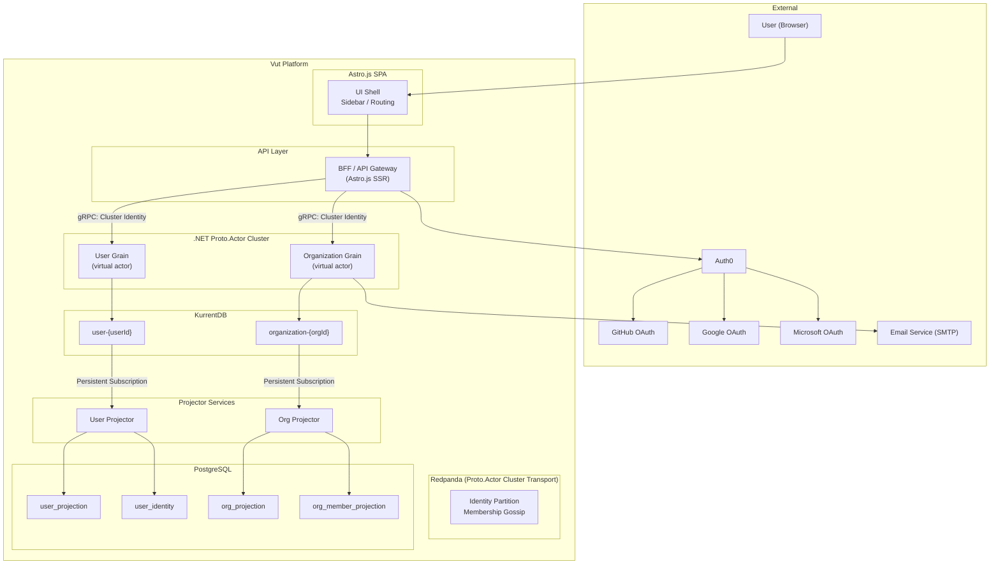

**Key difference from the previous design:** The BFF no longer communicates with an "Actor Service" intermediary. Instead, the BFF (or a thin gRPC gateway) sends messages directly to virtual actors via cluster identity. The actors are auto-activated by Proto.Actor's runtime -- no manager spawns them.

---

## 2. Why Virtual Actors

### 2.1 Problems with the Actor Manager Pattern

The previous design used an `ActorManagerBase<TActor>` pattern where dedicated manager actors manually handled PID lookup, actor spawning, hydration from KurrentDB, and passivation. This introduced several issues:

1. **Manager bottleneck**: Every command for any user or org flows through a single manager actor per kind, creating a serialization point.
2. **Manual lifecycle bookkeeping**: The manager must track which actors exist, which are idle, which need rehydration -- duplicating what virtual actors handle natively.
3. **PID caching complexity**: Managers must maintain a dictionary of PIDs, invalidate on passivation, and refresh on re-activation.
4. **Failure recovery gaps**: If a manager crashes, all its tracked PIDs are lost. Recovery requires re-discovering or re-spawning actors.
5. **Single-node affinity**: The manager pattern assumes all actors of a kind are local to the manager's node, defeating cluster distribution.

### 2.2 What Virtual Actors Solve

Virtual actors in Proto.Actor address every one of these problems:

| Concern | Actor Manager Pattern | Virtual Actor (Grain) |
|---------|----------------------|----------------------|
| Actor location | Manager looks up PID in dictionary | Cluster identity partitioning; runtime resolves location |
| Actor creation | Manager spawns on first message | Runtime auto-activates on first message |
| Actor lifecycle | Manager tracks Loading/Active/Idle/Passivated | Runtime manages activation; grain uses ReceiveTimeout for passivation |
| Failover | Manager must re-spawn lost actors | Runtime re-activates on another node automatically |
| Distribution | Manager is a single node | Grains are distributed across cluster by identity hash |
| Code surface | ActorManagerBase<TActor> + custom logic per kind | Just the grain itself; no manager needed |

### 2.3 Trade-offs Acknowledged

- **Less explicit control**: Virtual actors hide lifecycle details. If you need fine-grained control over when actors are deactivated, the implicit model requires trust in the runtime.
- **Debugging complexity**: Location transparency means a grain may be on any node. Tracing requires correlation IDs propagated through the cluster.
- **Learning curve**: Virtual actor semantics differ from local actors. The team must understand activation, passivation, and identity-based routing.

These trade-offs are acceptable because Vut's aggregate actors (User, Organization, Product, Task) are natural grain candidates -- they are identified by ID, have independent lifecycles, and need no hierarchical supervision beyond crash-restart.

---

## 3. Component Diagram

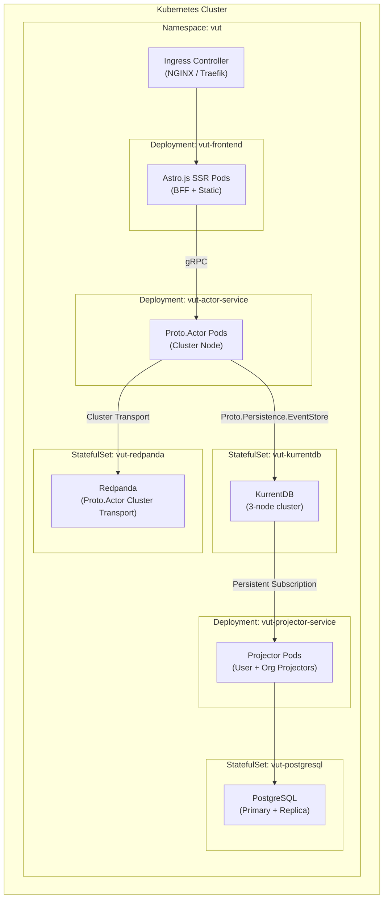

**Key change**: The actor service is now a homogeneous Proto.Actor cluster node. Every pod runs the same code and can host any grain kind. There are no "manager" pods or special roles. The cluster provider (Redpanda) handles membership and identity partitioning.

---

## 4. Cluster Topology & Placement

### 4.1 Cluster Configuration

Every `vut-actor-service` pod joins the Proto.Actor cluster on startup. The cluster is configured with:

- **Cluster Provider**: Redpanda (Kafka-compatible) for membership gossip
- **Identity Lookup**: Partition identity lookup (hash-based partitioning of grain identities across nodes)
- **Cluster Kinds**: Registered at startup for each aggregate type

```csharp
// Pseudocode -- Cluster configuration at startup
var clusterConfig = ClusterConfig.Setup(
    clusterName: "vut-cluster",
    clusterProvider: new RedpandaProvider(new RedpandaConfig("vut-redpanda:9092")),
    identityLookup: new PartitionIdentityLookup(),
    kinds: new[]
    {
        ClusterKind.Get("user", GetUserGrainProps()),
        ClusterKind.Get("organization", GetOrganizationGrainProps()),
    }
);

var cluster = new Cluster(system, clusterConfig);
await cluster.StartAsync();
```

### 4.2 Cluster Kinds

| Cluster Kind | Identity Format | Grain Type | Description |
|-------------|----------------|------------|-------------|
| `user` | `{userId}` (UUID) | `UserGrain` | One grain per Vut user |
| `organization` | `{orgId}` (UUID) | `OrganizationGrain` | One grain per Vut organization |

Future epics will register additional kinds:

| Cluster Kind | Identity Format | Grain Type | Epic |
|-------------|----------------|------------|------|
| `product` | `{productId}` (UUID) | `ProductGrain` | Epic 2 |
| `task` | `{taskId}` (UUID) | `TaskGrain` | Epic 3 |

### 4.3 Identity Partitioning

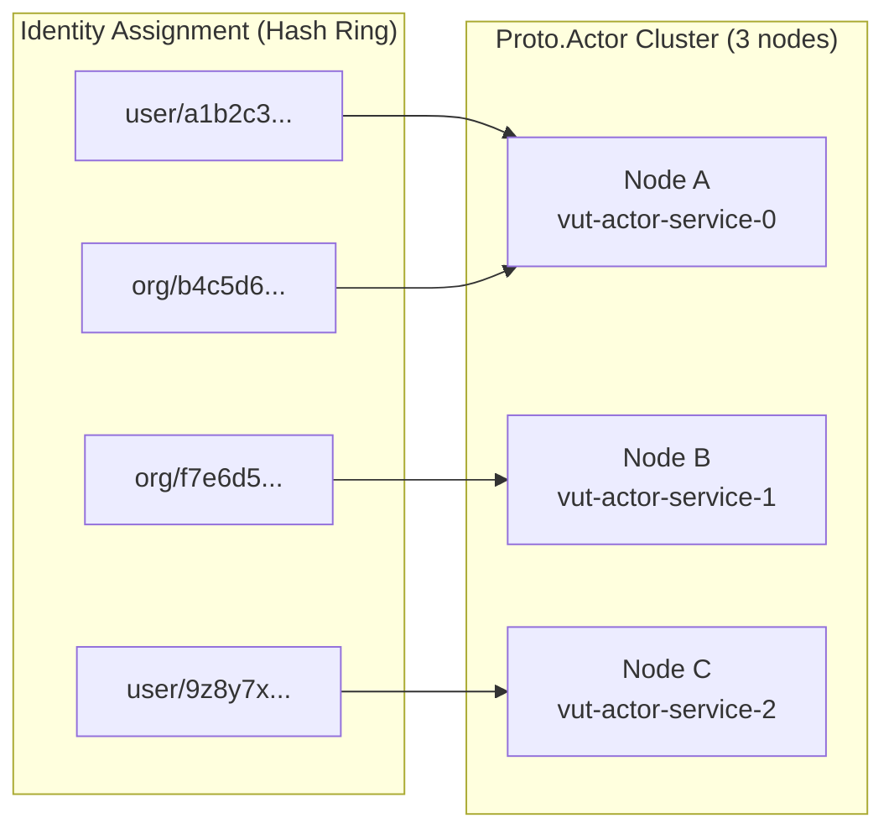

The partition identity lookup uses consistent hashing to map each `(kind, identity)` pair to a specific node. When a grain is activated, the request is routed to the owning node. If that node fails, the identity is re-partitioned to a surviving node and the grain re-activates there.

### 4.4 Grain Activation Flow

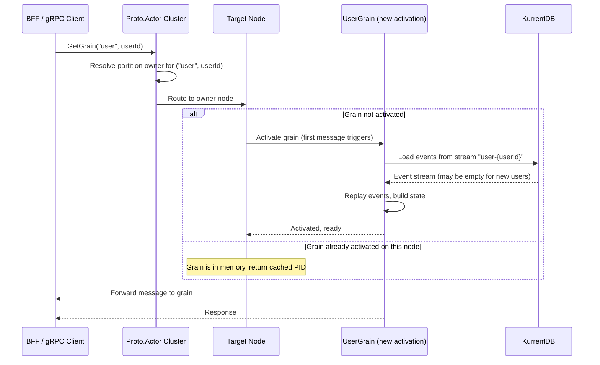

**Key points:**
- Activation is implicit. The first message to any grain identity triggers activation.
- State is hydrated from KurrentDB during activation using `Proto.Persistence.EventStore`.
- If the grain is already active on the owning node, the message is delivered directly (no re-hydration).
- If the owning node fails, the cluster re-partitions identities and the grain re-activates on a new node.

---

## 5. Virtual Actor (Grain) Design

### 5.1 Base Grain Abstraction

All aggregate grains share a common base that handles event sourcing lifecycle. This replaces the old `AggregateActorBase<TState>` and eliminates the need for `ActorManagerBase<TActor>`.

```csharp
// Pseudocode -- base grain abstraction
public abstract class AggregateGrain<TState> where TState : class, new()
{
    private readonly Persistence _persistence;
    private TState _state = new();

    protected AggregateGrain(
        IProvider persistenceProvider,
        string streamId)
    {
        _persistence = Persistence.WithEventSourcingAndSnapshotting(
            persistenceProvider,
            streamId,
            ApplyEvent,
            ApplySnapshot,
            () => _state);
    }

    // Called on first activation or when grain wakes up
    protected async Task OnActivate()
    {
        await _persistence.RecoverStateAsync();
    }

    protected async Task EmitEvent(object @event)
    {
        await _persistence.PersistEventAsync(@event);
    }

    private void ApplyEvent(object @event)
    {
        // Delegate to subclass
        Apply(_state, @event);
    }

    private void ApplySnapshot(Snapshot snapshot)
    {
        _state = (TState)snapshot.State;
    }

    protected abstract void Apply(TState state, object @event);
}
```

**What this replaces:**
- No `ActorManagerBase<TActor>` -- the cluster runtime handles identity resolution and activation.
- No manual PID dictionary -- `Cluster.GetGrain(kind, identity)` returns the PID.
- No spawn/hydrate/passivate state machine -- the grain lifecycle is driven by the runtime.

### 5.2 Grain Lifecycle State Machine

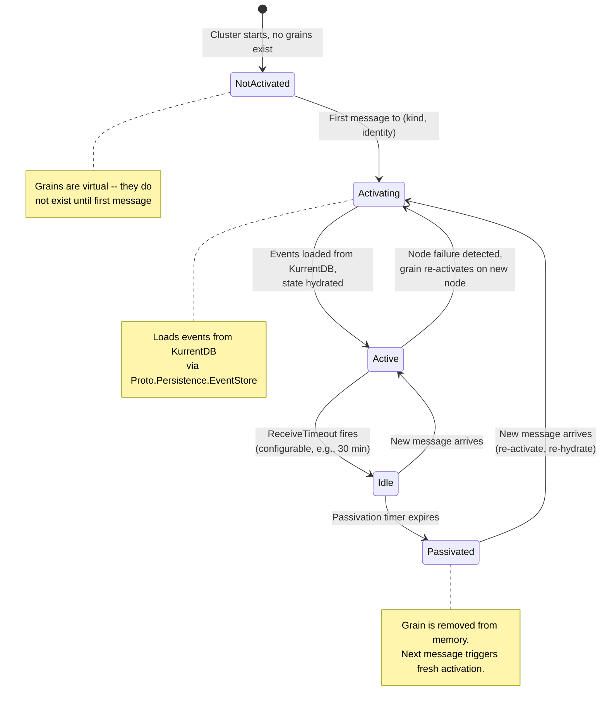

**Passivation strategy:** Each grain sets a `ReceiveTimeout` (e.g., 30 minutes). When the timeout fires, the grain performs cleanup (if needed) and allows the runtime to deactivate it. This prevents idle grains from consuming memory indefinitely.

```csharp
// Pseudocode -- passivation via ReceiveTimeout
protected override Task OnActivated()
{
    // Set timeout for passivation
    Context.SetReceiveTimeout(TimeSpan.FromMinutes(30));
    return base.OnActivated();
}

protected override Task OnReceiveTimeout()
{
    // Grain will be passivated after this
    // State is safe because events are in KurrentDB
    return Task.CompletedTask;
}
```

### 5.3 User Grain

**Cluster Kind:** `user`
**Identity:** `{userId}` (UUID)
**Event Stream:** `user-{userId}`
**Responsibility:** Manages the user aggregate root. Creates user on first login, links additional identity providers, handles profile updates, and manages email verification.

```
Cluster Messages (gRPC):
  CreateUser(providerId, providerName, displayName, avatarUrl, email?) -> userId
  LinkIdentity(userId, providerId, providerName, email?)
  UpdateProfile(displayName, avatarUrl)
  RequestEmailVerification(userId, email) -> token
  VerifyEmail(token) -> email

Events (persisted to KurrentDB via Proto.Persistence.EventStore):
  UserCreated(userId, displayName, avatarUrl, email?, actorId, timestamp)
  IdentityLinked(userId, providerId, providerName, email?, actorId, timestamp)
  UserProfileUpdated(userId, displayName, avatarUrl, actorId, timestamp)
  EmailVerificationRequested(userId, email, token, actorId, timestamp)
  EmailVerified(userId, email, actorId, timestamp)

State (hydrated from events on activation):
  userId: UUID
  displayName: string
  avatarUrl: string
  email: string?
  isEmailVerified: bool
  emailVerificationToken: string
  emailVerificationTokenExpiresAt: timestamp
  identities: Map<providerId, IdentityEntry>

IdentityEntry:
  providerId: string (Auth0 subject, e.g., "github|12345678")
  providerName: string (e.g., "github", "google", "microsoft")
  email: string?
  linkedAt: timestamp
```

**Validation Rules:**
- `CreateUser` is idempotent: if the user already exists (state has a userId), return the existing userId without emitting a duplicate event. `CreateUser` also emits an `IdentityLinked` event for the initial provider. If `email` is provided from the provider, it is stored but marked as unverified (`isEmailVerified = false`). Email may be null -- identity providers do not guarantee returning an email.
- `LinkIdentity` validates that the `providerId` is not already linked to a different user. If already linked to this user, it is a no-op.
- `UpdateProfile` only emits `UserProfileUpdated` if displayName or avatarUrl actually changed.
- `RequestEmailVerification` generates a time-limited 6-digit code (expires in 15 minutes). The user provides an email address on the `/verify-email` page -- this is the primary way email is collected. Emits `EmailVerificationRequested`.
- `VerifyEmail` validates the token has not expired and matches. On success, sets `isEmailVerified = true` and updates `email`. Emits `EmailVerified`.

**Email Verification Gate:**
All platform actions (create organization, invite members, etc.) require `isEmailVerified = true`. The BFF checks this from the read model before forwarding commands. Unverified users are redirected to the email verification page.

### 5.4 Organization Grain

**Cluster Kind:** `organization`
**Identity:** `{orgId}` (UUID)
**Event Stream:** `organization-{orgId}`
**Responsibility:** Manages the organization aggregate root. Handles creation, member management, and role changes.

```
Cluster Messages (gRPC):
  CreateOrganization(name, ownerId) -> orgId
  RenameOrganization(newName)
  InviteMember(inviteeEmail, role)
  AcceptInvitation(userId, email)
  DeclineInvitation(userId, email)
  RemoveMember(userId)
  ChangeMemberRole(userId, newRole)

Events (persisted to KurrentDB via Proto.Persistence.EventStore):
  OrganizationCreated(orgId, name, actorId, timestamp)
  OrganizationRenamed(orgId, newName, actorId, timestamp)
  MemberInvited(orgId, inviteeEmail, role, actorId, timestamp)
  MemberJoined(orgId, userId, actorId, timestamp)
  MemberRemoved(orgId, userId, actorId, timestamp)
  MemberRoleChanged(orgId, userId, oldRole, newRole, actorId, timestamp)
  OrganizationDeleted(orgId, actorId, timestamp)

State (hydrated from events on activation):
  orgId: UUID
  name: string
  members: Map<userId, MemberEntry>
  invitations: Map<email, InvitationEntry>
  isDeleted: bool

MemberEntry:
  userId: UUID
  role: Owner | Member
  joinedAt: timestamp

InvitationEntry:
  email: string
  role: Owner | Member
  invitedAt: timestamp
  status: Pending | Accepted | Declined
```

**Validation Rules:**
- `CreateOrganization`: name must be non-empty, creator is automatically added as Owner.
- `RenameOrganization`: only Owners can rename.
- `InviteMember`: only Owners can invite.
- `AcceptInvitation`: the email used in the invitation must match the user's verified email.
- `RemoveMember`: only Owners can remove. Cannot remove the last Owner.
- `ChangeMemberRole`: only Owners can change roles. Cannot demote the last Owner.
- `OrganizationDeleted` event is defined but the UI action is deferred (not required in Epic 1).

### 5.5 Sending Messages to Grains

The BFF (or a thin gRPC gateway layer) sends messages to grains using cluster identity, not PIDs:

```csharp
// Pseudocode -- sending a command to a User grain
var cluster = // injected Cluster instance
var userGrain = cluster.GetUserGrain(userId);
var response = await userGrain.CreateUser(
    new CreateUserRequest
    {
        ProviderId = providerId,
        ProviderName = "github",
        DisplayName = displayName,
        AvatarUrl = avatarUrl,
        Email = email
    },
    CancellationTokens.DefaultTimeout);

// The cluster runtime:
// 1. Resolves which node owns ("user", userId)
// 2. Activates the grain on that node if not already active
// 3. Grain loads state from KurrentDB during activation
// 4. Delivers the message
// 5. Returns the response
```

**No manager actor is involved.** The cluster runtime handles routing, activation, and delivery.

---

## 6. Event Sourcing Integration

### 6.1 Proto.Persistence.EventStore Bridge

KurrentDB integration uses the `Proto.Persistence.EventStore` NuGet package, which provides an `IProvider` implementation that bridges Proto.Actor's persistence API with KurrentDB's streams.

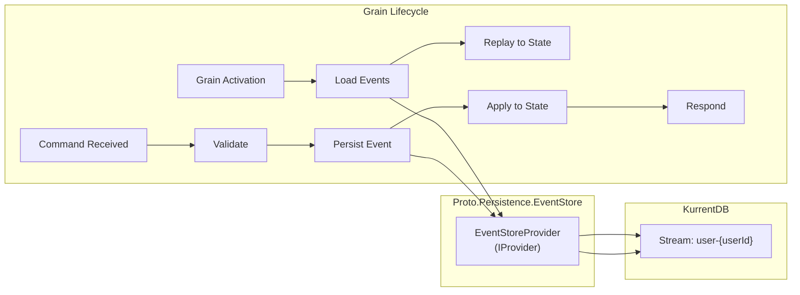

**Provider initialization:**

```csharp
// Pseudocode -- registering Proto.Persistence.EventStore
var eventStoreConnection = EventStoreClientSettings.Create(
    "esdb://vut-kurrentdb:2113?tls=false");

var persistenceProvider = new EventStoreProvider(eventStoreConnection);

// Each grain gets its own persistence instance scoped to its stream
// streamId = "user-{userId}" for user grains
// streamId = "organization-{orgId}" for org grains
```

### 6.2 Event Serialization

Events are serialized as JSON in KurrentDB using `System.Text.Json` with camelCase naming. Each event type maps to a concrete CLR type.

Proto.Persistence.EventStore handles serialization and deserialization transparently. The grain only works with strongly-typed event objects.

### 6.3 Stream Naming Convention

| Aggregate | Stream ID Format | Cluster Kind | Example |
|-----------|-----------------|-------------|---------|
| User | `user-{userId}` | `user` | `user-a1b2c3d4-e5f6-7890-abcd-ef1234567890` |
| Organization | `organization-{orgId}` | `organization` | `organization-f7e6d5c4-b3a2-1098-7654-321fedcba098` |
| Product | `product-{productId}` | `product` | (Epic 2) |
| Task | `task-{taskId}` | `task` | (Epic 3) |

### 6.4 Event Envelope

Every event is wrapped in a consistent envelope:

```json
{
  "eventId": "uuid-v4",
  "eventType": "UserCreated",
  "streamId": "user-a1b2c3d4-...",
  "eventNumber": 1,
  "timestamp": "2026-05-05T14:30:00.000Z",
  "actorId": "user-a1b2c3d4-...",
  "payload": {
    "userId": "a1b2c3d4-e5f6-7890-abcd-ef1234567890",
    "displayName": "Jane Developer",
    "avatarUrl": "https://avatars.githubusercontent.com/u/12345678",
    "email": "jane@example.com"
  }
}
```

Note: `email` may be `null` if the identity provider did not return one. It is only populated after the user completes email verification.

### 6.5 KurrentDB Persistent Subscriptions (Projector Feeds)

Projectors subscribe to KurrentDB persistent subscriptions directly. KurrentDB handles consumer group management, checkpointing, and retry policies natively.

| Subscription Group | Stream Filter | Consumer Strategy | Purpose |
|--------------------|---------------|-------------------|---------|
| `vut-projector-user` | `user-*` | Round-robin (1 consumer) | All User stream events |
| `vut-projector-org` | `organization-*` | Round-robin (1 consumer) | All Organization stream events |

Persistent subscriptions are created via KurrentDB's HTTP API or .NET SDK at startup. They track checkpoints internally -- no `projection_checkpoint` table is needed.

**Redpanda's role:** Redpanda is used exclusively as Proto.Actor's cluster transport for actor location routing and membership gossip between nodes. It is NOT used for event distribution to projectors.

---

## 7. Read Model (PostgreSQL Projections)

### 7.1 Entity Relationship Diagram

```mermaid
erDiagram
    USER_PROJECTION ||--o{ USER_IDENTITY : "has identities"
    USER_PROJECTION ||--o{ ORG_MEMBER_PROJECTION : "belongs to"
    USER_PROJECTION ||--o{ USER_ORG_PROJECTION : "reverse index"
    ORG_PROJECTION ||--o{ ORG_MEMBER_PROJECTION : "has members"
    ORG_PROJECTION ||--o{ ORG_INVITATION_PROJECTION : "has invitations"
    ORG_PROJECTION ||--o{ USER_ORG_PROJECTION : "reverse index"

    USER_PROJECTION {
        uuid user_id PK
        text display_name
        text avatar_url
        text email
        boolean is_email_verified
        timestamptz created_at
        timestamptz updated_at
    }

    USER_IDENTITY {
        uuid user_id PK_FK
        text provider_id PK
        text provider_name
        text email
        timestamptz linked_at
    }

    ORG_PROJECTION {
        uuid org_id PK
        text name
        boolean is_deleted
        timestamptz created_at
        timestamptz updated_at
    }

    ORG_MEMBER_PROJECTION {
        uuid org_id PK_FK
        uuid user_id PK_FK
        text role
        timestamptz joined_at
    }

    ORG_INVITATION_PROJECTION {
        uuid org_id PK_FK
        text email PK
        text role
        text status
        timestamptz invited_at
        uuid user_id
    }

    USER_ORG_PROJECTION {
        uuid user_id PK_FK
        uuid org_id PK_FK
        text role
    }
```

### 7.2 SQL Schema

```sql
-- User projection (no provider_id -- identities are in user_identity)
CREATE TABLE user_projection (
    user_id           UUID PRIMARY KEY,
    display_name      TEXT NOT NULL,
    avatar_url        TEXT,
    email             TEXT,
    is_email_verified BOOLEAN NOT NULL DEFAULT FALSE,
    created_at        TIMESTAMPTZ NOT NULL,
    updated_at        TIMESTAMPTZ NOT NULL
);

-- User identity table (supports multiple providers per user)
CREATE TABLE user_identity (
    user_id       UUID NOT NULL REFERENCES user_projection(user_id),
    provider_id   TEXT NOT NULL,       -- Auth0 subject (e.g., "github|12345678")
    provider_name TEXT NOT NULL,       -- e.g., "github", "google", "microsoft"
    email         TEXT,                -- Email from this provider (nullable)
    linked_at     TIMESTAMPTZ NOT NULL DEFAULT NOW(),
    PRIMARY KEY (user_id, provider_id)
);

-- Index for looking up a user by any linked provider
CREATE UNIQUE INDEX idx_user_identity_provider ON user_identity(provider_id);
-- Index for auto-linking by email (find existing user with same email)
CREATE INDEX idx_user_identity_email ON user_identity(email) WHERE email IS NOT NULL;

-- Organization projection
CREATE TABLE org_projection (
    org_id        UUID PRIMARY KEY,
    name          TEXT NOT NULL,
    is_deleted    BOOLEAN NOT NULL DEFAULT FALSE,
    created_at    TIMESTAMPTZ NOT NULL,
    updated_at    TIMESTAMPTZ NOT NULL
);

-- Organization member projection (derived from org stream events)
CREATE TABLE org_member_projection (
    org_id        UUID NOT NULL REFERENCES org_projection(org_id),
    user_id       UUID NOT NULL REFERENCES user_projection(user_id),
    role          TEXT NOT NULL CHECK (role IN ('Owner', 'Member')),
    joined_at     TIMESTAMPTZ NOT NULL,
    PRIMARY KEY (org_id, user_id)
);

-- Organization invitation projection (derived from org stream events)
CREATE TABLE org_invitation_projection (
    org_id            UUID NOT NULL REFERENCES org_projection(org_id),
    email             TEXT NOT NULL,
    role              TEXT NOT NULL CHECK (role IN ('Owner', 'Member')),
    status            TEXT NOT NULL CHECK (status IN ('Pending', 'Accepted', 'Declined')),
    invited_at        TIMESTAMPTZ NOT NULL,
    user_id           UUID,  -- NULL until the invitee signs in
    PRIMARY KEY (org_id, email)
);

-- User organization membership (reverse index for "my orgs" queries)
CREATE TABLE user_org_projection (
    user_id       UUID NOT NULL REFERENCES user_projection(user_id),
    org_id        UUID NOT NULL REFERENCES org_projection(org_id),
    role          TEXT NOT NULL,
    PRIMARY KEY (user_id, org_id)
);

-- Indexes
CREATE INDEX idx_org_member_projection_user ON org_member_projection(user_id);
CREATE INDEX idx_org_invitation_projection_email ON org_invitation_projection(email, status);
```

### 7.3 Projector Service Design

The projector service is a .NET worker that subscribes to KurrentDB persistent subscriptions and updates PostgreSQL projections.

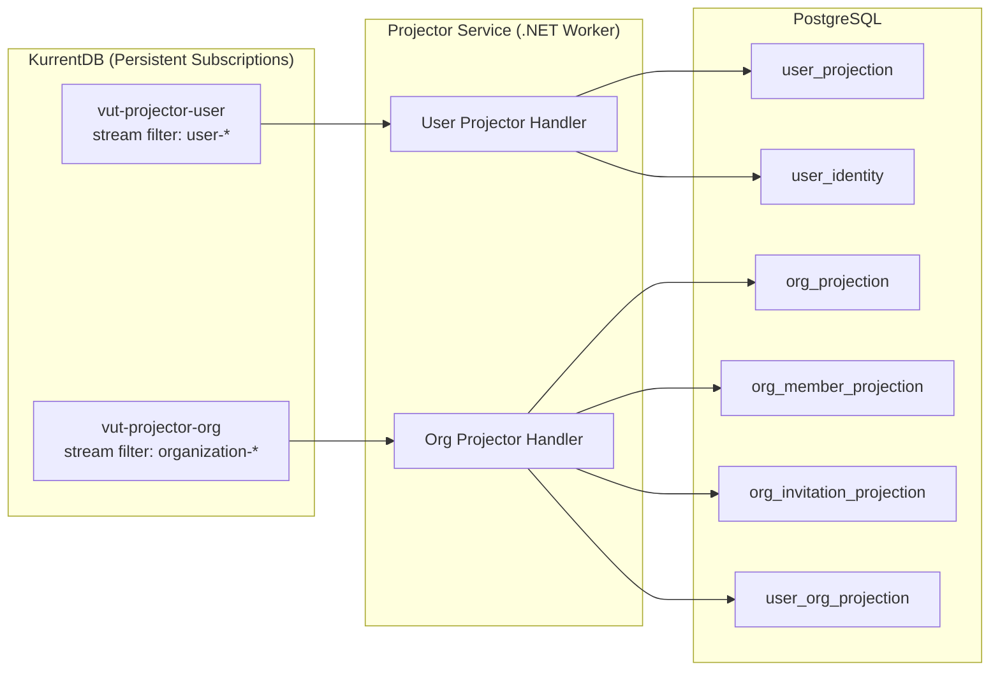

**Projector Idempotency:** Projectors handle events idempotently -- re-processing an event produces the same result. Checkpointing is managed by KurrentDB's persistent subscription infrastructure (no separate checkpoint table needed). On restart, projectors resume from the last acknowledged position automatically.

**Projectors are separate from the actor cluster.** They are independent .NET workers that subscribe to KurrentDB persistent subscriptions. They do not participate in the Proto.Actor cluster. This separation ensures:
- Projectors can be scaled independently of the actor service.
- Projector failures do not affect grain availability.
- Projectors can be rebuilt from KurrentDB at any time without touching the actor service.

---

## 8. Key Workflow Sequence Diagrams

### 8.1 First-Time User Sign-In

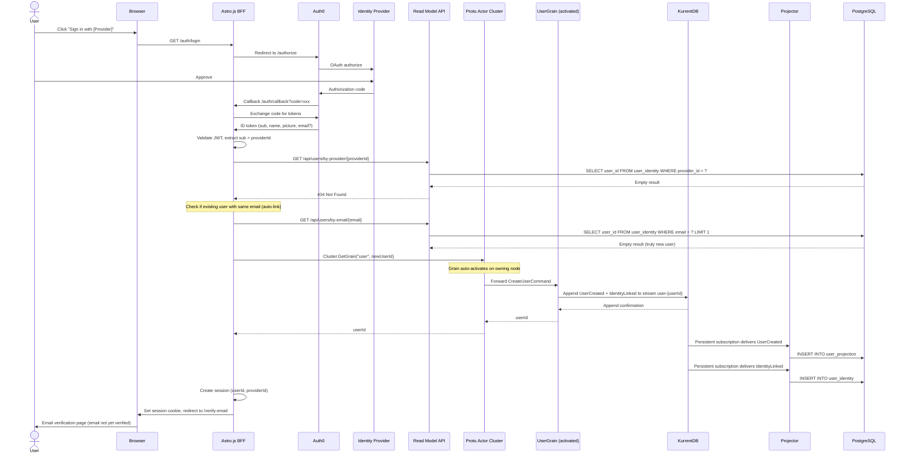

**Virtual actor difference:** The BFF sends the command directly to the grain via cluster identity. No manager actor intermediates. The grain activates on its first message, loading (empty) state from KurrentDB, processes the command, and persists events.

### 8.2 Email Verification

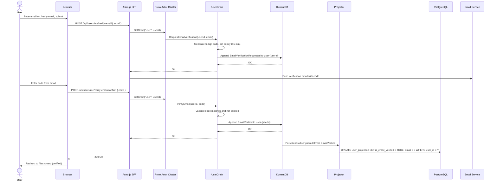

### 8.3 Returning User Sign-In


**Note:** The returning user sign-in flow is entirely read-path. No grain activation is needed because the user is not creating events -- only reading from the PostgreSQL read model.

### 8.4 Create Organization

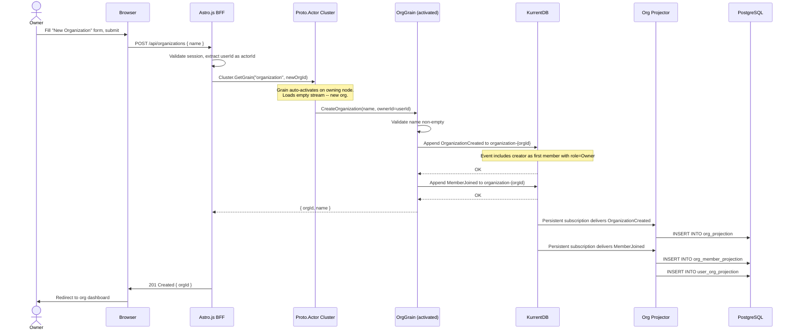

**Virtual actor difference:** The grain is activated by the first `CreateOrganization` message. Since the stream is empty (new org), hydration is instant. The grain validates, generates events, and persists them.

### 8.5 Invite and Accept Member

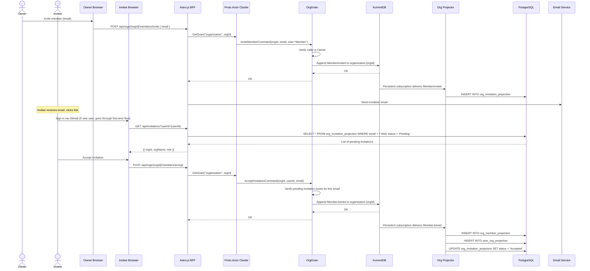

### 8.6 Organization Switching

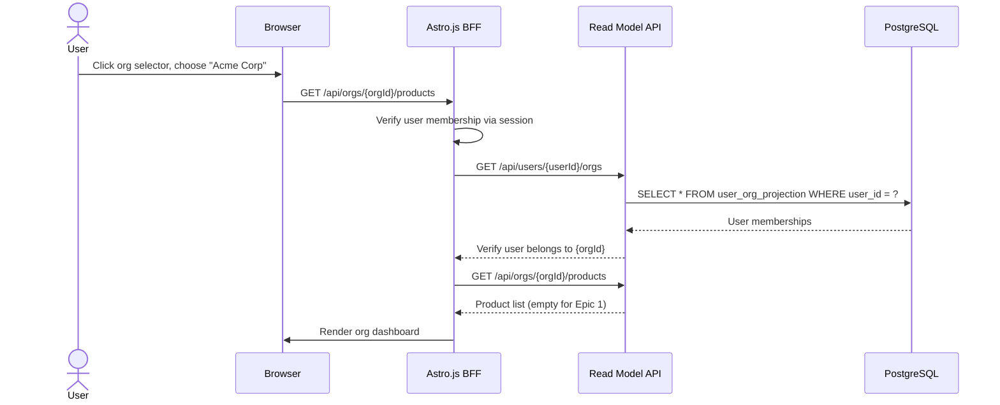

---

## 9. Infrastructure Setup (Kubernetes)

### 9.1 Namespace and Resource Quotas

All Vut services run in the `vut` namespace.

```yaml
# k8s/namespace.yaml
apiVersion: v1
kind: Namespace
metadata:
  name: vut
  labels:
    app.kubernetes.io/part-of: vut
```

### 9.2 KurrentDB StatefulSet

```yaml
# k8s/kurrentdb/statefulset.yaml (sketch)
apiVersion: apps/v1
kind: StatefulSet
metadata:
  name: vut-kurrentdb
  namespace: vut
spec:
  replicas: 3
  serviceName: vut-kurrentdb
  selector:
    matchLabels:
      app: vut-kurrentdb
  template:
    spec:
      containers:
        - name: kurrentdb
          image: kurrentdb/kurrentdb:latest
          ports:
            - containerPort: 2113  # HTTP/API
            - containerPort: 1113  # TCP
          env:
            - name: EVENTSTORE_CLUSTER_SIZE
              value: "3"
            - name: EVENTSTORE_RUN_PROJECTIONS
              value: "None"  # We project in .NET consumers
            - name: EVENTSTORE_DB
              value: "/data/db"
          volumeMounts:
            - name: data
              mountPath: /data
  volumeClaimTemplates:
    - metadata:
        name: data
      spec:
        accessModes: ["ReadWriteOnce"]
        resources:
          requests:
            storage: 10Gi
```

### 9.3 Redpanda StatefulSet (Proto.Actor Cluster Transport)

Redpanda serves as the cluster transport for Proto.Actor -- handling actor location routing, membership gossip, and message dispatch between actor nodes. It is NOT used for event distribution to projectors.

```yaml
# k8s/redpanda/statefulset.yaml (sketch)
apiVersion: apps/v1
kind: StatefulSet
metadata:
  name: vut-redpanda
  namespace: vut
spec:
  replicas: 3
  serviceName: vut-redpanda
  selector:
    matchLabels:
      app: vut-redpanda
  template:
    spec:
      containers:
        - name: redpanda
          image: redpandadata/redpanda:latest
          ports:
            - containerPort: 9092  # Kafka API (Proto.Actor cluster transport)
            - containerPort: 9644  # Admin API
          command:
            - redpanda
            - start
            - --smp 1
            - --memory 512M
            - --overprovisioned
            - --kafka-addr internal://0.0.0.0:9092
```

### 9.4 PostgreSQL StatefulSet

```yaml
# k8s/postgresql/statefulset.yaml (sketch)
apiVersion: apps/v1
kind: StatefulSet
metadata:
  name: vut-postgresql
  namespace: vut
spec:
  replicas: 1  # Primary; read replica added later
  serviceName: vut-postgresql
  selector:
    matchLabels:
      app: vut-postgresql
  template:
    spec:
      containers:
        - name: postgresql
          image: postgres:16
          ports:
            - containerPort: 5432
          env:
            - name: POSTGRES_DB
              value: vut_readmodel
            - name: POSTGRES_USER
              valueFrom:
                secretKeyRef:
                  name: vut-postgresql-secret
                  key: username
            - name: POSTGRES_PASSWORD
              valueFrom:
                secretKeyRef:
                  name: vut-postgresql-secret
                  key: password
```

### 9.5 Actor Service Deployment

```yaml
# k8s/actor-service/deployment.yaml (sketch)
apiVersion: apps/v1
kind: Deployment
metadata:
  name: vut-actor-service
  namespace: vut
spec:
  replicas: 3  # Multiple nodes for grain distribution
  selector:
    matchLabels:
      app: vut-actor-service
  template:
    spec:
      containers:
        - name: actor-service
          image: vut/actor-service:latest
          ports:
            - containerPort: 5000  # gRPC
          env:
            - name: KurrentDB__ConnectionString
              value: "esdb://vut-kurrentdb:2113?tls=false"
            - name: ProtoActor__ClusterProvider
              value: "Redpanda"
            - name: ProtoActor__RedpandaBootstrapServers
              value: "vut-redpanda:9092"
            - name: Auth0__Domain
              valueFrom:
                secretKeyRef:
                  name: vut-auth0-secret
                  key: domain
            - name: Auth0__Audience
              valueFrom:
                secretKeyRef:
                  name: vut-auth0-secret
                  key: audience
```

**Note:** The actor service is scaled to 3 replicas for grain distribution. Each pod joins the cluster and can host any grain kind. Grains are distributed across nodes by identity hash partitioning.

### 9.6 Frontend Deployment (Astro.js BFF)

```yaml
# k8s/frontend/deployment.yaml (sketch)
apiVersion: apps/v1
kind: Deployment
metadata:
  name: vut-frontend
  namespace: vut
spec:
  replicas: 2
  selector:
    matchLabels:
      app: vut-frontend
  template:
    spec:
      containers:
        - name: frontend
          image: vut/frontend:latest
          ports:
            - containerPort: 3000
          env:
            - name: ACTOR_SERVICE_URL
              value: "http://vut-actor-service:5000"
            - name: READMODEL_URL
              value: "http://vut-readmodel-api:5001"
            - name: AUTH0_DOMAIN
              valueFrom:
                secretKeyRef:
                  name: vut-auth0-secret
                  key: domain
            - name: AUTH0_CLIENT_ID
              valueFrom:
                secretKeyRef:
                  name: vut-auth0-secret
                  key: client-id
            - name: AUTH0_CLIENT_SECRET
              valueFrom:
                secretKeyRef:
                  name: vut-auth0-secret
                  key: client-secret
```

---

## 10. Auth0 Integration Architecture

### 10.1 Authentication Flow

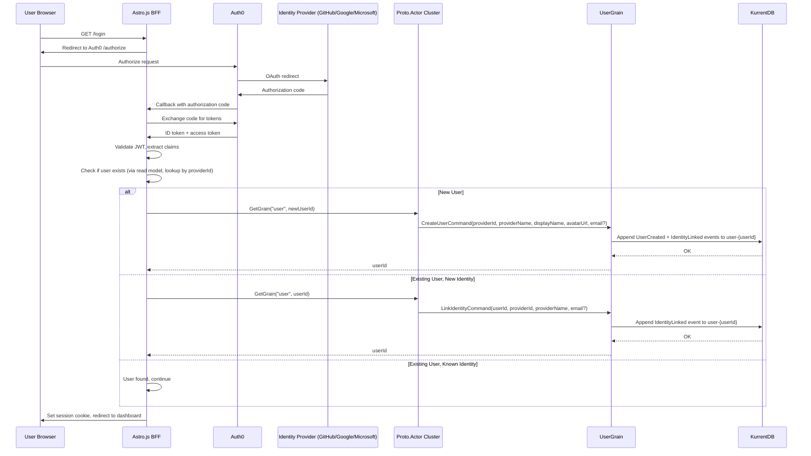

### 10.2 JWT Claims Used

Auth0 token includes these claims that Vut extracts:
- `sub`: The Auth0 user ID (format varies by provider: `github|12345678`, `google-oauth2|1234567890`, `windowslive|1234567890`)
- `nickname`: Username (provider-specific)
- `name`: Display name
- `picture`: Avatar URL
- `email`: Email address (nullable -- identity providers do not guarantee this; e.g., GitHub users may have no public email)

The `sub` claim's prefix identifies the provider. Vut uses this as the `providerId` and stores it alongside a `providerName` in the `user_identity` table to support multiple login providers per user.

### 10.3 Auth Middleware

The BFF validates the JWT on every request:
1. Extract Bearer token or session cookie
2. Validate JWT signature against Auth0 JWKS
3. Extract `sub` claim as the Vut `providerId`
4. Look up the Vut `userId` from the read model using `user_identity` table: `SELECT user_id FROM user_identity WHERE provider_id = ?`
5. Attach `userId` and `providerId` to the request context as the `actorId` for all commands

If a user logs in with a new provider and the provider returns an email that matches an existing user, the BFF auto-links the identity (see Section 8.1). Auto-linking is only possible when the provider returns an email -- it is skipped when email is null.

---

## 11. API Design (BFF Endpoints)

### 11.1 Authentication Endpoints

| Method | Path | Description |
|--------|------|-------------|
| GET | `/auth/login` | Initiates Auth0 login flow (redirect) |
| GET | `/auth/callback` | Auth0 callback, exchanges code, creates/retrieves user, auto-links identity by email if matched (only when provider returns email) |
| POST | `/auth/logout` | Clears session, redirects to Auth0 logout |

### 11.2 User Endpoints

| Method | Path | Description |
|--------|------|-------------|
| GET | `/api/users/me` | Current user profile (includes `isEmailVerified`) |
| PATCH | `/api/users/me` | Update display name / avatar |
| GET | `/api/users/me/identities` | List linked identity providers |
| DELETE | `/api/users/me/identities/{providerId}` | Unlink an identity provider (must keep at least one) |

### 11.3 Email Verification Endpoints

| Method | Path | Description |
|--------|------|-------------|
| POST | `/api/users/me/verify-email` | Request email verification (sends code to given email) |
| POST | `/api/users/me/verify-email/confirm` | Submit verification code to confirm email |

### 11.4 Organization Endpoints

| Method | Path | Description |
|--------|------|-------------|
| POST | `/api/organizations` | Create organization |
| GET | `/api/organizations` | List user's organizations |
| GET | `/api/organizations/{orgId}` | Get org details |
| PATCH | `/api/organizations/{orgId}` | Rename organization |
| GET | `/api/organizations/{orgId}/members` | List members |
| POST | `/api/organizations/{orgId}/members/invite` | Invite member |
| POST | `/api/organizations/{orgId}/members/accept` | Accept invitation |
| POST | `/api/organizations/{orgId}/members/decline` | Decline invitation |
| DELETE | `/api/organizations/{orgId}/members/{userId}` | Remove member |
| PATCH | `/api/organizations/{orgId}/members/{userId}/role` | Change role |

### 11.5 Invitation Endpoints

| Method | Path | Description |
|--------|------|-------------|
| GET | `/api/invitations` | List pending invitations for current user |

### 11.6 Internal Lookup Endpoints (BFF-to-ReadModel)

| Method | Path | Description |
|--------|------|-------------|
| GET | `/api/users/by-provider/{providerId}` | Look up user by any linked provider identity |
| GET | `/api/users/by-email/{email}` | Look up user by email (for auto-linking; only usable when provider returns email) |

---

## 12. Frontend Architecture

### 12.1 Astro.js SPA Shell

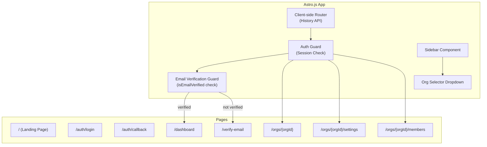

### 12.2 Client-Side State

The Astro.js frontend maintains a minimal client-side state store:
- `currentUser`: The logged-in user's profile (includes `isEmailVerified`)
- `identities`: List of linked identity providers for the current user
- `organizations`: List of orgs the user belongs to
- `currentOrgId`: The currently selected organization
- `pendingInvitations`: Invitations awaiting response

State is hydrated from the read model API on initial page load and kept fresh via refetch on navigation.

### 12.3 Authorization Model (Frontend)

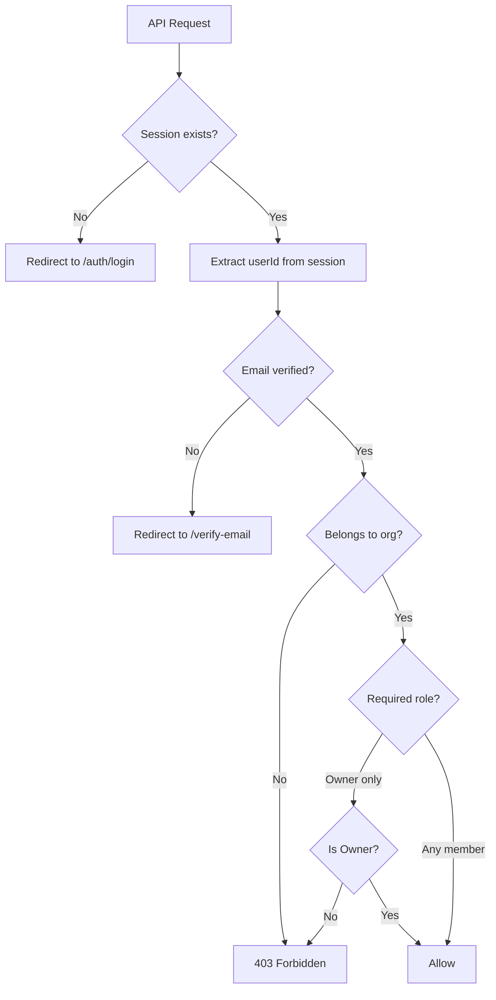

---

## 13. Data Flow Summary

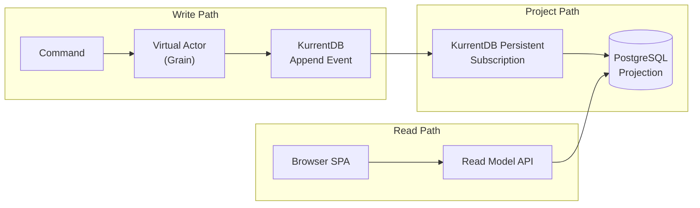

**Write Path:** Browser -> BFF -> Proto.Actor Cluster (grain auto-activation) -> KurrentDB
**Project Path:** KurrentDB (persistent subscription) -> Projector -> PostgreSQL
**Read Path:** Browser -> BFF -> Read Model API -> PostgreSQL

This separation ensures:
- Writes are always consistent (KurrentDB is the source of truth)
- Reads are eventually consistent (projection lag is typically <100ms)
- Projections can be rebuilt from KurrentDB at any time
- Grains are stateless across activations (state is rehydrated from KurrentDB)

---

## 14. Error Handling & Resilience

### 14.1 Grain Failure Recovery

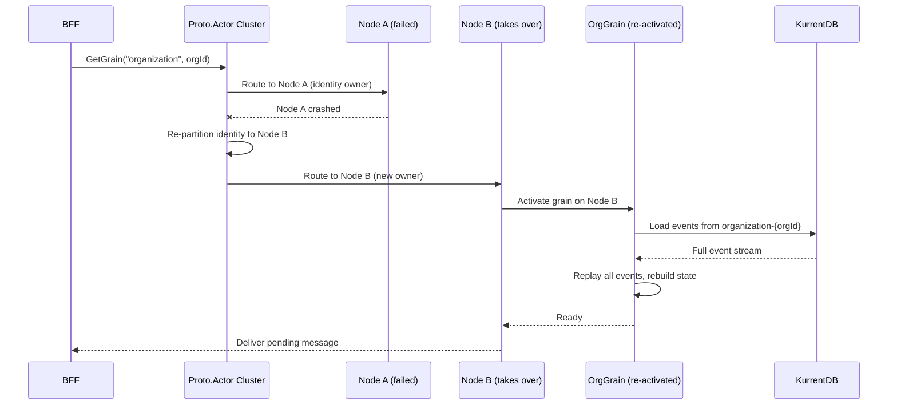

**Key resilience properties:**
- If a node crashes, all grains on that node are lost from memory but their events are safe in KurrentDB.
- The cluster re-partitions identities to surviving nodes automatically.
- Grains re-activate on new nodes by re-hydrating from KurrentDB -- state is never lost.
- The client receives a transparent retry; the grain appears to survive the failure.

### 14.2 Timeout & Retry Strategy

| Scenario | Strategy |
|----------|----------|
| Grain activation timeout (slow KurrentDB) | BFF retries with exponential backoff (max 3 retries, 2s timeout per attempt) |
| gRPC call to cluster timeout | BFF returns 503 Service Unavailable to the browser |
| KurrentDB append failure | Grain returns error to caller; no event is persisted; client can retry |
| Projector failure (PostgreSQL down) | KurrentDB persistent subscription retries; events are not acked until projection succeeds |
| Redpanda cluster transport failure | Actor service pods lose membership; cluster re-forms when Redpanda recovers |

### 14.3 Idempotency

- **Grain commands** must be idempotent where possible. `CreateUser` returns the existing userId if the user already exists. `LinkIdentity` is a no-op if already linked.
- **Projector handlers** are idempotent by design -- re-processing an event produces the same database state (UPSERT semantics).
- **BFF requests** should use idempotency keys for mutating operations to prevent duplicate command submission on network retries.

---

## 15. Performance Considerations

### 15.1 Grain Activation Cost

Grain activation requires loading events from KurrentDB. For aggregates with long event histories, this can be slow. Mitigations:

1. **Snapshotting**: `Proto.Persistence.EventStore` supports snapshotting. Periodically save a snapshot of the grain state. On activation, load the latest snapshot and only replay events after it.
   - Recommended snapshot interval: every 50 events or when event count exceeds 100.
   - Snapshot storage: KurrentDB (same provider handles events and snapshots).

2. **Passivation tuning**: Set `ReceiveTimeout` to balance memory usage vs. activation cost.
   - Short timeout (5 min): Frequent re-activations, low memory usage.
   - Long timeout (60 min): Fewer activations, higher memory usage.
   - Recommended starting point: 30 minutes, adjustable per grain kind.

3. **Cold start optimization**: For grains that are accessed predictably (e.g., org grains during business hours), consider warming them up by sending a health-check message on deployment.

### 15.2 Read Path Performance

- PostgreSQL indexes are optimized for the query patterns in the API endpoints (see Section 7.2).
- The read model API should use connection pooling and prepared statements.
- For large result sets (e.g., orgs with many members), implement pagination.

### 15.3 Write Path Performance

- gRPC communication between BFF and the actor cluster is low-latency binary protocol.
- KurrentDB appends are single-digit millisecond latency for small events.
- The write path (BFF -> grain -> KurrentDB) should complete in under 50ms for most commands.

---

## 16. Security Considerations

### 16.1 Authentication & Authorization

- **Auth**: Third-party identity provider (Auth0). No stored passwords.
- **Authorization**: Role-based access at the organization level (owner vs. member). Product access is inherited from org membership.
- **Tenant Isolation**: All queries are scoped to the user's organization memberships. Cross-org data access is prevented at the API layer.
- **Event Store**: KurrentDB access is restricted to the backend services; no direct client access.
- **HTTPS Only**: All communication is over TLS.
- **No Secrets in Events**: Events never contain authentication tokens or sensitive credentials.

### 16.2 Cluster Security

- **Redpanda** (cluster transport) should be on an internal network, not exposed to the internet.
- **gRPC** between BFF and actor service should use mutual TLS in production.
- **KurrentDB** should require authentication and run on an internal network.

### 16.3 Input Validation

- All commands are validated in the grain before events are emitted.
- The BFF performs basic input validation (non-empty strings, valid email format) before sending commands.
- KurrentDB streams are append-only -- events cannot be tampered with after persistence.

---

## 17. Cross-Cutting Concerns Established in Epic 1

These patterns, once established in Epic 1, are reused by all subsequent epics:

| Concern | Implementation | Reused By |
|---------|---------------|-----------|
| Virtual actor cluster configuration | Proto.Actor cluster with Redpanda provider, partition identity lookup | Epics 2-6 |
| Cluster kind registration | `ClusterKind.Get("kind", Props)` pattern | Epics 2-6 (add "product", "task" kinds) |
| Aggregate grain base with event sourcing | `AggregateGrain<TState>` with `Proto.Persistence.EventStore` | Epics 2-6 |
| Event envelope with actorId + timestamp | Standardized JSON envelope in grain events | Epics 2-6 |
| KurrentDB stream append | Shared persistence provider | Epics 2-6 |
| Redpanda (Proto.Actor cluster transport) | Actor location routing, membership gossip | Epics 2-6 |
| Projector service (KurrentDB subscription, project) | Shared projector framework | Epics 2-6 |
| BFF session management + Auth0 | Astro.js middleware | Epics 2-6 |
| Authorization middleware (org membership check) | BFF request pipeline | Epics 2-6 |
| Kubernetes manifests pattern | Deployment + Service + ConfigMap | Epics 2-6 |
| Grain passivation via ReceiveTimeout | Configurable timeout per grain kind | Epics 2-6 |

### Migration Notes for Epics 2-6

When adding new aggregate types (Product, Task), follow this pattern:

1. **Define the grain class** inheriting from `AggregateGrain<TState>`.
2. **Register a new cluster kind** in the cluster configuration: `ClusterKind.Get("product", Props.FromProducer(() => new ProductGrain()))`.
3. **Define events and state** for the new aggregate.
4. **Define gRPC messages** for the new grain's commands.
5. **Add a projector handler** for the new stream type.
6. **Add read model tables** for the new projections.
7. **Add BFF endpoints** that call `Cluster.GetGrain("product", productId)`.

No changes to the cluster topology, Redpanda configuration, or base infrastructure are needed. The virtual actor model scales horizontally by adding more nodes.

---

## 18. Technology Decisions for Epic 1

| Decision | Choice | Rationale |
|----------|--------|-----------|
| Actor framework | Proto.Actor (virtual actors) | PRD requirement. Virtual actors eliminate the Actor Manager pattern, provide automatic activation, location transparency, and cluster distribution. |
| Event store | KurrentDB (EventStoreDB) | PRD requirement. Purpose-built for event sourcing with stream-based storage. |
| Event sourcing bridge | Proto.Persistence.EventStore | Official integration between Proto.Actor persistence and KurrentDB. Handles event loading, snapshotting, and state recovery. |
| Message broker | Redpanda | Proto.Actor cluster transport for actor location routing and membership gossip. NOT used for event distribution -- projectors subscribe to KurrentDB persistent subscriptions directly. |
| Read model | PostgreSQL | PRD requirement. Mature, reliable, supports the complex queries needed for projections and the cumulative flow (Epic 5). |
| Frontend | Astro.js + Tailwind CSS | PRD requirement. SSR-capable, island architecture for selective hydration, excellent performance. |
| Auth | Auth0 | PRD requirement. Managed service, supports GitHub SSO and future providers. |
| Serialization | System.Text.Json (JSON) | Native .NET, high performance, no external dependency. |
| ID generation | UUID v4 | Globally unique, no coordination needed, safe for distributed grain creation. |
| Session management | HTTP-only cookie (BFF) | Secure, no token exposure to JavaScript, BFF validates JWT server-side. |
| Cluster provider | Redpanda | Kafka-compatible, high performance, supports Proto.Actor membership gossip out of the box. |
| Identity lookup | PartitionIdentityLookup | Hash-based partitioning, distributes grains evenly across nodes, handles re-partitioning on node failure. |

---

## 19. Open Questions

1. **Snapshot frequency for grains:** What is the optimal snapshot interval? Recommendation is every 50 events, but this should be validated with real-world data from production usage.

2. **Grain-to-grain communication:** When an Organization grain needs to validate that a User exists (e.g., for `AcceptInvitation`), should it call the User grain directly, or rely on the read model? Direct grain-to-grain calls provide strong consistency but add latency and coupling. Read model checks are eventually consistent but simpler. Recommendation: use read model checks for cross-aggregate validation; use grain-to-grain calls only when strong consistency is required.

3. **gRPC gateway vs. direct cluster access:** Should the BFF contain Proto.Actor client libraries and communicate directly with the cluster, or should there be a thin gRPC API gateway that wraps the cluster calls? Direct access is simpler but couples the BFF to Proto.Actor. A gateway adds a network hop but decouples the frontend from the actor framework. Recommendation: start with direct access, refactor to gateway if the coupling becomes problematic.

4. **Concurrency handling for grains:** Proto.Actor processes messages one at a time per grain (actor model guarantee). However, if a grain receives concurrent requests from different BFF instances, they are queued. Is this acceptable for all use cases, or do we need request-response patterns with timeouts?

5. **Monitoring and observability:** How should grain activation, passivation, and event processing be monitored? Recommendation: use OpenTelemetry for distributed tracing across the BFF, cluster, and projectors. Export to a Prometheus/Grafana stack.

6. **Component library selection:** Astro.js + Tailwind CSS is confirmed, but the specific component library is TBD. Options include Headless UI, Radix, or a purpose-built minimal set.

7. **Projection recalculation strategy:** When statuses are renamed or removed in a product, how are historical events and the cumulative flow diagram affected? Options: (a) rewrite historical events, (b) maintain a status name mapping, (c) show legacy names for historical data.

8. **Projection confidence model:** The exact statistical model for the projected completion date needs to be selected during implementation.

9. **Organization deletion semantics:** When an organization is deleted, are events soft-deleted (marked as deleted) or hard-deleted from KurrentDB?

10. **Tag namespace registry:** Should tags be strictly validated against known namespaces, or is any `namespace:value` string accepted? The PRD assumes free-form, but a registry would enable better autocomplete and consistency.

11. **Minimum data threshold for projections:** How many data points (days of status transitions) are needed before the cumulative flow diagram shows a projected completion date?

12. **Email change flow:** Should users be able to change their verified email after the initial verification? If so, what is the flow?
