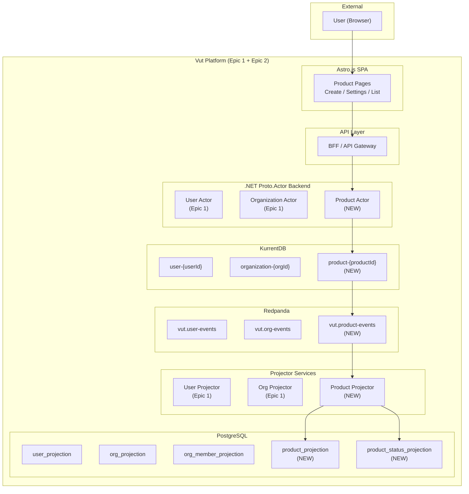
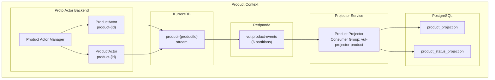
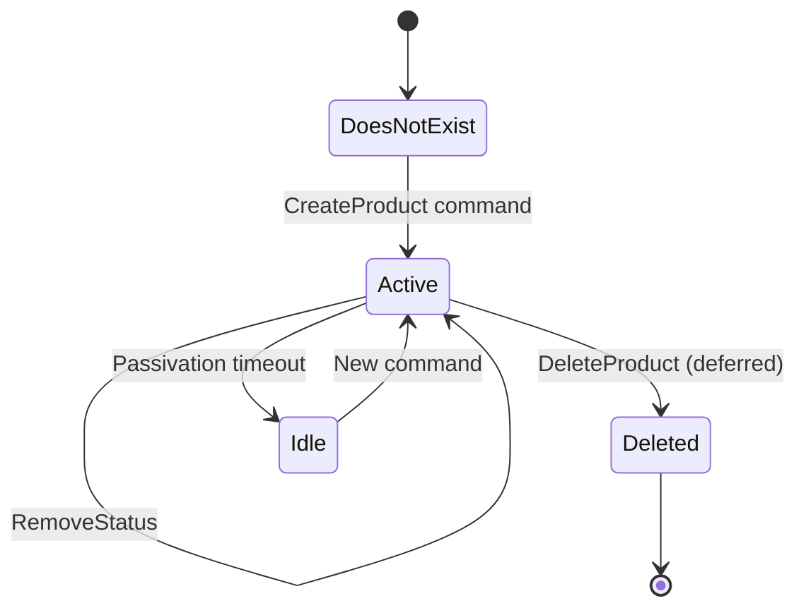
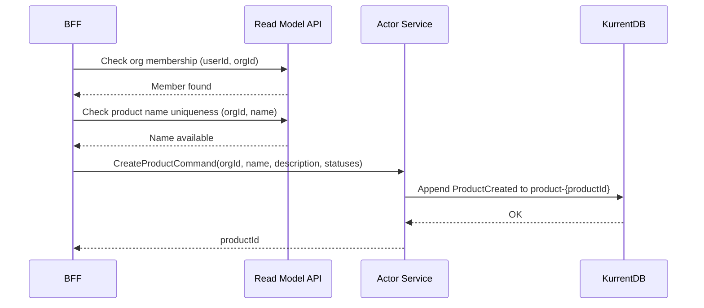
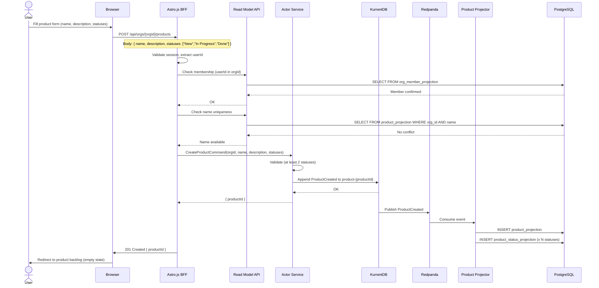
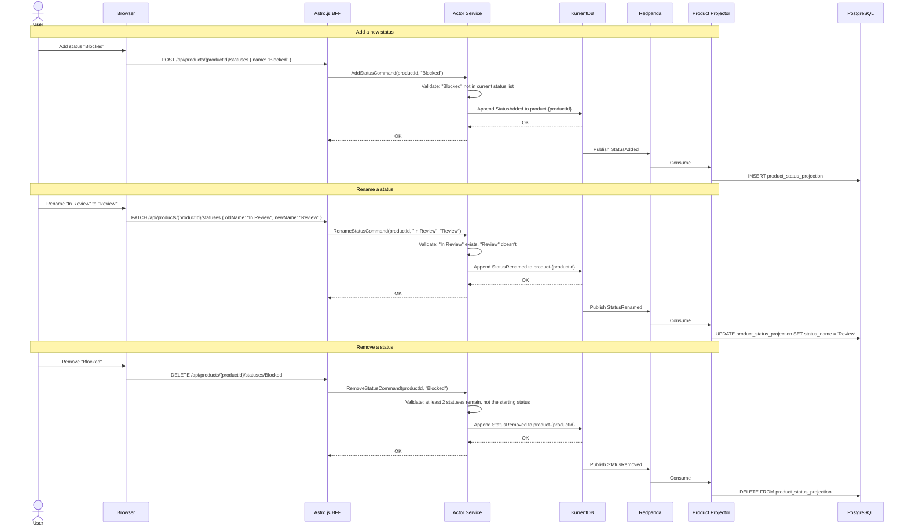
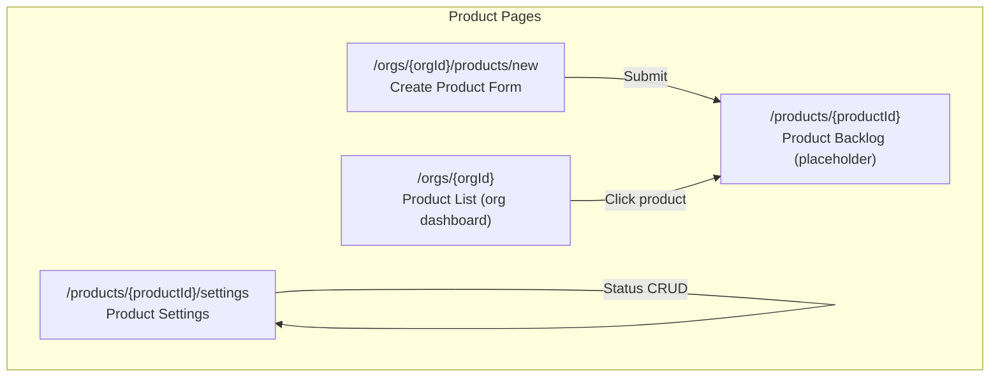
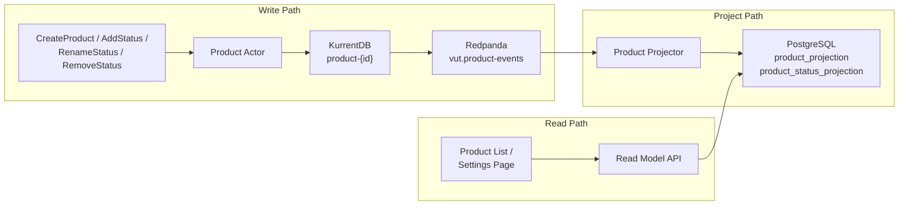

# Epic 2 Architecture: Product Setup with Configurable Workflow

## 1. System Context

Epic 2 introduces the Product aggregate -- the container for work within an organization. It builds directly on the infrastructure established in Epic 1 (actors, KurrentDB, Redpanda, PostgreSQL projectors, BFF). No new infrastructure components are added; only a new aggregate root and its projections.



## 2. Component Diagram



## 3. Actor Model: Product Actor

### 3.1 Product Actor Design

**Stream:** `product-{productId}`
**Responsibility:** Manages the product aggregate root. Handles creation, renaming, description changes, and status configuration mutations.



### 3.2 Commands

```
CreateProduct(orgId, name, description, initialStatuses) -> productId
RenameProduct(newName)
ChangeDescription(newDescription)
AddStatus(statusName)
RenameStatus(oldStatusName, newStatusName)
RemoveStatus(statusName)
DeleteProduct()  -- deferred, not in Epic 2 UI
```

### 3.3 Events

| Event | Payload |
|-------|---------|
| `ProductCreated` | productId, orgId, name, description, initialStatuses (ordered list), actorId, timestamp |
| `ProductRenamed` | productId, newName, actorId, timestamp |
| `ProductDescriptionChanged` | productId, newDescription, actorId, timestamp |
| `StatusAdded` | productId, statusName, actorId, timestamp |
| `StatusRenamed` | productId, oldStatusName, newStatusName, actorId, timestamp |
| `StatusRemoved` | productId, statusName, actorId, timestamp |
| `ProductDeleted` | productId, actorId, timestamp |

### 3.4 Actor State

```
ProductState:
  productId: UUID
  orgId: UUID
  name: string
  description: string
  statuses: List<string>  // ordered, first is the "starting" status
  isDeleted: bool
```

### 3.5 Validation Rules

- **CreateProduct:**
  - `name` must be non-empty.
  - `initialStatuses` must contain at least 2 entries.
  - First status in the list is designated as the starting status (convention: "New").
  - `orgId` must reference an existing organization where the actor is a member.
  - Product name must be unique within the organization (enforced via read model check before command, and eventual consistency).

- **RenameProduct:**
  - `newName` must be non-empty.
  - Product must exist and not be deleted.

- **AddStatus:**
  - `statusName` must be unique within the product's status list (case-insensitive).
  - `statusName` must be non-empty.

- **RenameStatus:**
  - `oldStatusName` must exist in the product's status list.
  - `newStatusName` must not collide with an existing status (case-insensitive).

- **RemoveStatus:**
  - Product must retain at least 2 statuses.
  - The starting status (first in list) cannot be removed.
  - Note: Removing a status that tasks are currently in is allowed at the stream level; the projection handles display consistency. This is an open question from the PRD (Section 9, item 2).

### 3.6 Cross-Aggregate Validation

When creating a product, the BFF must verify:
1. The user belongs to the target organization (org membership check via read model).
2. No existing product in the organization has the same name (uniqueness check via read model).

These checks are performed at the API layer (BFF) before sending the command to the actor. The actor itself does not query the read model; it trusts the BFF's pre-validation and focuses on internal consistency.



## 4. Event Stream Design

### 4.1 Stream: `product-{productId}`

The product stream captures all mutations to the product entity, including status configuration changes. Statuses are part of the product stream -- they are not a separate entity.

Example event sequence for a product lifecycle:

```
Stream: product-a1b2c3d4
  1. ProductCreated { name: "Vut Mobile App", initialStatuses: ["New", "In Progress", "Done"] }
  2. ProductDescriptionChanged { newDescription: "Cross-platform mobile client" }
  3. StatusAdded { statusName: "In Review" }
  4. StatusRenamed { oldStatusName: "Done", newStatusName: "Complete" }
  5. StatusRemoved { statusName: "Complete" }  // if they simplify the workflow
```

### 4.2 Initial Statuses in ProductCreated

The `ProductCreated` event carries the full initial status configuration as an ordered array. This ensures the product is immediately usable for task creation. The ordering is significant: the first element is the starting status.

```json
{
  "eventType": "ProductCreated",
  "payload": {
    "productId": "a1b2c3d4-e5f6-...",
    "orgId": "f7e6d5c4-...",
    "name": "Vut Mobile App",
    "description": "Cross-platform mobile client",
    "initialStatuses": ["New", "In Progress", "In Review", "Done"],
    "actorId": "user-...",
    "timestamp": "2026-05-05T14:30:00.000Z"
  }
}
```

## 5. Read Model Projections

### 5.1 Product Projection

```sql
-- Product current state
CREATE TABLE product_projection (
    product_id   UUID PRIMARY KEY,
    org_id       UUID NOT NULL REFERENCES org_projection(org_id),
    name         TEXT NOT NULL,
    description  TEXT NOT NULL DEFAULT '',
    is_deleted   BOOLEAN NOT NULL DEFAULT FALSE,
    created_at   TIMESTAMPTZ NOT NULL,
    updated_at   TIMESTAMPTZ NOT NULL
);

-- Product status configuration (derived from product stream events)
CREATE TABLE product_status_projection (
    product_id    UUID NOT NULL REFERENCES product_projection(product_id),
    status_name   TEXT NOT NULL,
    sort_order    INT NOT NULL,  -- 0 = starting status
    PRIMARY KEY (product_id, status_name)
);

-- Indexes
CREATE INDEX idx_product_projection_org ON product_projection(org_id);
CREATE INDEX idx_product_status_projection_product ON product_status_projection(product_id);
CREATE UNIQUE INDEX idx_product_name_unique ON product_projection(org_id, name) WHERE is_deleted = FALSE;
```

### 5.2 Projector Event Handling

The Product Projector handles events from the `vut.product-events` Redpanda topic:

| Event | Projection Action |
|-------|-------------------|
| `ProductCreated` | INSERT into `product_projection`; INSERT each status into `product_status_projection` with sort_order |
| `ProductRenamed` | UPDATE `product_projection.name` |
| `ProductDescriptionChanged` | UPDATE `product_projection.description` |
| `StatusAdded` | INSERT into `product_status_projection` (sort_order = MAX + 1) |
| `StatusRenamed` | UPDATE `product_status_projection.status_name` WHERE old name matches |
| `StatusRemoved` | DELETE from `product_status_projection` WHERE name matches |
| `ProductDeleted` | UPDATE `product_projection.is_deleted = TRUE` |

### 5.3 Product Projector Idempotency

The projector uses the same `projection_checkpoint` table pattern from Epic 1. Each event is processed with a PostgreSQL UPSERT pattern (INSERT ... ON CONFLICT DO UPDATE) to handle re-delivery safely.

## 6. Key Workflow Sequence Diagrams

### 6.1 Create Product



### 6.2 Manage Statuses



## 7. API Design

### 7.1 Product Endpoints

| Method | Path | Description | Auth |
|--------|------|-------------|------|
| POST | `/api/orgs/{orgId}/products` | Create product | Org member |
| GET | `/api/orgs/{orgId}/products` | List products in org | Org member |
| GET | `/api/products/{productId}` | Get product details | Org member |
| PATCH | `/api/products/{productId}` | Rename / change description | Org member |
| GET | `/api/products/{productId}/statuses` | Get status list | Org member |
| POST | `/api/products/{productId}/statuses` | Add a status | Org member |
| PATCH | `/api/products/{productId}/statuses` | Rename a status | Org member |
| DELETE | `/api/products/{productId}/statuses/{statusName}` | Remove a status | Org member |

All endpoints verify that the requesting user belongs to the organization that owns the product (via `org_member_projection`).

## 8. Frontend Architecture

### 8.1 New Pages



### 8.2 Product Creation Form

The creation form includes:
- **Name** (required text input)
- **Description** (optional textarea)
- **Status Builder** (a dynamic list where the user adds statuses in order):
  - First status is pre-filled with "New" and marked as the starting status (not removable)
  - "Add Status" button appends a new row
  - Each row has a name input and a remove button
  - Minimum 2 statuses required before submission

### 8.3 Sidebar Update

The sidebar navigation is updated to show products under the currently selected organization:

```
[Org Selector: Acme Corp]
  Products:
    - Vut Mobile App
    - Backend API
  [+ New Product]
  Settings
  Members
```

## 9. State Diagram: Product Status Configuration

```mermaid
stateDiagram-v2
    state "Product Status List" as SL {
        [*] --> TwoStatuses: ProductCreated<br/>(min 2 statuses)
        TwoStatuses --> NStatuses: AddStatus
        NStatuses --> NStatuses: AddStatus
        NStatuses --> NStatuses: RenameStatus
        NStatuses --> TwoStatuses: RemoveStatus<br/>(if > 2)
        TwoStatuses --> TwoStatuses: RenameStatus

        state "Constraints" as C {
            note right of C
                Starting status (first) cannot be removed.
                Names must be unique (case-insensitive).
                At least 2 statuses must exist.
            end note
        }
    }
```

## 10. Data Flow


