# Epic 3 Architecture: Task Management & Backlog

## 1. System Context

Epic 3 introduces the Task aggregate -- the unit of work in Vut. Tasks live inside products and are the most event-rich entity, generating six event types. This epic also introduces the Tag Index projection for autocomplete and the backlog list UI. All infrastructure was established in Epic 1.

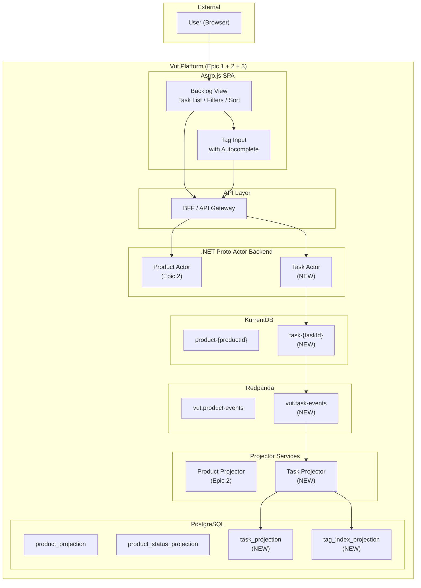

## 2. Component Diagram

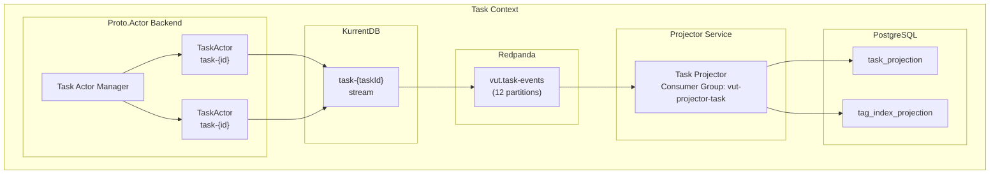

## 3. Actor Model: Task Actor

### 3.1 Task Actor Design

**Stream:** `task-{taskId}`
**Responsibility:** Manages the task aggregate root. Handles all task mutations (create, edit title, edit description, change status, add/remove tags).

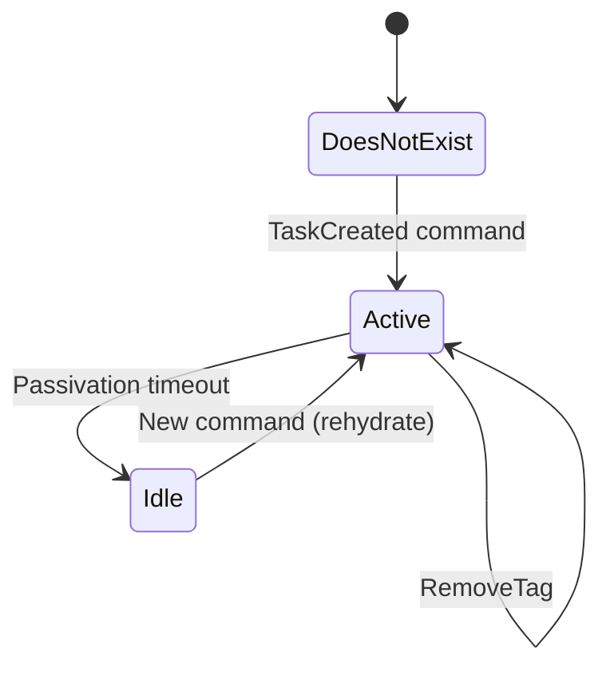

### 3.2 Commands

```
CreateTask(productId, title, description, tags) -> taskId
ChangeTitle(newTitle)
ChangeDescription(newDescription)
ChangeStatus(newStatus)
AddTag(tag)
RemoveTag(tag)
```

### 3.3 Events

| Event | Payload |
|-------|---------|
| `TaskCreated` | taskId, productId, title, description, actorId, timestamp |
| `TaskTitleChanged` | taskId, newTitle, actorId, timestamp |
| `TaskDescriptionChanged` | taskId, newDescription, actorId, timestamp |
| `TaskStatusChanged` | taskId, oldStatus, newStatus, actorId, timestamp |
| `TagAdded` | taskId, tag, actorId, timestamp |
| `TagRemoved` | taskId, tag, actorId, timestamp |

### 3.4 Actor State

```
TaskState:
  taskId: UUID
  productId: UUID
  title: string
  description: string
  status: string          // defaults to "New" on creation
  tags: Set<string>       // unique set of namespace:value strings
  createdAt: timestamp
  updatedAt: timestamp
```

### 3.5 Validation Rules

- **CreateTask:**
  - `title` must be non-empty.
  - `productId` must reference an existing product (verified by BFF before command).
  - `status` is set to the product's starting status (first status in `product_status_projection`).
  - `tags` must follow `namespace:value` format (regex: `[a-zA-Z0-9_-]+:[a-zA-Z0-9_-]+`).
  - No duplicate tags in the initial list.

- **ChangeTitle:** `newTitle` must be non-empty and different from current.

- **ChangeDescription:** No validation (empty description is allowed).

- **ChangeStatus:**
  - `newStatus` must exist in the product's status list (verified by reading product actor state or cached status list).
  - `newStatus` must differ from current status.
  - `oldStatus` in the event is the task's current status before the change.

- **AddTag:**
  - Tag must follow `namespace:value` format.
  - Tag must not already be present in the task's tag set.

- **RemoveTag:**
  - Tag must exist in the task's tag set.

### 3.6 Cross-Aggregate Interaction

The Task Actor needs to validate status changes against the Product's status configuration. Two design approaches:

**Chosen approach: BFF pre-validation with cached product status list.**

1. The BFF fetches the product's status list from the read model before issuing a `ChangeStatus` command.
2. The Task Actor also maintains a cached copy of the product's statuses (loaded at task creation time and updated via product events).
3. This avoids synchronous actor-to-actor calls while maintaining correctness.

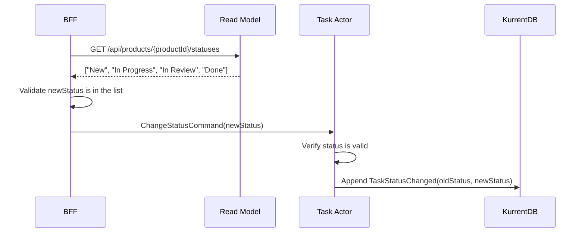

## 4. Event Stream Design

### 4.1 Stream: `task-{taskId}`

Example event sequence for a task:

```
Stream: task-f1e2d3c4
  1. TaskCreated  { title: "Implement login screen", productId: "a1b2...", description: "..." }
  2. TagAdded     { tag: "area:frontend" }
  3. TagAdded     { tag: "priority:high" }
  4. TaskTitleChanged { newTitle: "Implement mobile login screen" }
  5. TaskStatusChanged { oldStatus: "New", newStatus: "In Progress" }
  6. TagRemoved   { tag: "priority:high" }
```

### 4.2 Event Payload Details

**TaskCreated:**
```json
{
  "eventType": "TaskCreated",
  "payload": {
    "taskId": "f1e2d3c4-...",
    "productId": "a1b2c3d4-...",
    "title": "Implement login screen",
    "description": "## Overview\nBuild the login UI...",
    "actorId": "user-...",
    "timestamp": "2026-05-05T14:30:00.000Z"
  }
}
```

**TaskStatusChanged:**
```json
{
  "eventType": "TaskStatusChanged",
  "payload": {
    "taskId": "f1e2d3c4-...",
    "oldStatus": "New",
    "newStatus": "In Progress",
    "actorId": "user-...",
    "timestamp": "2026-05-05T15:00:00.000Z"
  }
}
```

**TagAdded:**
```json
{
  "eventType": "TagAdded",
  "payload": {
    "taskId": "f1e2d3c4-...",
    "tag": "area:frontend",
    "actorId": "user-...",
    "timestamp": "2026-05-05T14:35:00.000Z"
  }
}
```

### 4.3 Redpanda Topic: `vut.task-events`

- **Partitions:** 12 (higher partition count due to expected higher throughput)
- **Key:** `taskId` (string) -- ensures ordering per task
- **Consumer Groups:**
  - `vut-projector-task`: Updates task_projection and tag_index_projection
  - `vut-projector-cfd`: Updates cumulative flow snapshot (Epic 5)

## 5. Read Model Projections

### 5.1 Task Projection

```sql
-- Task current state
CREATE TABLE task_projection (
    task_id       UUID PRIMARY KEY,
    product_id    UUID NOT NULL REFERENCES product_projection(product_id),
    title         TEXT NOT NULL,
    description   TEXT NOT NULL DEFAULT '',
    status        TEXT NOT NULL,
    tags          JSONB NOT NULL DEFAULT '[]',  -- array of strings
    created_at    TIMESTAMPTZ NOT NULL,
    updated_at    TIMESTAMPTZ NOT NULL
);

-- Indexes for backlog queries
CREATE INDEX idx_task_projection_product ON task_projection(product_id);
CREATE INDEX idx_task_projection_product_status ON task_projection(product_id, status);
CREATE INDEX idx_task_projection_product_updated ON task_projection(product_id, updated_at DESC);

-- GIN index for tag filtering (JSONB contains)
CREATE INDEX idx_task_projection_tags ON task_projection USING GIN (tags jsonb_path_ops);

-- Full-text search index for title/description
CREATE INDEX idx_task_projection_search ON task_projection USING GIN (
    to_tsvector('english', coalesce(title, '') || ' ' || coalesce(description, ''))
);
```

### 5.2 Tag Index Projection

```sql
-- Tag autocomplete index per product
CREATE TABLE tag_index_projection (
    product_id    UUID NOT NULL REFERENCES product_projection(product_id),
    tag_namespace TEXT NOT NULL,
    tag_value     TEXT NOT NULL,
    tag_full      TEXT NOT NULL,  -- namespace:value
    use_count     INT NOT NULL DEFAULT 1,
    last_used_at  TIMESTAMPTZ NOT NULL,
    PRIMARY KEY (product_id, tag_full)
);

-- Index for autocomplete queries
CREATE INDEX idx_tag_index_product_namespace ON tag_index_projection(product_id, tag_namespace);
CREATE INDEX idx_tag_index_product_use_count ON tag_index_projection(product_id, use_count DESC);
```

### 5.3 Projector Event Handling

| Event | Projection Action |
|-------|-------------------|
| `TaskCreated` | INSERT into `task_projection` (status = starting status from product config) |
| `TaskTitleChanged` | UPDATE `task_projection.title`, UPDATE `updated_at` |
| `TaskDescriptionChanged` | UPDATE `task_projection.description`, UPDATE `updated_at` |
| `TaskStatusChanged` | UPDATE `task_projection.status`, UPDATE `updated_at` |
| `TagAdded` | UPDATE `task_projection.tags` (append to JSONB array); UPSERT into `tag_index_projection` (increment `use_count`) |
| `TagRemoved` | UPDATE `task_projection.tags` (remove from JSONB array) |

### 5.4 Tag Index Maintenance

The Tag Index projector tracks tag usage for autocomplete:

- On `TagAdded`: UPSERT into `tag_index_projection`. If the tag already exists for the product, increment `use_count` and update `last_used_at`.
- On `TagRemoved`: Do NOT decrement `use_count` -- the tag still exists as a valid suggestion. We track usage, not current applicability.
- This means the tag index is append-only and grows over time, which is correct behavior for autocomplete.

## 6. Key Workflow Sequence Diagrams

### 6.1 Create Task

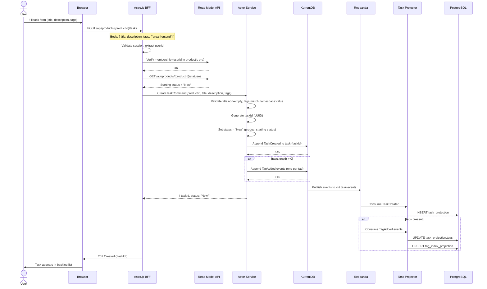

### 6.2 Inline Edit Task Title

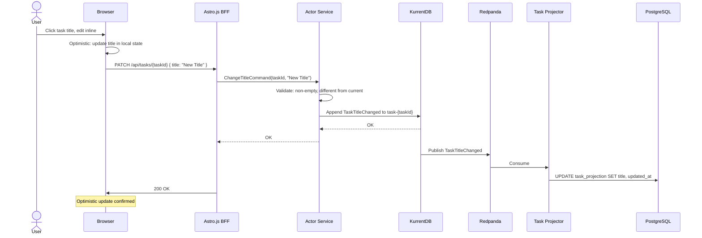

### 6.3 Add Tag with Autocomplete

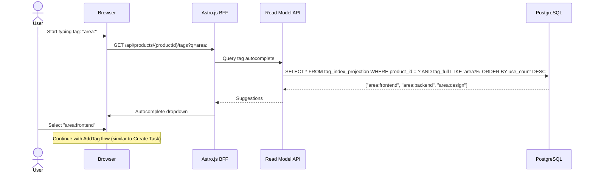

### 6.4 Filter and Sort Backlog

```mermaid
sequenceDiagram
    actor User
    participant Browser
    participant BFF as Astro.js BFF
    participant RM as Read Model API
    participant PG as PostgreSQL

    User->>Browser: Apply filter: status IN ["New","In Progress"], tag includes "area:frontend"
    Browser->>BFF: GET /api/products/{productId}/tasks?status=New,In Progress&tag=area:frontend&sort=updated_at:desc

    BFF->>RM: Query tasks
    RM->>PG: |
        SELECT * FROM task_projection
        WHERE product_id = $1
        AND status = ANY($2)
        AND tags @> '["area:frontend"]'::jsonb
        ORDER BY updated_at DESC
        LIMIT 50 OFFSET 0
    PG-->>RM: Task rows
    RM-->>BFF: Task list

    BFF->>Browser: Filtered task list
    Browser->>User: Updated backlog display
```

### 6.5 Change Task Status

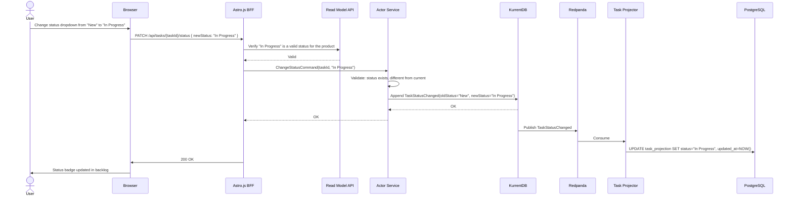

## 7. API Design

### 7.1 Task Endpoints

| Method | Path | Description | Auth |
|--------|------|-------------|------|
| POST | `/api/products/{productId}/tasks` | Create task | Org member |
| GET | `/api/products/{productId}/tasks` | List tasks (with filters/sort) | Org member |
| GET | `/api/tasks/{taskId}` | Get task details | Org member |
| PATCH | `/api/tasks/{taskId}` | Update title/description | Org member |
| PATCH | `/api/tasks/{taskId}/status` | Change status | Org member |
| POST | `/api/tasks/{taskId}/tags` | Add tag | Org member |
| DELETE | `/api/tasks/{taskId}/tags/{tag}` | Remove tag | Org member |

### 7.2 Tag Autocomplete Endpoint

| Method | Path | Description | Auth |
|--------|------|-------------|------|
| GET | `/api/products/{productId}/tags?q={prefix}` | Tag autocomplete suggestions | Org member |

### 7.3 Backlog Query Parameters

```
GET /api/products/{productId}/tasks
  ?status=New,In Progress     (comma-separated, OR logic)
  &tag=area:frontend          (repeatable, AND logic)
  &tag=-type:bug              (exclude with - prefix)
  &q=search text              (title + description full-text)
  &sort=updated_at:desc       (field:direction)
  &page=1&pageSize=50         (pagination)
```

## 8. Frontend Architecture

### 8.1 Backlog Page Layout

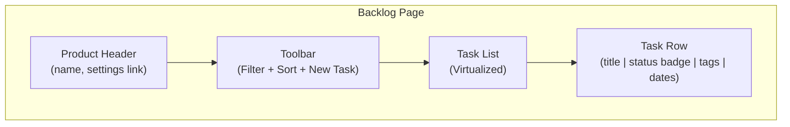

### 8.2 Inline Editing Pattern

Title and description use inline editing:
1. Click on the text to enter edit mode.
2. Text becomes an editable input/textarea.
3. On blur or Enter, the change is saved (API call).
4. On Escape, the change is reverted.
5. Optimistic update: local state updates immediately, reverts on API error.

### 8.3 Tag Input Component

The tag input component:
1. Shows current tags as removable badges.
2. Typing shows autocomplete suggestions from the tag index.
3. Only allows `namespace:value` format (validated client-side).
4. Typing `:` triggers namespace-scoped suggestions.
5. Enter or click adds the tag.

### 8.4 Client-Side Filtering and Sorting

For responsiveness, the backlog supports both client-side and server-side modes:
- **Client-side** (default for < 1000 tasks): Full task list is fetched once. Filtering and sorting are applied in-browser. No server round-trips for filter changes.
- **Server-side** (automatic for >= 1000 tasks): Pagination is enabled. Each filter/sort change triggers a new API request.

The transition between modes is transparent -- the same UI components work with both data sources.

## 9. State Diagram: Task Lifecycle

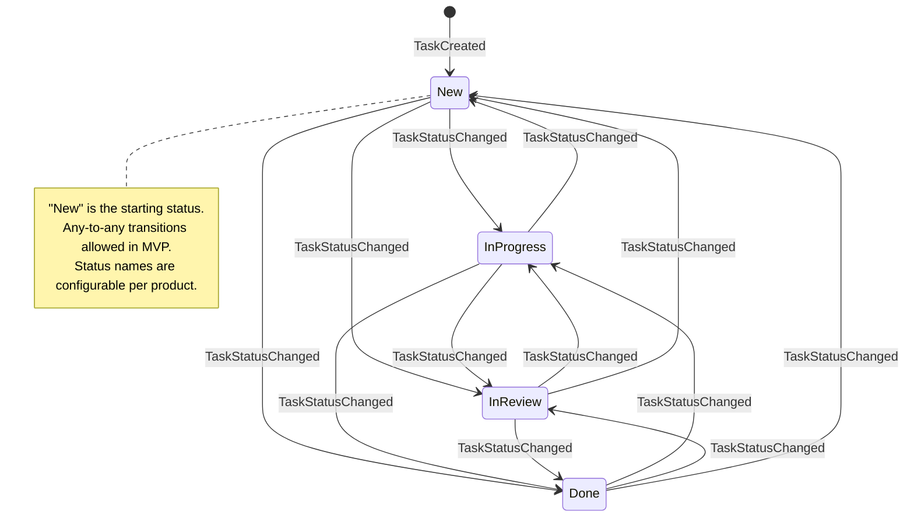

## 10. Data Flow

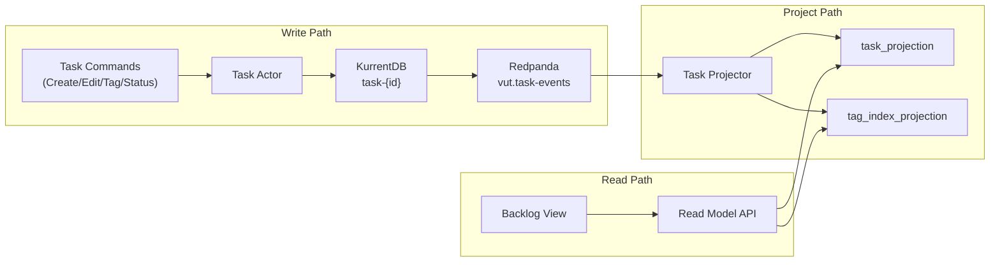

## 11. Performance Considerations

### 11.1 Backlog Load Time (< 1 second for 10,000 tasks)

- **Database indexes:** Composite indexes on `(product_id, updated_at)`, `(product_id, status)`, and GIN index on `tags` JSONB column.
- **Pagination:** Default page size of 50 tasks. Infinite scroll loads additional pages.
- **Projection optimization:** The `task_projection` table is a flat denormalized view. No joins needed for the backlog list.
- **Client-side cache:** Once loaded, filter/sort changes are applied client-side (for < 1000 tasks), avoiding server round-trips.

### 11.2 Tag Autocomplete Performance

- The `tag_index_projection` table is small (unique tags per product, typically < 100 rows).
- Indexed by `(product_id, tag_full)` with ILIKE prefix matching.
- Results are cached client-side per product for the session duration.

### 11.3 Actor Passivation

Task actors are passivated after 5 minutes of inactivity. For a product with 10,000 tasks, only recently-modified tasks have active actors. This keeps memory usage bounded.

## 12. Impact on Future Epics

This epic establishes the following that Epics 4-6 depend on:

| Component | Used By |
|-----------|---------|
| `task_projection` with status + tags | Epic 4 (Kanban), Epic 5 (CFD), Epic 6 (Saved Views) |
| `TaskStatusChanged` event | Epic 5 (CFD snapshot projection) |
| Tag index for autocomplete | Epic 4 (Kanban filters), Epic 6 (Saved Views) |
| Inline editing pattern | Epic 4 (Card detail panel) |
| Status change via API | Epic 4 (Drag-and-drop) |
