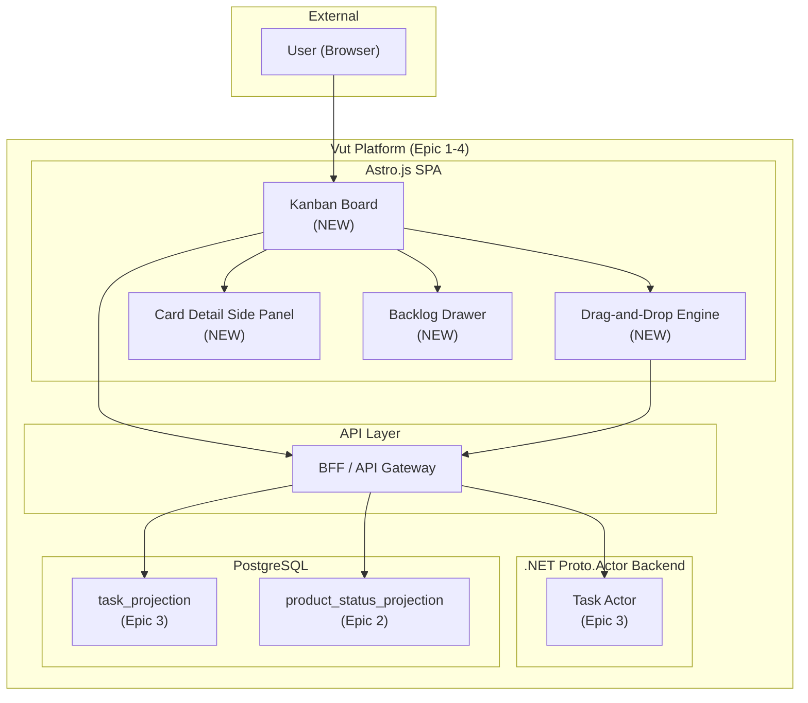
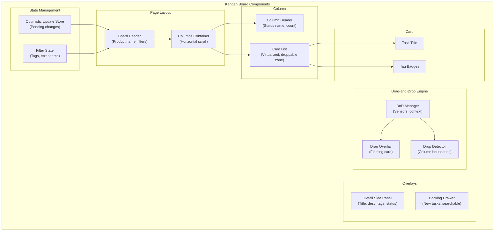
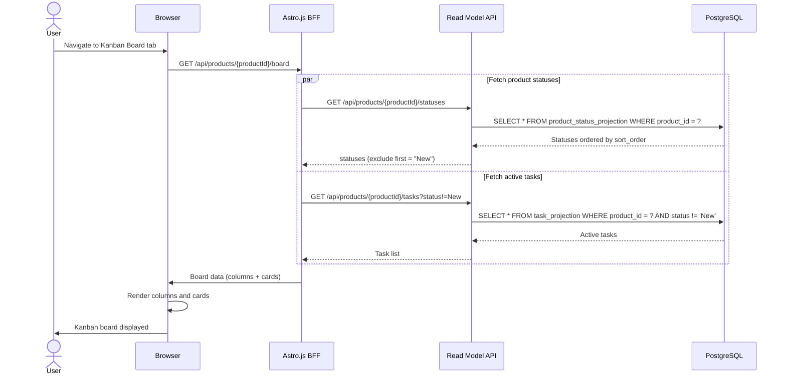
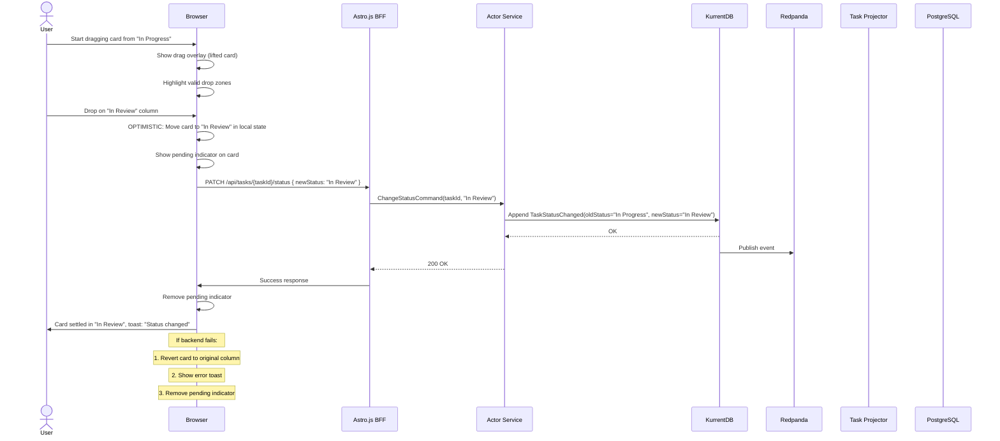
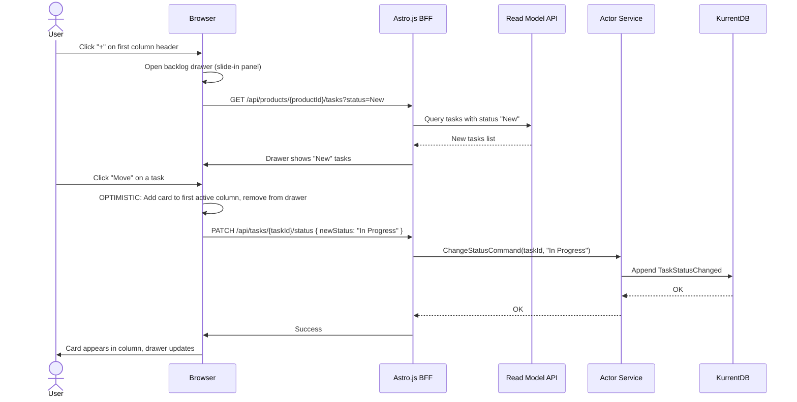
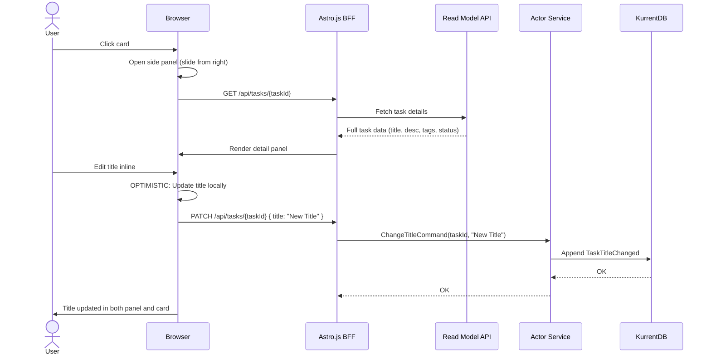
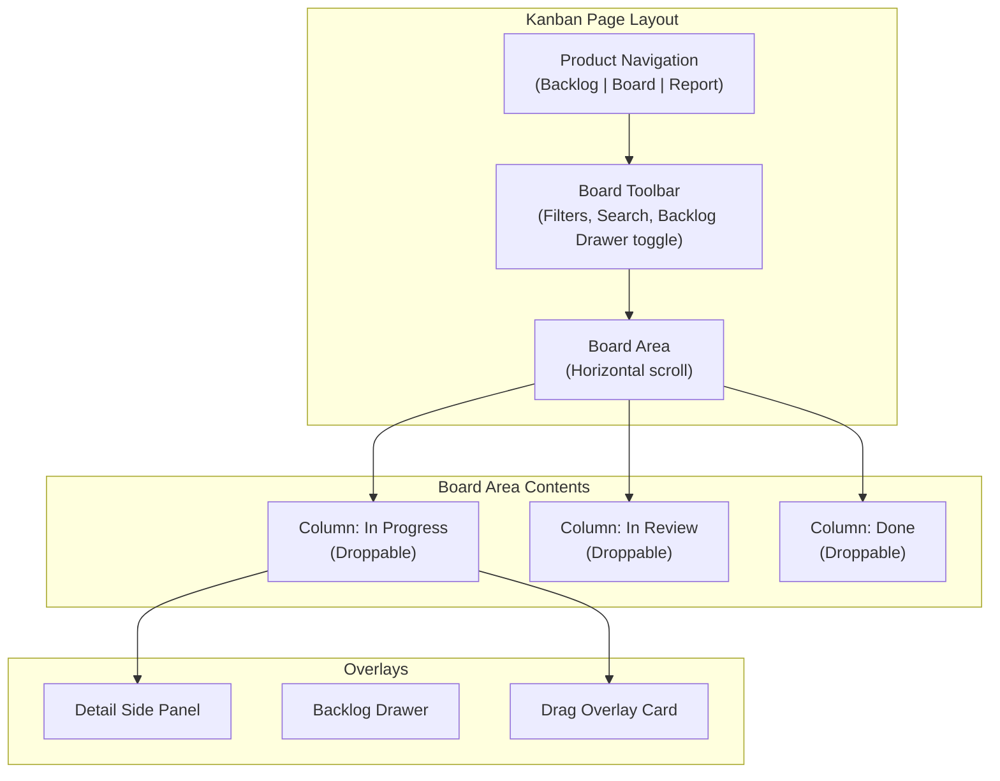
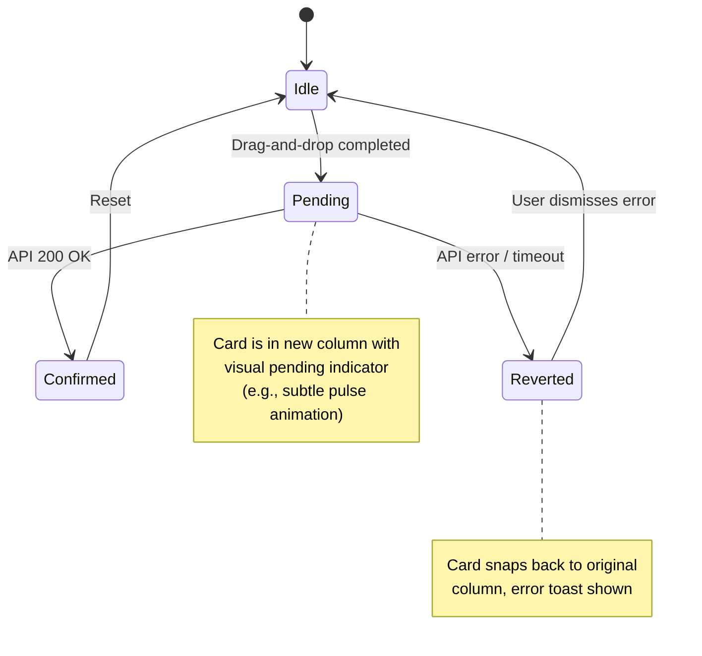
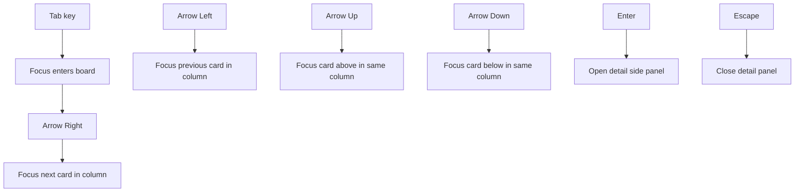
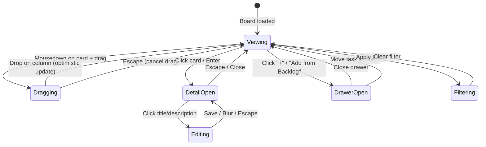

# Epic 4 Architecture: Kanban Board with Drag-and-Drop

## 1. System Context

Epic 4 introduces the Kanban Board -- a visual, column-based view of active work. It consumes existing event types (no new events) and reuses the Task Actor for status changes. The primary complexity is in the frontend: drag-and-drop, optimistic updates, keyboard accessibility, and the "Add from Backlog" drawer.



## 2. Component Diagram



## 3. Data Flow

### 3.1 Board Loading



### 3.2 Drag-and-Drop Status Change (Optimistic Update)



### 3.3 "Add from Backlog" Drawer



### 3.4 Card Detail Panel



## 4. Frontend Architecture

### 4.1 Kanban Board Page Structure



### 4.2 Drag-and-Drop Library

Recommended library: **@dnd-kit/core** (or equivalent for Astro.js framework integration)

Key configuration:
- **Sensors:** Pointer sensor (mouse/touch) with activation constraint (5px distance to prevent accidental drags)
- **Droppable columns:** Each status column is a droppable area
- **Draggable cards:** Each task card is draggable
- **Drag overlay:** A rendered copy of the card follows the cursor during drag
- **Collision detection:** Rect intersection algorithm to determine target column

### 4.3 Optimistic Update Pattern



### 4.4 Optimistic Update Store

The client-side store tracks pending operations:

```typescript
// Pseudocode for optimistic update state
interface PendingChange {
  taskId: string;
  type: "status_change";
  originalStatus: string;
  newStatus: string;
  timestamp: Date;
}

interface BoardState {
  columns: Map<string, Task[]>;  // status -> tasks
  pendingChanges: Map<string, PendingChange>;  // taskId -> pending
  filters: BoardFilters;
}
```

When a drag completes:
1. Add entry to `pendingChanges`.
2. Move the task in `columns` map from old status to new status.
3. Fire API request.
4. On success: remove from `pendingChanges`.
5. On failure: reverse the `columns` move, remove from `pendingChanges`, show error toast.

### 4.5 Keyboard Navigation



Keyboard accessibility requirements:
- All cards are focusable (`tabindex` managed by roving tabindex pattern).
- Arrow keys move focus between cards within and across columns.
- Enter opens the detail side panel.
- Escape closes the detail side panel.
- ARIA labels on columns (e.g., "In Progress column, 5 tasks") and cards (e.g., "Implement login screen, status: In Progress").
- Focus is trapped in the detail panel when open.

### 4.6 Responsive Behavior

- **Desktop (>1024px):** Columns are displayed side by side, horizontal scroll if > 4 columns.
- **Tablet (768-1024px):** Columns are narrower, horizontal scroll always enabled.
- **Mobile (<768px):** Columns stack vertically (swipe between columns), cards are full-width. Touch drag is supported.

## 5. API Design

No new API endpoints are introduced in this epic. The Kanban Board consumes:

| Endpoint | Usage |
|----------|-------|
| `GET /api/products/{productId}/statuses` | Column headers |
| `GET /api/products/{productId}/tasks?status!=New` | Board data (excludes "New") |
| `PATCH /api/tasks/{taskId}/status` | Drag-and-drop status change |
| `GET /api/tasks/{taskId}` | Card detail panel |
| `PATCH /api/tasks/{taskId}` | Inline title/description edit from panel |
| `POST /api/tasks/{taskId}/tags` | Add tag from panel |
| `DELETE /api/tasks/{taskId}/tags/{tag}` | Remove tag from panel |
| `GET /api/products/{productId}/tags?q=` | Tag autocomplete in panel |

### 5.1 Board Data Endpoint (Optimized)

A dedicated board endpoint that returns all data in a single call:

```
GET /api/products/{productId}/board

Response:
{
  "columns": [
    { "status": "In Progress", "sortOrder": 1 },
    { "status": "In Review", "sortOrder": 2 },
    { "status": "Done", "sortOrder": 3 }
  ],
  "tasks": [
    {
      "taskId": "...",
      "title": "Implement login",
      "status": "In Progress",
      "tags": ["area:frontend", "priority:high"],
      "updatedAt": "2026-05-05T15:00:00Z"
    }
  ]
}
```

## 6. State Diagram: Board Interaction



## 7. Performance Considerations

### 7.1 Board Rendering

- **Virtualized card lists:** Columns with > 20 cards use virtualization (render only visible cards).
- **Memoized cards:** Task cards are memoized components -- re-render only when their specific data changes.
- **Column reflow:** Columns are CSS Grid or Flexbox. No JavaScript-based layout calculations.

### 7.2 Drag-and-Drop Performance

- Drag overlay is a single DOM element that follows the cursor. The original card becomes a placeholder.
- Collision detection runs on `requestAnimationFrame`, not on every mouse move.
- During drag, no API calls are made until the drop event.

### 7.3 Optimistic Update Safety

- Pending changes have a client-side timeout (10 seconds). If the API doesn't respond, the change is reverted.
- Only one pending status change per task is allowed. A second drag on the same task while pending is queued.
- The pending indicator provides visual feedback that the change hasn't been confirmed yet.

## 8. Accessibility (a11y)

| Feature | Implementation |
|---------|---------------|
| Roving tabindex | Only one card is in the tab order at a time. Arrow keys move the tabindex. |
| ARIA roles | Board: `role="grid"`, Columns: `role="row"`, Cards: `role="gridcell"` |
| ARIA labels | Column: `"In Progress column, 5 tasks"`, Card: `"Implement login, In Progress"` |
| Live regions | `aria-live="polite"` on toast container for status change announcements |
| Focus management | Focus moves to detail panel when opened, returns to card when closed |
| Keyboard shortcuts | Enter (open detail), Escape (close), Arrow keys (navigate) |
| Screen reader | Status changes announced: `"Task moved to In Review"` |

## 9. Impact on Future Epics

| Component | Used By |
|-----------|---------|
| Board data endpoint | Epic 5 (Report may reference board), Epic 6 (Saved Views extends board) |
| Filter state management | Epic 6 (Saved Views serializes/deserializes filter state) |
| Optimistic update pattern | Epic 5 (if any interactive report features), Phase 2 (real-time updates) |
| Card detail panel | Reused across all epics for task interaction |
| Drag-and-drop engine | Phase 2 (real-time collaborative drag-and-drop) |
