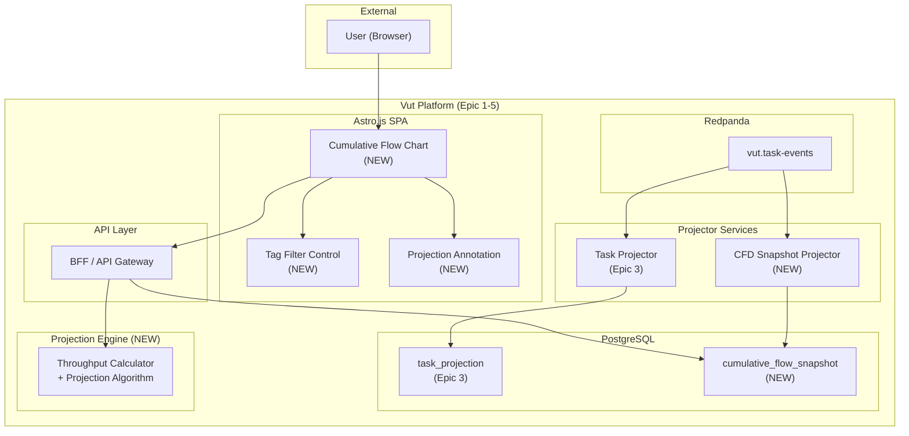
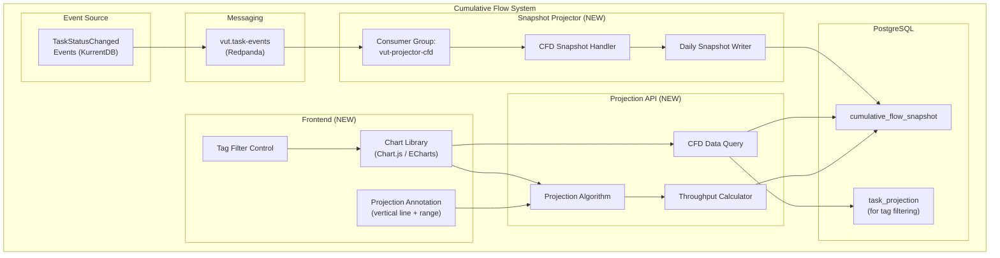
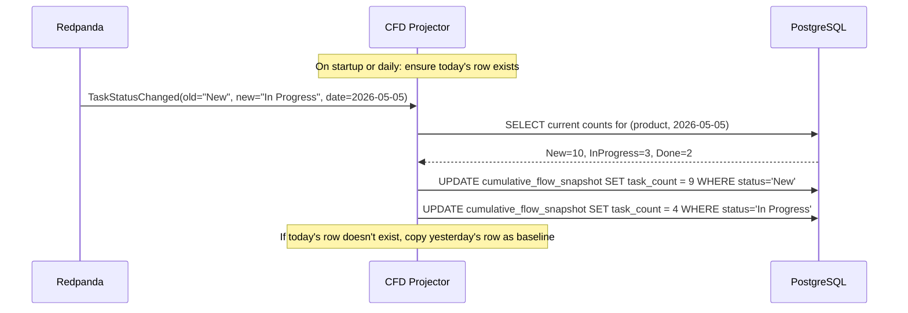
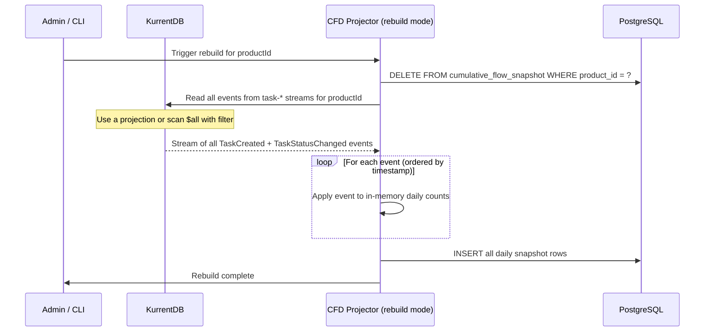
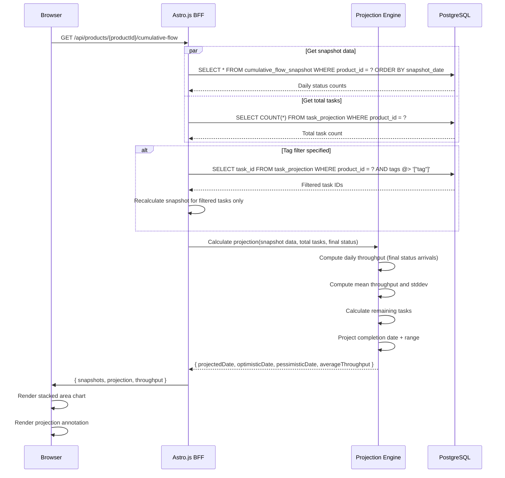
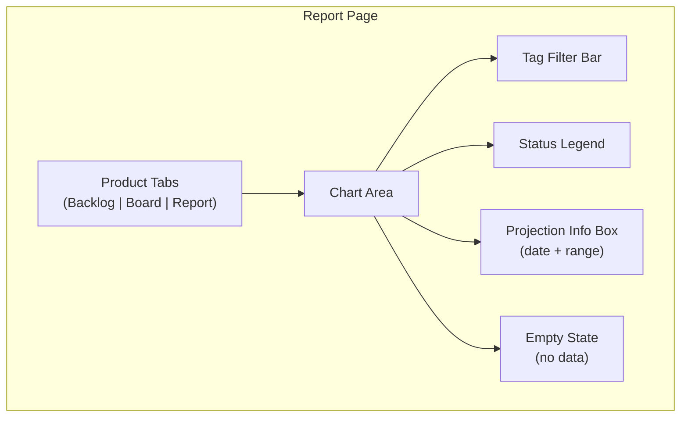
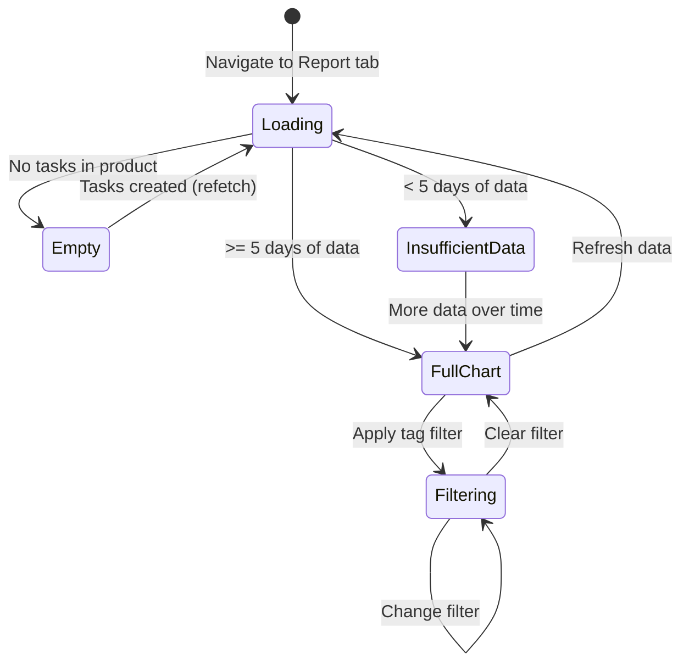
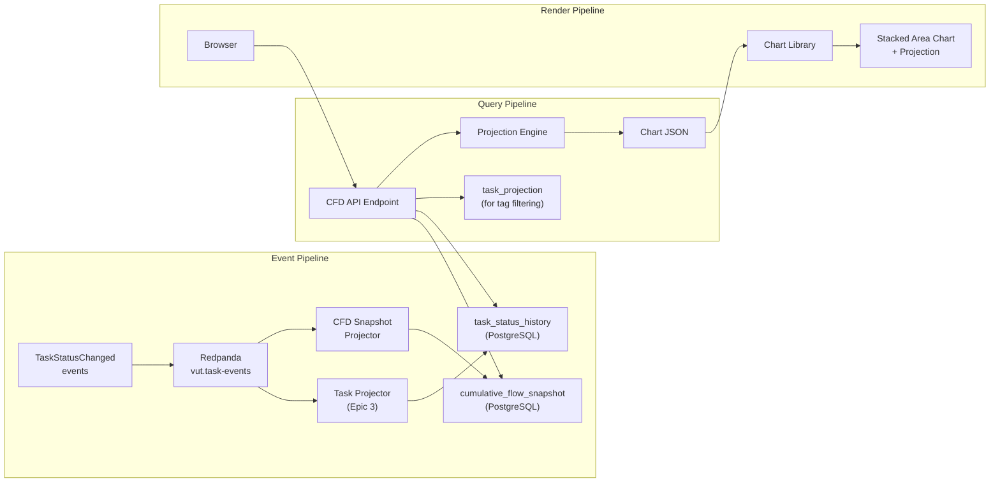

# Epic 5 Architecture: Cumulative Flow & Completion Forecast

## 1. System Context

Epic 5 delivers Vut's signature feature: the cumulative flow diagram with a projected completion date. It introduces a new projection (Cumulative Flow Snapshot) that pre-aggregates daily task counts per status, a throughput-based projection algorithm, and an interactive chart UI. No new event types are introduced; it consumes existing `TaskStatusChanged` events.



## 2. Component Diagram



## 3. Cumulative Flow Snapshot Projection

### 3.1 Table Schema

```sql
-- Daily snapshot of task counts per status per product
CREATE TABLE cumulative_flow_snapshot (
    product_id    UUID NOT NULL REFERENCES product_projection(product_id),
    snapshot_date DATE NOT NULL,
    status        TEXT NOT NULL,
    task_count    INT NOT NULL DEFAULT 0,
    PRIMARY KEY (product_id, snapshot_date, status)
);

-- Index for CFD queries (date range per product)
CREATE INDEX idx_cfs_product_date ON cumulative_flow_snapshot(product_id, snapshot_date);

-- Index for throughput queries (final status per product over time)
CREATE INDEX idx_cfs_product_status_date ON cumulative_flow_snapshot(product_id, status, snapshot_date);
```

### 3.2 Snapshot Construction

The snapshot is maintained incrementally by the CFD Snapshot Projector, which consumes `TaskStatusChanged` events from Redpanda.

```mermaid
flowchart TD
    Event["TaskStatusChanged event"] --> Extract["Extract:<br/>productId, oldStatus, newStatus, timestamp(date)"]
    Extract --> DateKey["Date key = event timestamp UTC date"]
    Extract --> Decrement["Decrement oldStatus count<br/>for (productId, date, oldStatus)"]
    Extract --> Increment["Increment newStatus count<br/>for (productId, date, newStatus)"]

    Decrement --> Upsert1["UPSERT into<br/>cumulative_flow_snapshot"]
    Increment --> Upsert2["UPSERT into<br/>cumulative_flow_snapshot"]

    note right of DateKey
        All dates are UTC.
        snapshot_date is the calendar date
        when the event occurred.
    end note
```

### 3.3 Snapshot Projector Logic

For each `TaskStatusChanged` event:

1. Extract `productId`, `oldStatus`, `newStatus`, and `timestamp` from the event.
2. Determine `snapshot_date` = `timestamp.ToUniversalTime().Date`.
3. Decrement the count for `(productId, snapshot_date, oldStatus)`:
   - If the row exists, decrement `task_count` by 1.
   - If `task_count` reaches 0, DELETE the row (keeps the table clean).
   - If the row doesn't exist (edge case: first event of the day for a status that has no tasks yet), INSERT with `task_count = -1` (this can happen if events arrive out of order; the rebuild corrects it).
4. Increment the count for `(productId, snapshot_date, newStatus)`:
   - If the row exists, increment `task_count` by 1.
   - If the row doesn't exist, INSERT with `task_count = 1`.

**Important:** The snapshot represents cumulative counts per day. To get the count for a given day, we must SUM all deltas from the beginning up to that date. Alternatively, we can store absolute counts per day (easier for querying).

### 3.4 Alternative: Absolute Daily Snapshots

To simplify queries, the snapshot stores **absolute counts** per status per day. The projector maintains these:



**Daily Row Creation:** At the start of each new day (UTC midnight), or lazily on the first event of the day, the projector creates a new row for today by copying yesterday's counts. This ensures every day has a complete row per status.

### 3.5 Snapshot Rebuild

A rebuild mechanism allows recreating the entire snapshot from scratch:



## 4. Throughput Calculation

### 4.1 Definition

**Throughput** = number of tasks reaching the final status per unit time (per day).

The final status is the last status in the product's ordered status list (e.g., "Done").

### 4.2 Query

```sql
-- Throughput: tasks entering the final status per day
SELECT
    snapshot_date,
    task_count AS daily_done_count
FROM cumulative_flow_snapshot
WHERE product_id = $1
  AND status = 'Done'  -- final status
  AND snapshot_date >= $2  -- start of measurement window
ORDER BY snapshot_date;
```

### 4.3 Daily Throughput Derivation

The snapshot stores absolute counts per day. To derive daily throughput:

```sql
-- Daily throughput = increase in Done count from previous day
SELECT
    today.snapshot_date,
    today.task_count - COALESCE(yesterday.task_count, 0) AS daily_throughput
FROM cumulative_flow_snapshot today
LEFT JOIN cumulative_flow_snapshot yesterday
    ON today.product_id = yesterday.product_id
    AND yesterday.snapshot_date = today.snapshot_date - INTERVAL '1 day'
    AND yesterday.status = 'Done'
WHERE today.product_id = $1
  AND today.status = 'Done'
ORDER BY today.snapshot_date;
```

## 5. Projection Algorithm

### 5.1 Linear Extrapolation (MVP)

The MVP uses linear extrapolation based on average throughput:

```
Remaining tasks = Total tasks - Tasks in final status
Average daily throughput = SUM(daily throughput) / number of days with data
Projected days to completion = Remaining tasks / Average daily throughput
Projected completion date = Today + Projected days to completion
```

### 5.2 Confidence Range

The confidence range is based on throughput variance:

```
Daily throughputs = [t1, t2, t3, ..., tn]
Mean throughput = avg(t1..tn)
Std deviation = stddev(t1..tn)

Optimistic days = Remaining tasks / (Mean + StdDev * 0.5)
Pessimistic days = Remaining tasks / max(Mean - StdDev * 0.5, 0.1)

Optimistic date = Today + Optimistic days
Pessimistic date = Today + Pessimistic days

Projected range = [Optimistic date, Pessimistic date]
```

### 5.3 Projection Sequence



### 5.4 Insufficient Data Handling

The projection is hidden or shows a warning when:
- Fewer than 5 days of status transition data exist.
- Average throughput is 0 (no tasks have reached the final status).
- Remaining tasks is 0 (all tasks are in the final status -- project is complete).

## 6. Tag-Based Filtering

### 6.1 Filtered CFD Query

When a tag filter is applied, the CFD must recalculate using only matching tasks:

```mermaid
sequenceDiagram
    participant Browser
    participant BFF as Astro.js BFF
    participant PG as PostgreSQL

    Browser->>BFF: GET /api/products/{productId}/cumulative-flow?tag=area:frontend

    BFF->>PG: SELECT task_id FROM task_projection WHERE product_id = ? AND tags @> '["area:frontend"]'
    PG-->>BFF: Filtered task IDs: [t1, t3, t7, ...]

    Note over BFF: Cannot use pre-aggregated snapshot<br/>for tag-filtered queries.

    BFF->>PG: |
        For each filtered task, get its TaskStatusChanged events
        (requires either scanning the event store or a per-task
        status history table)

    Note over BFF: Alternative: maintain a tag-scoped<br/>snapshot index.

    BFF->>BFF: Reconstruct daily counts for filtered tasks
    BFF->>BFF: Calculate projection for filtered subset
    BFF-->>Browser: Filtered CFD data + projection
```

### 6.2 Tag-Filtered Snapshot Strategy

Two approaches:

**Approach A: On-the-fly calculation (simpler, slower)**
- When a tag filter is applied, query `task_projection` for matching task IDs.
- For each matching task, reconstruct its status history from events (or a status history table).
- Build daily counts dynamically.
- Acceptable for small-to-medium datasets (< 1000 filtered tasks).

**Approach B: Pre-computed tag snapshots (complex, faster)**
- Maintain a secondary snapshot indexed by tag.
- Impractical for free-form tags (too many combinations).

**Recommended for MVP: Approach A** with a status history projection:

```sql
-- Status history per task (enables tag-filtered CFD without scanning KurrentDB)
CREATE TABLE task_status_history (
    task_id       UUID NOT NULL,
    old_status    TEXT,
    new_status    TEXT NOT NULL,
    changed_at    TIMESTAMPTZ NOT NULL,
    PRIMARY KEY (task_id, changed_at)
);

CREATE INDEX idx_tsh_task ON task_status_history(task_id);
CREATE INDEX idx_tsh_date ON task_status_history(changed_at);
```

The Task Projector (from Epic 3) populates this table when processing `TaskStatusChanged` events. With this table, tag-filtered CFD queries can:

1. Find filtered task IDs from `task_projection`.
2. Get status transitions for those tasks from `task_status_history`.
3. Reconstruct daily counts in SQL or application code.

### 6.3 Tag-Filtered Query Performance

For the tag-filtered CFD query with `task_status_history`:

```sql
-- Get status transitions for filtered tasks
SELECT h.task_id, h.old_status, h.new_status, h.changed_at
FROM task_status_history h
JOIN task_projection t ON h.task_id = t.task_id
WHERE t.product_id = $1
  AND t.tags @> $2::jsonb  -- '["area:frontend"]'
ORDER BY h.changed_at;
```

This query is bounded by the number of filtered tasks times their average status transitions. For 1000 tasks with ~5 transitions each = 5000 rows -- well within performance bounds.

## 7. API Design

### 7.1 Cumulative Flow Endpoints

| Method | Path | Description |
|--------|------|-------------|
| GET | `/api/products/{productId}/cumulative-flow` | Get CFD data + projection |
| GET | `/api/products/{productId}/cumulative-flow?tag=area:frontend` | Tag-filtered CFD |
| POST | `/api/admin/products/{productId}/cumulative-flow/rebuild` | Rebuild snapshot (admin) |

### 7.2 CFD Response Format

```json
{
  "productId": "a1b2c3d4-...",
  "statuses": ["New", "In Progress", "In Review", "Done"],
  "finalStatus": "Done",
  "snapshots": [
    {
      "date": "2026-05-01",
      "counts": {
        "New": 10,
        "In Progress": 3,
        "In Review": 1,
        "Done": 2
      }
    },
    {
      "date": "2026-05-02",
      "counts": {
        "New": 9,
        "In Progress": 4,
        "In Review": 1,
        "Done": 3
      }
    }
  ],
  "projection": {
    "projectedDate": "2026-06-12",
    "optimisticDate": "2026-06-05",
    "pessimisticDate": "2026-06-20",
    "averageThroughput": 1.4,
    "remainingTasks": 12,
    "totalTasks": 16,
    "hasSufficientData": true,
    "dataPoints": 14
  },
  "filteredBy": null
}
```

### 7.3 Tag-Filtered Response

Same format, with `filteredBy` populated:

```json
{
  "filteredBy": ["area:frontend"],
  "snapshots": [...],
  "projection": {
    "projectedDate": "2026-05-28",
    "remainingTasks": 4,
    "totalTasks": 6,
    ...
  }
}
```

## 8. Frontend Architecture

### 8.1 Chart Component



### 8.2 Chart Rendering Library

Recommended: **Apache ECharts** (via astro integration) or **Chart.js**.

Key chart configuration:
- **Chart type:** Stacked area chart.
- **X-axis:** Time (date). Auto-scales from first data point to projected date.
- **Y-axis:** Task count (integer). Starts at 0.
- **Bands:** One colored area per status, stacked. Statuses are ordered matching the product's status order.
- **Colors:** Status colors are assigned per product. Default palette ensures WCAG 2.1 AA contrast between adjacent bands.
- **Projection line:** A dashed vertical line at the projected date, extending the chart canvas.
- **Projection range:** A shaded area between optimistic and pessimistic dates.
- **Tooltip:** On hover, shows exact counts per status for the hovered date.
- **Responsive:** Chart resizes with the container. Aspect ratio maintained.

### 8.3 Tag Filter Control

The tag filter control allows the user to select tags to include:
1. A multi-select input with autocomplete from the product's tag index.
2. Selected tags appear as removable badges.
3. Changing the tag filter triggers a new API request (or client-side re-filtering if data is already loaded).
4. The chart re-renders with filtered data. The projection recalculates.

### 8.4 Empty and Insufficient Data States

| State | Display |
|-------|---------|
| No tasks in product | "Add tasks and move them through your workflow to see the cumulative flow diagram." |
| Tasks exist but no status changes | A single stacked bar showing all tasks in "New" status. No projection. |
| < 5 days of data | Chart renders with available data. Projection area says: "Insufficient data for projection. Keep moving tasks through your workflow." |
| >= 5 days of data | Full chart + projection. |

## 9. State Diagram: Report Loading



## 10. Data Flow



## 11. Performance Considerations

### 11.1 Snapshot Query Performance

The unfiltered CFD query fetches from `cumulative_flow_snapshot`:
- Typical dataset: 30-90 rows (30 days x 3-4 statuses).
- Indexed by `(product_id, snapshot_date)` -- fast range scan.
- Query time: < 10ms.

### 11.2 Tag-Filtered Query Performance

Tag-filtered queries join `task_projection` (tags) with `task_status_history`:
- For 1000 filtered tasks with 5 transitions each: 5000 rows.
- Query time: < 200ms with proper indexes.
- Result is cached client-side for the session.

### 11.3 Projection Calculation

Throughput calculation and linear extrapolation are done in-memory in the .NET Projection Engine:
- Processing 90 days of throughput data is trivial (< 1ms).
- The result is included in the API response, not computed client-side.

### 11.4 Chart Rendering

- ECharts/Chart.js renders 90 data points with 4 series in < 50ms.
- Tag filter changes trigger a new API request; the chart shows a loading skeleton during refetch.
- The projected date range extends the X-axis beyond the last data point, which the chart library handles natively.

## 12. Open Design Decisions (from PRD Section 9)

| Decision | Recommendation |
|----------|---------------|
| Projection algorithm | Linear extrapolation (MVP). Monte Carlo simulation in Phase 2. |
| Minimum data threshold | 5 days of status transitions before showing projection. |
| Status rename handling | Maintain a status name mapping in the product projection. Historical snapshot data uses the name current at the time of the snapshot. Renames update future snapshots only. |
| Tag filtering for CFD | Use `task_status_history` table for on-the-fly reconstruction. Acceptable performance for MVP. |
