# Epic 6 Architecture: Saved Views & Personal Kanban Filters

## 1. System Context

Epic 6 adds personal, persistent filter/sort configurations on top of the Kanban Board from Epic 4. Saved views are scoped per user per product and allow instant switching between perspectives without reconfiguring filters. This is a focused feature with primarily frontend and API work; the backend adds a lightweight persistence mechanism.

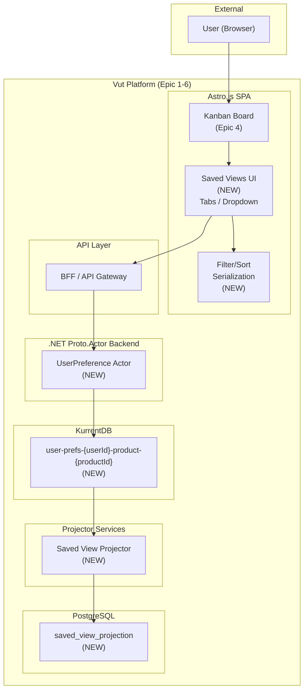

## 2. Component Diagram

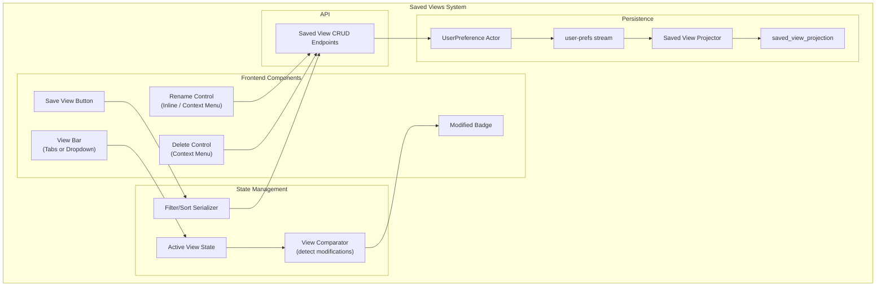

## 3. Storage Design Decision

The epic spec raises a question: should saved views be event-sourced or stored directly in PostgreSQL?

### 3.1 Decision: Event-Sourced with Lightweight Projection

Saved views ARE event-sourced for consistency with the overall architecture, but with pragmatic concessions:

**Rationale:**
- The project is event-sourced throughout. Mixing in a CRUD table for one entity type creates architectural inconsistency.
- Event sourcing enables audit trails for preference changes (useful in Phase 2 for shared views).
- The projection is trivial (no complex joins or aggregations).

**Concession:** The UserPreference Actor is lightweight. It does not need the full rehydration-from-KurrentDB pattern because:
- Preference streams are tiny (a few events per product per user).
- The actor is almost always passivated between uses.
- The projection is the primary read path; the actor is only for writes.

### 3.2 Stream Naming

`user-prefs-{userId}-product-{productId}`

Each user-product combination gets its own stream. This keeps streams small and avoids cross-contamination between products.

### 3.3 Alternative Considered: Direct PostgreSQL Table

A simpler approach would be a single PostgreSQL table with no event sourcing:

```sql
-- Not chosen for MVP, but viable for Phase 2 simplification
CREATE TABLE saved_views (
    view_id UUID PRIMARY KEY,
    user_id UUID NOT NULL,
    product_id UUID NOT NULL,
    name TEXT NOT NULL,
    filters JSONB NOT NULL,
    sort JSONB NOT NULL,
    created_at TIMESTAMPTZ NOT NULL,
    updated_at TIMESTAMPTZ NOT NULL
);
```

This approach is noted as a fallback if the event-sourced approach proves too heavyweight for user preferences.

## 4. Actor Model: UserPreference Actor

### 4.1 Actor Design

**Stream:** `user-prefs-{userId}-product-{productId}`
**Responsibility:** Manages saved view CRUD for a specific user-product combination.

```
Commands:
  SaveView(name, filters, sort) -> viewId
  RenameView(viewId, newName)
  DeleteView(viewId)

Events:
  ViewSaved(viewId, userId, productId, name, filters, sort, actorId, timestamp)
  ViewRenamed(viewId, newName, actorId, timestamp)
  ViewDeleted(viewId, actorId, timestamp)

State:
  views: Map<viewId, SavedView>

SavedView:
  viewId: UUID
  name: string
  filters: FilterConfiguration
  sort: SortConfiguration
```

### 4.2 Validation Rules

- **SaveView:**
  - `name` must be non-empty and unique among the user's views for this product.
  - `filters` and `sort` must be valid serializable configurations.
  - Maximum 20 saved views per user per product (prevent clutter).

- **RenameView:**
  - `viewId` must exist in the current state.
  - `newName` must be non-empty and unique among the user's views for this product.

- **DeleteView:**
  - `viewId` must exist in the current state.

### 4.3 Actor Lifecycle

The UserPreference Actor follows the same lifecycle pattern as other actors:
- Spawned on first command for the user-product pair.
- Rehydrated from the KurrentDB stream.
- Passivated after 5 minutes of inactivity.

Given the small stream size (typically < 20 events), rehydration is near-instant.

## 5. Event Stream Design

### 5.1 Events

**ViewSaved:**
```json
{
  "eventType": "ViewSaved",
  "payload": {
    "viewId": "v1a2b3c4-...",
    "userId": "user-...",
    "productId": "product-...",
    "name": "Frontend Tasks",
    "filters": {
      "tags": { "include": ["area:frontend"], "exclude": [] },
      "textSearch": null
    },
    "sort": {
      "field": "updated_at",
      "direction": "desc"
    },
    "actorId": "user-...",
    "timestamp": "2026-05-05T14:30:00.000Z"
  }
}
```

**ViewRenamed:**
```json
{
  "eventType": "ViewRenamed",
  "payload": {
    "viewId": "v1a2b3c4-...",
    "newName": "Frontend Focus",
    "actorId": "user-...",
    "timestamp": "2026-05-05T15:00:00.000Z"
  }
}
```

**ViewDeleted:**
```json
{
  "eventType": "ViewDeleted",
  "payload": {
    "viewId": "v1a2b3c4-...",
    "actorId": "user-...",
    "timestamp": "2026-05-05T15:30:00.000Z"
  }
}
```

### 5.2 Redpanda Topic

| Topic | Key | Partitions | Purpose |
|-------|-----|------------|---------|
| `vut.user-prefs-events` | `{userId}:{productId}` | 3 | Saved view events |

## 6. Read Model Projection

### 6.1 Saved View Projection

```sql
-- Saved views per user per product
CREATE TABLE saved_view_projection (
    view_id     UUID PRIMARY KEY,
    user_id     UUID NOT NULL REFERENCES user_projection(user_id),
    product_id  UUID NOT NULL REFERENCES product_projection(product_id),
    name        TEXT NOT NULL,
    filters     JSONB NOT NULL,
    sort        JSONB NOT NULL,
    is_deleted  BOOLEAN NOT NULL DEFAULT FALSE,
    created_at  TIMESTAMPTZ NOT NULL,
    updated_at  TIMESTAMPTZ NOT NULL
);

-- Indexes
CREATE INDEX idx_svp_user_product ON saved_view_projection(user_id, product_id) WHERE is_deleted = FALSE;
CREATE UNIQUE INDEX idx_svp_name_unique ON saved_view_projection(user_id, product_id, name) WHERE is_deleted = FALSE;
```

### 6.2 Projector Event Handling

| Event | Action |
|-------|--------|
| `ViewSaved` | INSERT into `saved_view_projection` |
| `ViewRenamed` | UPDATE `name`, `updated_at` |
| `ViewDeleted` | UPDATE `is_deleted = TRUE`, `updated_at` |

## 7. Filter and Sort Serialization

### 7.1 Filter Configuration Schema

The filter configuration is a JSON object that captures the current board filter state:

```typescript
// Filter configuration (serializable)
interface FilterConfiguration {
  tags: {
    include: string[];   // Tags that must be present
    exclude: string[];   // Tags that must be absent
  };
  textSearch: string | null;  // Free-text search query
}

// Sort configuration (serializable)
interface SortConfiguration {
  field: "updated_at" | "created_at" | "title" | "status";
  direction: "asc" | "desc";
}

// Complete saved view
interface SavedView {
  viewId: string;
  name: string;
  filters: FilterConfiguration;
  sort: SortConfiguration;
}
```

### 7.2 Serialization and Deserialization

When saving a view, the frontend serializes the current filter/sort state into the JSON schema above. When loading a saved view, the frontend deserializes and applies it.

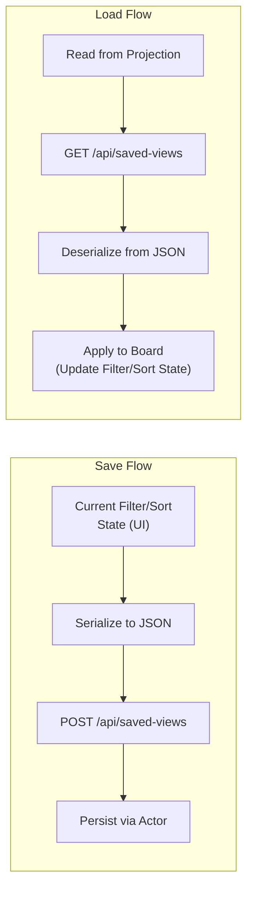

### 7.3 View Modification Detection

The frontend detects when the current filter/sort state differs from the active saved view:

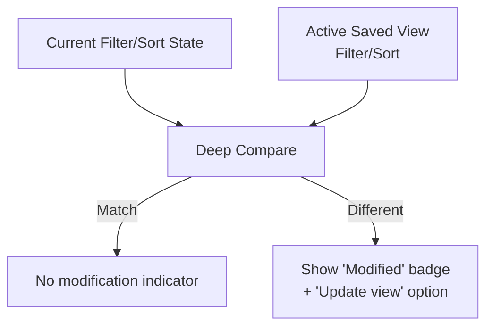

Deep comparison is straightforward because the filter/sort state is a plain JSON object. Structural equality check determines if the view has been modified.

## 8. Key Workflow Sequence Diagrams

### 8.1 Save a View

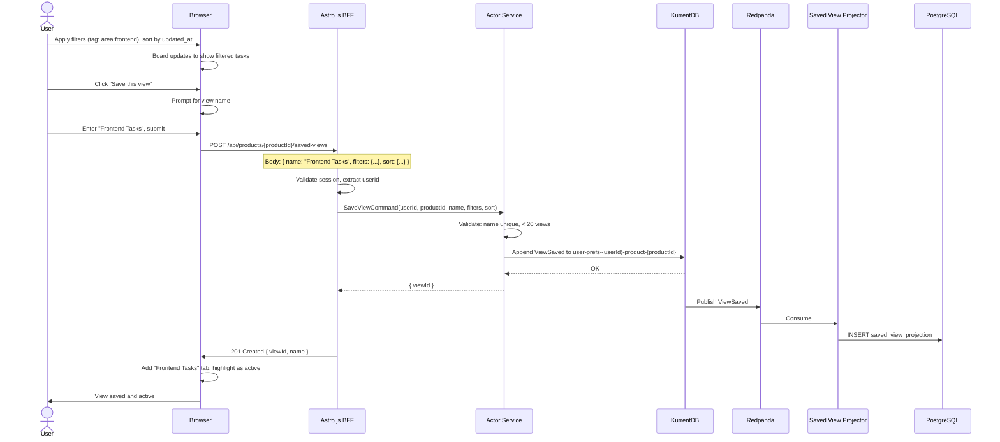

### 8.2 Switch Between Saved Views

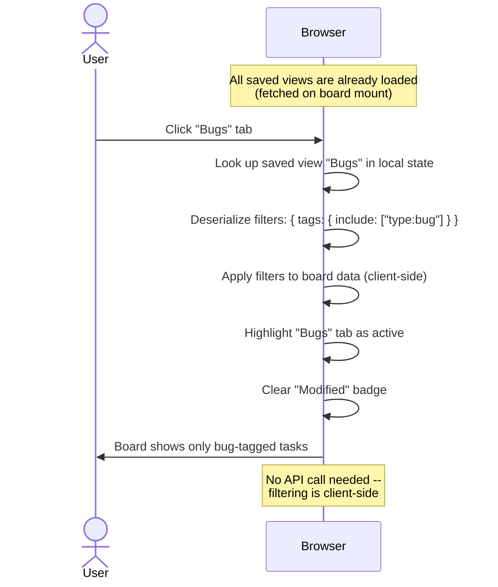

### 8.3 Rename a View

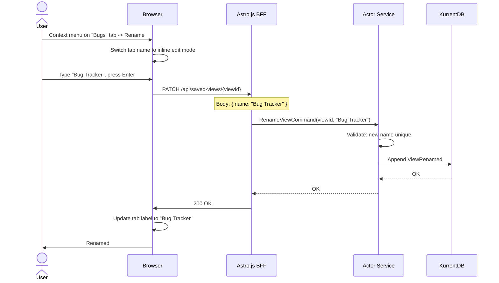

### 8.4 Delete a View

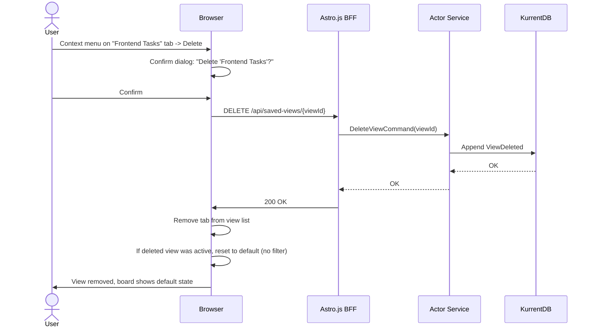

### 8.5 Modified View Detection

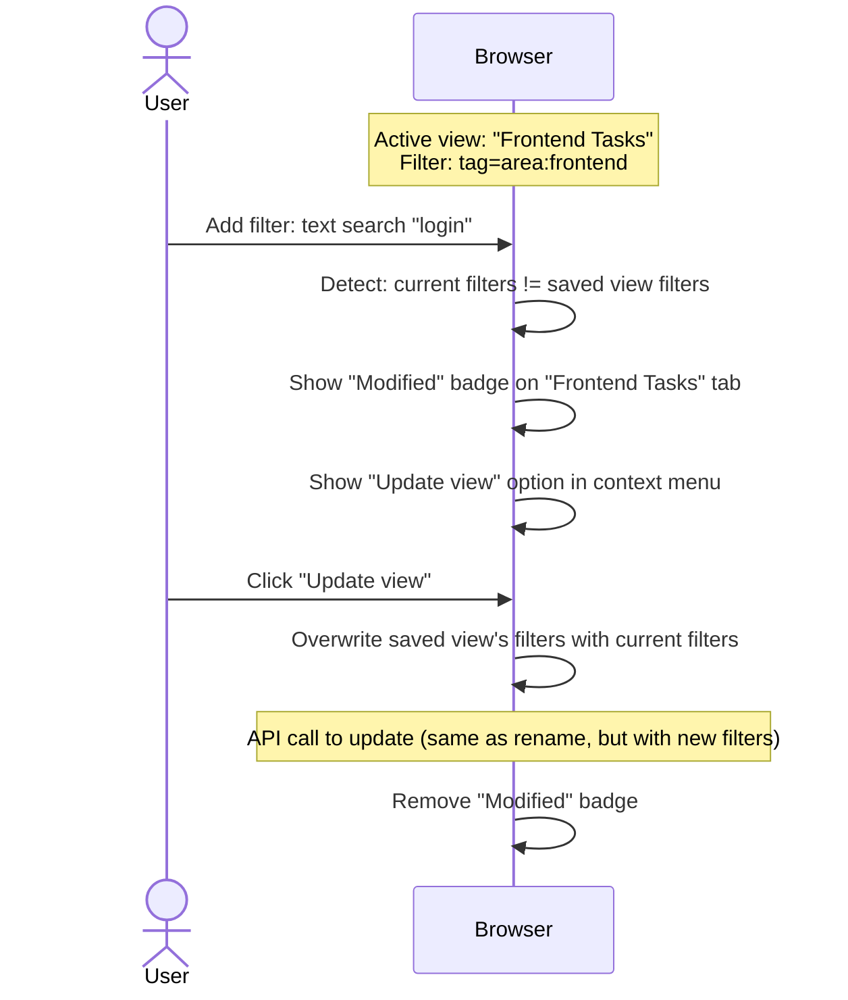

## 9. API Design

### 9.1 Saved View Endpoints

| Method | Path | Description |
|--------|------|-------------|
| GET | `/api/products/{productId}/saved-views` | List user's saved views for a product |
| POST | `/api/products/{productId}/saved-views` | Create a saved view |
| GET | `/api/saved-views/{viewId}` | Get saved view details |
| PATCH | `/api/saved-views/{viewId}` | Rename a saved view |
| PUT | `/api/saved-views/{viewId}` | Update filters/sort of a saved view |
| DELETE | `/api/saved-views/{viewId}` | Delete a saved view |

### 9.2 Create Request

```json
POST /api/products/{productId}/saved-views
{
  "name": "Frontend Tasks",
  "filters": {
    "tags": {
      "include": ["area:frontend"],
      "exclude": []
    },
    "textSearch": null
  },
  "sort": {
    "field": "updated_at",
    "direction": "desc"
  }
}
```

### 9.3 List Response

```json
GET /api/products/{productId}/saved-views

{
  "views": [
    {
      "viewId": "v1a2b3c4-...",
      "name": "Frontend Tasks",
      "filters": {
        "tags": { "include": ["area:frontend"], "exclude": [] },
        "textSearch": null
      },
      "sort": { "field": "updated_at", "direction": "desc" },
      "createdAt": "2026-05-01T10:00:00Z",
      "updatedAt": "2026-05-01T10:00:00Z"
    },
    {
      "viewId": "d5e6f7a8-...",
      "name": "Bugs",
      "filters": {
        "tags": { "include": ["type:bug"], "exclude": [] },
        "textSearch": null
      },
      "sort": { "field": "updated_at", "direction": "asc" },
      "createdAt": "2026-05-03T14:00:00Z",
      "updatedAt": "2026-05-03T14:00:00Z"
    }
  ]
}
```

## 10. Frontend Architecture

### 10.1 View Bar Component

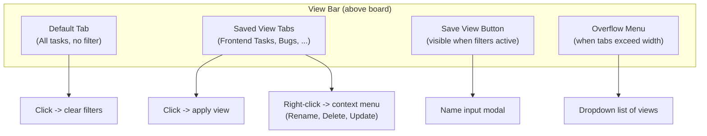

### 10.2 Client-Side State Extension

The Kanban Board state from Epic 4 is extended:

```typescript
// Extended board state
interface BoardState {
  columns: Map<string, Task[]>;
  pendingChanges: Map<string, PendingChange>;
  filters: BoardFilters;
  sort: SortConfig;
  savedViews: SavedView[];        // Loaded on mount
  activeViewId: string | null;    // Currently active view
  isModified: boolean;            // Current state differs from active view
}
```

### 10.3 View Lifecycle on the Board

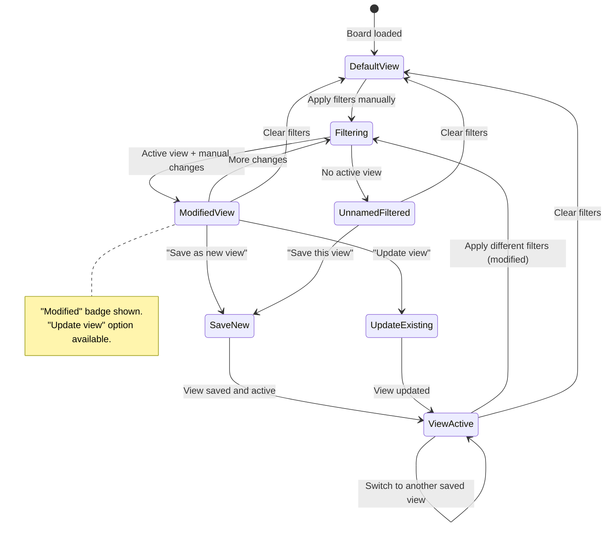

## 11. State Diagram: Saved View CRUD

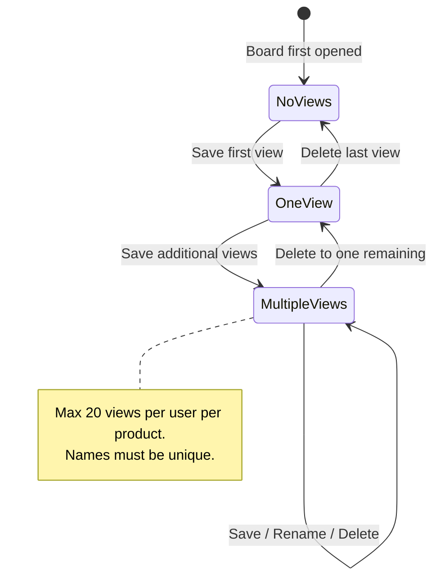

## 12. Data Flow

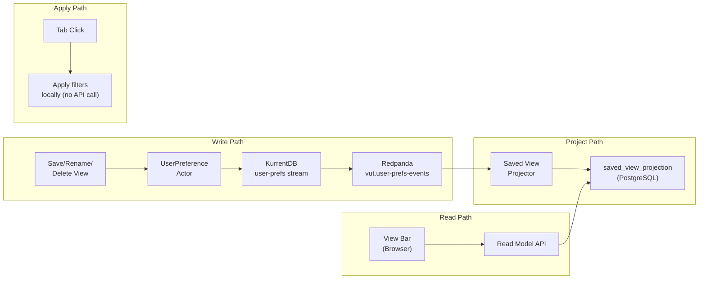

## 13. Performance Considerations

### 13.1 View Switching Speed

- Saved views are fetched on board mount and cached in client-side state.
- Switching views is a client-only operation: deserialize the view's filter/sort config and apply it to the in-memory task list.
- No API calls during view switching. This satisfies the "instantaneous" requirement.
- Target: < 50ms for view switch (DOM update only).

### 13.2 View List Loading

- The saved view list for a user-product pair is typically < 20 items.
- Fetched as part of the board data endpoint or as a single dedicated call.
- Stored in client state for the board's lifetime.

### 13.3 Projection Size

- `saved_view_projection` is tiny. Even at scale (10,000 users x 5 products x 10 views), it's 500,000 rows -- negligible for PostgreSQL.
- The `WHERE is_deleted = FALSE` partial index keeps queries fast.

## 14. Future Considerations

| Concern | Phase 2 Handling |
|---------|------------------|
| Shared views (team-level) | Add `scope` field to ViewSaved event: "personal" vs "team". Team views are visible to all org members. |
| Backlog saved views | Extend the same mechanism to the backlog view. The filter/sort schema is shared. |
| Report view saving | The report already has its own tag filter. Saved report configurations can reuse the same persistence pattern. |
| View ordering | Add a `ViewReordered` event with explicit ordering, replacing the current alphabetical/creation-date sort. |
